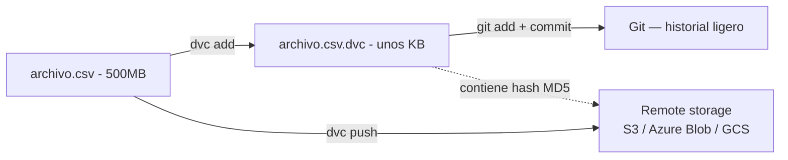

# 01 — Introducción y Arquitectura Interna

> Este cheat-sheet profundiza en la sintaxis y arquitectura interna de DVC. Para el enfoque operativo aplicado a un proyecto real, ver [[46-Reproducibilidad-con-DVC]] en `Machine Learning/`.

## ¿Qué es DVC y qué problema resuelve?

**DVC (Data Version Control)** es una herramienta open-source que extiende el modelo de versionado de Git a datos, modelos y pipelines de ML — cosas que Git maneja mal por diseño (archivos binarios grandes rompen el rendimiento de Git, que fue construido para versionar texto).

El problema concreto: un archivo CSV de 500MB que cambia semanalmente, versionado directamente en Git, convierte el repositorio en gigabytes de historial en poco tiempo, haciendo `git clone`/`git log` insoportablemente lentos para todo el equipo — incluso para quien solo necesita el código.

## La idea central: punteros ligeros en Git, datos reales en otro lado



`dvc add` no mete el archivo pesado a Git — genera un archivo pequeño `.dvc` (texto plano, YAML) con un **hash del contenido**, y mueve el archivo real al **cache local** de DVC. Git versiona solo el puntero `.dvc`; el contenido real vive en el cache local y, opcionalmente, en un almacenamiento remoto compartido.

## El Cache — dónde vive realmente el contenido

```bash
.dvc/cache/
└── a1/
    └── b2c3d4e5f6...   # nombre del archivo = su hash MD5 (sin el prefijo de 2 caracteres del directorio)
```

DVC organiza el cache por **hash de contenido** (similar a cómo Git guarda objetos internamente) — si dos archivos distintos tienen exactamente el mismo contenido, ocupan el mismo espacio en cache una sola vez (deduplicación automática). El archivo `.dvc` en el workspace apunta a esa entrada del cache mediante el hash.

## Workspace vs. Cache — cómo se conectan

```bash
cat data/demanda_historica.parquet.dvc
```

```yaml
outs:
  - md5: a1b2c3d4e5f6...
    size: 524288000
    path: demanda_historica.parquet
```

Por defecto, el archivo en el **workspace** (`data/demanda_historica.parquet`) es un **link** (hardlink, symlink o reflink, según el sistema de archivos) al archivo real dentro del cache — esto evita duplicar físicamente los datos entre el workspace y el cache, aunque puede hacer que el archivo en el workspace aparezca como "de solo lectura" hasta que se ejecute `dvc unprotect` (ver [[02 - Versionado de Datos - Comandos Fundamentales]]).

## Comparación conceptual con Git-LFS

| | Git-LFS | DVC |
|---|---|---|
| Qué versiona | Archivos grandes en general | Datos, modelos, **y pipelines completos** |
| Almacenamiento remoto | Servidor LFS propietario/específico de la plataforma (GitHub, GitLab) | Cualquier backend: S3, Azure Blob, GCS, SSH, carpeta local/red |
| Reproducibilidad de pipelines | No — solo versiona archivos | Sí — `dvc.yaml`/`dvc repro` (ver [[04 - DVC Pipelines - dvc.yaml y Reproducibilidad]]) |
| Métricas/experimentos | No | Sí — `dvc metrics`, `dvc exp` (ver [[06 - DVC Experiments - Iteración Rápida sin Comprometer Git]]) |
| Acoplado a una plataforma Git específica | A menudo sí | No — funciona con cualquier repo Git |

Git-LFS resuelve solo el problema de "archivos grandes en Git"; DVC resuelve ese problema **y además** añade reproducibilidad de pipelines completos y tracking de experimentos — es un superconjunto funcional pensado específicamente para flujos de trabajo de ciencia de datos y ML, no un reemplazo genérico de archivos grandes.

## Instalación

```bash
pip install dvc

# Con soporte específico de un backend de almacenamiento remoto:
pip install "dvc[s3]"       # Amazon S3
pip install "dvc[azure]"    # Azure Blob Storage
pip install "dvc[gs]"        # Google Cloud Storage
pip install "dvc[all]"       # todos los backends soportados
```

## `dvc init` — inicializar DVC dentro de un repo Git existente

```bash
git init   # si el repo no existe todavía
dvc init
```

```
.dvc/
├── config       # configuración del proyecto (remotes, etc.)
├── .gitignore
└── cache/        # (se crea vacío, se puebla al primer `dvc add`)
```

DVC **requiere** un repositorio Git existente — no funciona como sistema de versionado independiente. `dvc init` crea la carpeta `.dvc/` y la registra automáticamente en Git (los archivos de configuración de DVC sí se versionan en Git normalmente; solo los datos en sí van al cache/remote).

## `dvc doctor` — diagnóstico del entorno

```bash
dvc doctor
```

Reporta la versión de DVC, los backends de remote disponibles según qué extras estén instalados, y problemas de configuración comunes — el primer comando a correr cuando algo no funciona como se espera (ver [[10 - Buenas Prácticas, Troubleshooting y Comparativa]]).

## Panorama de este cheat-sheet

| Tema | Archivo |
|---|---|
| Comandos básicos de versionado | [[02 - Versionado de Datos - Comandos Fundamentales]] |
| Almacenamiento remoto (S3, Azure, GCS) | [[03 - Remotes y Almacenamiento en la Nube]] |
| Pipelines reproducibles | [[04 - DVC Pipelines - dvc.yaml y Reproducibilidad]] |
| Comparar métricas y gráficas entre corridas | [[05 - Params, Metrics y Plots]] |
| Experimentación rápida sin ensuciar Git | [[06 - DVC Experiments - Iteración Rápida sin Comprometer Git]] |
| Compartir datasets entre proyectos | [[07 - Data Registries, Import y Compartición entre Proyectos]] |
| CI/CD y reportes automáticos | [[08 - Integración con CI-CD y CML]] |
| Relación con MLflow y el resto del stack | [[09 - Integración con MLflow y el Ecosistema]] |
| Errores comunes y comparativa final | [[10 - Buenas Prácticas, Troubleshooting y Comparativa]] |

## Ver también

- [[46-Reproducibilidad-con-DVC]] (en `Machine Learning/`)
- `MLflow/03 - Tracking - Servidor, Backend Store y Artifact Store.md`
- `Git/` (fundamentos de Git en general)
