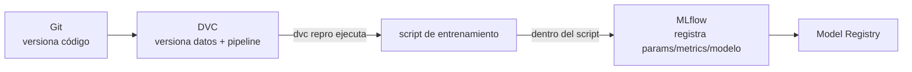

# 09 — Integración con MLflow y el Ecosistema

> Complementa la tabla conceptual de [[46-Reproducibilidad-con-DVC]] (en `Machine Learning/`) con sintaxis concreta de integración.

## DVC vs. MLflow — dónde empieza uno y termina el otro

Ya establecido conceptualmente en `Machine Learning/46-Reproducibilidad-con-DVC.md`: no compiten, se complementan. Aquí el detalle de **cómo se conectan en código**.



## Loguear la versión de datos de DVC como parámetro en MLflow

```python
import subprocess
import mlflow

def obtener_version_dvc(ruta_dvc_file):
    resultado = subprocess.run(
        ["dvc", "get-url", ruta_dvc_file], capture_output=True, text=True
    )
    return resultado.stdout.strip()

with mlflow.start_run():
    hash_datos = obtener_hash_dvc("data/demanda_historica.parquet.dvc")
    mlflow.log_param("dvc_data_hash", hash_datos)
    mlflow.log_param("dvc_data_version", "v2.3.0")   # o el tag/commit de Git correspondiente

    # ... entrenamiento normal ...
```

Esto es lo que cierra la trazabilidad completa: el run de MLflow (parámetros, métricas, modelo) queda vinculado explícitamente al hash exacto de los datos versionados por DVC que lo generaron — respondiendo simultáneamente "¿con qué hiperparámetros?" (MLflow) y "¿con qué datos exactos?" (DVC) desde un solo lugar consultable.

### Leer el hash directamente del archivo `.dvc`

```python
import yaml

def leer_hash_dvc(ruta_dvc_file):
    with open(ruta_dvc_file) as f:
        contenido = yaml.safe_load(f)
    return contenido["outs"][0]["md5"]

hash_datos = leer_hash_dvc("data/demanda_historica.parquet.dvc")
mlflow.log_param("dvc_data_md5", hash_datos)
```

Más simple y directo que invocar `dvc` como subproceso — el archivo `.dvc` (ver [[02 - Versionado de Datos - Comandos Fundamentales]]) ya es YAML plano, legible sin necesitar la CLI de DVC instalada en el entorno que hace el logging.

## Integrar DVC dentro de una etapa que también loguea a MLflow

```yaml
# dvc.yaml
stages:
  entrenar:
    cmd: python scripts/entrenar_con_mlflow.py
    deps:
      - scripts/entrenar_con_mlflow.py
      - data/processed/features.parquet
    params:
      - entrenamiento
    outs:
      - models/modelo.pkl
    metrics:
      - metrics/resultados.json:
          cache: false
```

```python
# scripts/entrenar_con_mlflow.py
import mlflow
import json
import yaml

with open("params.yaml") as f:
    params = yaml.safe_load(f)["entrenamiento"]

mlflow.set_experiment("claro-rd-demand-forecast")
with mlflow.start_run():
    mlflow.log_params(params)

    modelo = entrenar(params)
    mae = evaluar(modelo)

    mlflow.log_metric("mae", mae)
    mlflow.sklearn.log_model(modelo, "model")

    # DVC también necesita su propio archivo de métricas, para dvc metrics/dvc exp show
    with open("metrics/resultados.json", "w") as f:
        json.dump({"mae": mae}, f)

    joblib.dump(modelo, "models/modelo.pkl")   # output que DVC versiona
```

El mismo script alimenta a las dos herramientas simultáneamente: MLflow captura la corrida completa para su UI/Registry, mientras DVC versiona el modelo/datos como parte del pipeline reproducible — no hay redundancia real, cada una guarda la parte que le corresponde (ver la tabla de `Machine Learning/46-Reproducibilidad-con-DVC.md`).

## `dvc exp` como capa de reproducibilidad sobre búsquedas de Optuna

Ya cubierto en [[06 - DVC Experiments - Iteración Rápida sin Comprometer Git]] — el patrón resumido: Optuna decide **qué** hiperparámetros probar (búsqueda bayesiana inteligente), DVC garantiza que **cada intento sea reproducible** de extremo a extremo (datos + código + parámetros exactos), y MLflow registra el historial completo consultable de todo el proceso.

## DVC + Docker — reproducibilidad de entorno, no solo de datos

```dockerfile
FROM python:3.11-slim

RUN pip install dvc[s3] -r requirements.txt

COPY . /app
WORKDIR /app

RUN dvc pull   # trae los datos versionados DENTRO de la imagen (o en tiempo de ejecución, según el caso)
CMD ["dvc", "repro"]
```

Ver `Docker/Introduction to Docker.md` — combinar DVC con una imagen Docker fija (versiones exactas de dependencias) cierra el último eslabón de reproducibilidad: mismo código (Git), mismos datos (DVC), mismo entorno de ejecución (Docker).

## Ver también

- [[46-Reproducibilidad-con-DVC]] (en `Machine Learning/`)
- `MLflow/02 - Tracking - Fundamentos y API de Logging.md`
- `Optuna/01 - Introducción y Conceptos Fundamentales.md`
- `Docker/Introduction to Docker.md`
