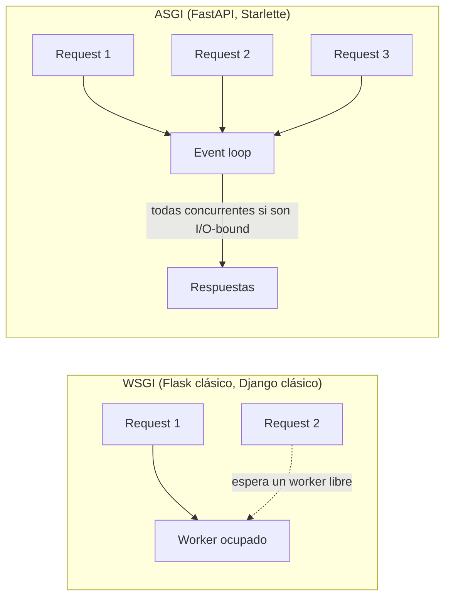

# 01 — Introducción y Arquitectura

> Este cheat-sheet profundiza en la sintaxis y arquitectura de FastAPI como framework web. Para el caso de uso específico de servir modelos de ML con él, ver [[49-APIs-con-FastAPI-para-Servir-Modelos]] — ese archivo asume que ya conoces lo básico que se cubre aquí.

## ¿Qué es FastAPI?

**FastAPI** es un framework web moderno de Python para construir APIs, construido sobre dos piezas ya maduras del ecosistema:

- **Starlette** — le da el motor ASGI: routing, manejo de requests/responses, WebSockets, middleware, todo asíncrono por diseño.
- **Pydantic** — le da la validación de datos: cada type hint que escribes en una función se convierte en una regla de validación real, aplicada automáticamente en cada request.

El resultado: escribes funciones Python normales con type hints, y FastAPI deriva de ahí la validación de entrada, la serialización de salida y la documentación interactiva — sin código repetido para ninguna de esas tres cosas.

## ASGI vs WSGI — por qué importa

Flask y Django (en su forma clásica) están construidos sobre **WSGI**, un estándar síncrono: una petición ocupa un worker hasta que termina. FastAPI está construido sobre **ASGI**, el sucesor asíncrono, que permite manejar miles de conexiones concurrentes en un solo proceso cuando el trabajo es I/O-bound (esperar una base de datos, otra API, un archivo).



Esto no significa que FastAPI sea "gratis más rápido" en todos los casos — ver [[10 - Async y Concurrencia]] para cuándo el `async` realmente ayuda y cuándo no.

## Instalación

```bash
pip install "fastapi[standard]"
# incluye uvicorn, pydantic, python-multipart, jinja2, httpx (para testing)

# o mínimo, sin extras:
pip install fastapi uvicorn
```

`uvicorn` es el servidor ASGI que efectivamente ejecuta la aplicación — FastAPI define el framework, Uvicorn lo sirve.

## La app mínima

```python
# main.py
from fastapi import FastAPI

app = FastAPI()

@app.get("/")
def leer_raiz():
    return {"mensaje": "Hola, mundo"}

@app.get("/saludo/{nombre}")
def saludar(nombre: str):
    return {"saludo": f"Hola, {nombre}"}
```

```bash
fastapi dev main.py
# o directamente:
uvicorn main:app --reload
```

`--reload` reinicia el servidor en cada cambio de código — solo para desarrollo, nunca en producción (ver [[15 - Despliegue y Producción]]).

## Documentación automática — la razón por la que se volvió estándar

Con la app corriendo, FastAPI expone dos interfaces de documentación generadas automáticamente a partir del código, sin mantenerlas a mano:

- `http://localhost:8000/docs` — **Swagger UI**, interactiva, permite probar endpoints directamente desde el navegador.
- `http://localhost:8000/redoc` — **ReDoc**, más orientada a lectura/referencia.
- `http://localhost:8000/openapi.json` — el esquema OpenAPI crudo que alimenta ambas interfaces.

Cada type hint, cada `Field(...)`, cada docstring que escribes se refleja ahí — la misma filosofía de "la documentación vive en el código" que ya viste con MkDocs.

## FastAPI frente a otros frameworks de Python

| Framework | Paradigma | Validación | Docs automáticas | Curva de aprendizaje |
|---|---|---|---|---|
| **FastAPI** | ASGI (async nativo) | Automática vía Pydantic | Sí (Swagger/ReDoc) | Media — el `async` toma tiempo de dominar |
| **Flask** | WSGI (síncrono) | Manual o con extensiones | No (requiere Flask-RESTX u otro) | Baja — minimalista por diseño |
| **Django REST Framework** | WSGI, con soporte ASGI parcial | Serializers manuales | Con drf-spectacular | Alta — requiere conocer Django completo |

FastAPI gana en proyectos donde la validación de datos es central (APIs de datos, ML, microservicios) y donde la velocidad de desarrollo con seguridad de tipos importa más que el ecosistema masivo de Django.

## Ver también

- [[02 - Path Operations y Routing]]
- [[03 - Request Body y Modelos Pydantic]]
- [[49-APIs-con-FastAPI-para-Servir-Modelos]]
- `Python/APIs.md`
