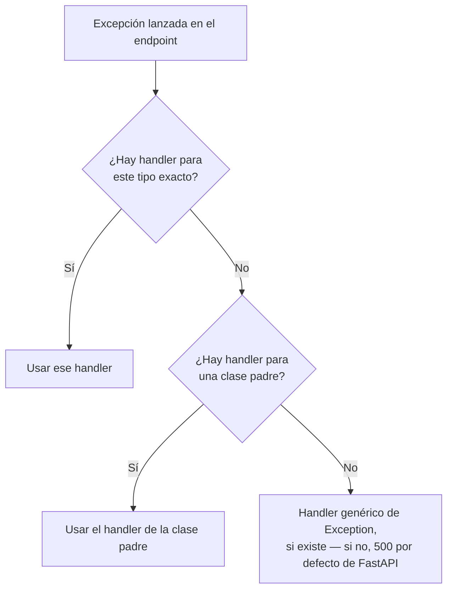

# 07 — Manejo de Errores y Excepciones

> Continúa de [[06 - Dependency Injection]]. El patrón básico de `HTTPException` ya se vio en [[49-APIs-con-FastAPI-para-Servir-Modelos]]; aquí se profundiza en manejo de errores a nivel de aplicación completa.

## `HTTPException` — el caso más común

```python
from fastapi import HTTPException, status

@app.get("/items/{id}")
def obtener_item(id: int):
    item = buscar_item(id)
    if item is None:
        raise HTTPException(
            status_code=status.HTTP_404_NOT_FOUND,
            detail=f"Item {id} no encontrado",
        )
    return item
```

`HTTPException` interrumpe la ejecución inmediatamente (como cualquier excepción de Python) y FastAPI la convierte en una respuesta HTTP con el `status_code` y `detail` indicados — no hace falta un `try/except` alrededor de cada `raise`.

## Headers custom en el error

```python
raise HTTPException(
    status_code=status.HTTP_401_UNAUTHORIZED,
    detail="Credenciales inválidas",
    headers={"WWW-Authenticate": "Bearer"},
)
```

## Excepciones custom + manejador global

Cuando el mismo tipo de error se repite en muchos endpoints, definir una excepción propia evita repetir `HTTPException(...)` con el mismo mensaje en cada lugar:

```python
class ModeloNoDisponibleError(Exception):
    def __init__(self, nombre_modelo: str):
        self.nombre_modelo = nombre_modelo

@app.exception_handler(ModeloNoDisponibleError)
async def manejador_modelo_no_disponible(request: Request, exc: ModeloNoDisponibleError):
    return JSONResponse(
        status_code=503,
        content={"error": f"El modelo '{exc.nombre_modelo}' no está cargado actualmente"},
    )

# en cualquier endpoint:
@app.post("/predecir")
def predecir(datos: DatosEntrada):
    if not modelo_cargado:
        raise ModeloNoDisponibleError(nombre_modelo="demand-forecast")
    ...
```

El endpoint solo hace `raise ModeloNoDisponibleError(...)` — la lógica de qué código HTTP y qué formato de respuesta le corresponde vive en un solo lugar, el manejador registrado con `@app.exception_handler`.

## Sobrescribir el formato de error de validación

```python
from fastapi.exceptions import RequestValidationError
from fastapi.responses import JSONResponse

@app.exception_handler(RequestValidationError)
async def manejador_validacion(request: Request, exc: RequestValidationError):
    return JSONResponse(
        status_code=422,
        content={
            "mensaje": "Los datos enviados no son válidos",
            "campos_con_error": [e["loc"][-1] for e in exc.errors()],
        },
    )
```

Por defecto, un error 422 de Pydantic devuelve el formato verboso visto en [[05 - Validación Avanzada con Pydantic]]. Sobrescribir `RequestValidationError` permite adaptar ese formato al contrato que espera el cliente de la API (por ejemplo, un frontend que solo necesita saber qué campos fallaron, no la estructura completa de Pydantic).

## Manejador global — capturar todo lo no anticipado

```python
@app.exception_handler(Exception)
async def manejador_generico(request: Request, exc: Exception):
    logger.exception(f"Error no manejado en {request.url.path}")
    return JSONResponse(
        status_code=500,
        content={"error": "Error interno del servidor"},
    )
```

Este manejador es la red de seguridad final: cualquier excepción no capturada por un manejador más específico cae aquí, se loguea con el traceback completo (igual que en [[49-APIs-con-FastAPI-para-Servir-Modelos]]) y el cliente recibe un mensaje genérico sin exponer detalles internos.

## Jerarquía de resolución de manejadores



FastAPI busca el manejador más específico registrado para el tipo de excepción lanzada; si no encuentra uno exacto, sube por la jerarquía de herencia de Python hasta encontrar uno que aplique.

## Ver también

- [[06 - Dependency Injection]]
- [[05 - Validación Avanzada con Pydantic]]
- [[49-APIs-con-FastAPI-para-Servir-Modelos]]
