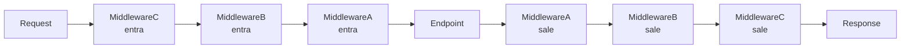

# 08 — Middleware y CORS

> Continúa de [[07 - Manejo de Errores y Excepciones]]. El patrón básico de middleware custom ya se vio en [[49-APIs-con-FastAPI-para-Servir-Modelos]]; aquí se cubre en más profundidad, junto con CORS.

## Middleware custom — repaso y extensión

```python
import time
from fastapi import Request

@app.middleware("http")
async def agregar_header_tiempo(request: Request, call_next):
    inicio = time.perf_counter()
    respuesta = await call_next(request)
    duracion = time.perf_counter() - inicio
    respuesta.headers["X-Process-Time"] = str(duracion)
    return respuesta
```

Un middleware envuelve **cada** request antes de llegar al endpoint y **cada** response antes de salir — `call_next(request)` es lo que efectivamente ejecuta el endpoint (o el siguiente middleware en la cadena).

## Orden de ejecución con múltiples middlewares

```python
app.add_middleware(MiddlewareA)
app.add_middleware(MiddlewareB)
app.add_middleware(MiddlewareC)
```



`add_middleware` apila en orden **inverso** al de registro: el último agregado es el primero en procesar el request entrante. Importante para casos donde el orden afecta el resultado (ej. un middleware de autenticación debe ejecutarse antes que uno que dependa del usuario autenticado).

## CORS — por qué es necesario

Cuando un frontend servido desde un dominio (`https://miapp.com`) hace peticiones a una API en otro dominio (`https://api.miapp.com`), el navegador bloquea la respuesta por defecto salvo que el servidor declare explícitamente qué orígenes tiene permitido acceder — esa es la política **CORS (Cross-Origin Resource Sharing)**.

```python
from fastapi.middleware.cors import CORSMiddleware

app.add_middleware(
    CORSMiddleware,
    allow_origins=["https://miapp.com", "http://localhost:3000"],
    allow_credentials=True,
    allow_methods=["GET", "POST", "PUT", "DELETE"],
    allow_headers=["*"],
)
```

- `allow_origins` — lista blanca de dominios permitidos. `["*"]` permite cualquiera, **nunca usar en producción junto con `allow_credentials=True`** (el navegador lo rechaza por diseño, es una combinación insegura).
- `allow_credentials=True` — permite que el navegador envíe cookies/headers de autenticación en la petición cross-origin.
- `allow_methods` / `allow_headers` — qué verbos HTTP y headers custom están permitidos.

## Otros middlewares incluidos en Starlette

```python
from fastapi.middleware.gzip import GZipMiddleware
from fastapi.middleware.trustedhost import TrustedHostMiddleware

app.add_middleware(GZipMiddleware, minimum_size=1000)
# comprime automáticamente respuestas mayores a 1000 bytes

app.add_middleware(TrustedHostMiddleware, allowed_hosts=["api.miapp.com", "*.miapp.com"])
# rechaza requests cuyo header Host no coincida — mitiga ataques de host header injection
```

## Middleware vs dependencia — cuándo usar cada uno

| | Middleware | Dependencia (`Depends`) |
|---|---|---|
| **Alcance** | Toda la app, sin excepción | Solo los endpoints que la declaran |
| **Acceso al endpoint específico** | No sabe qué endpoint se ejecutará | Sí, forma parte de su firma |
| **Caso típico** | Logging global, CORS, compresión, medir latencia | Autenticación de un endpoint, conexión a BD, validación de parámetros compartidos |
| **Puede modificar la respuesta después de generada** | Sí | No directamente |

En la práctica: si la lógica necesita saber **qué endpoint específico** se está llamando o requiere inyectar un valor típado a la función, usa una dependencia (ver [[06 - Dependency Injection]]); si es verdaderamente transversal a toda petición sin importar el endpoint, usa middleware.

## Ver también

- [[06 - Dependency Injection]]
- [[07 - Manejo de Errores y Excepciones]]
- [[49-APIs-con-FastAPI-para-Servir-Modelos]]
