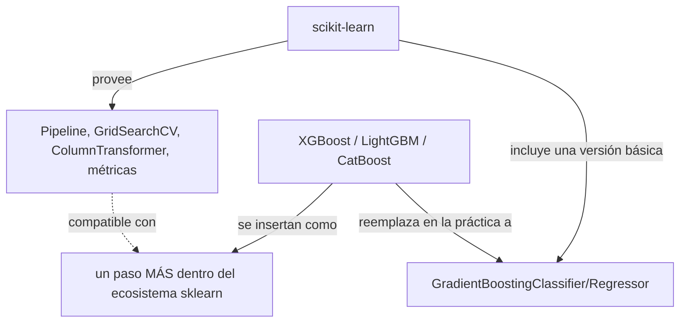
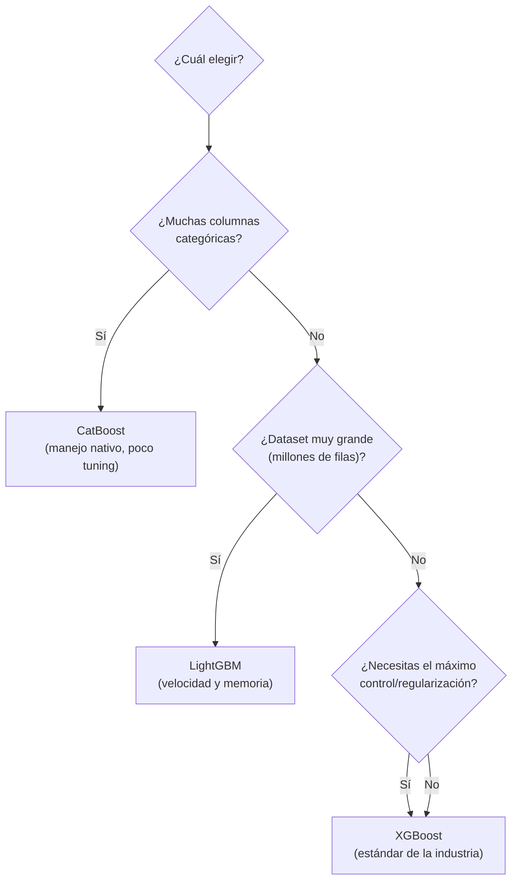

# 01 — Introducción y Panorama

> Este cheat-sheet profundiza en XGBoost, LightGBM y CatBoost. Para la teoría matemática de boosting (residuos, gradiente, Newton boosting), ver [[36-Ensambles-en-Profundidad]] en `Machine Learning/`. Para la API general de scikit-learn, ver `Scikit-learn/07 - Árboles y Ensambles - Sintaxis y API.md`.

## La pregunta central: ¿sustituyen o complementan a scikit-learn?

**Complementan, no sustituyen.** Las tres librerías implementan un *wrapper* que respeta exactamente el contrato de scikit-learn (`fit`/`predict`/`get_params`/`set_params`, ver `Scikit-learn/01 - Introducción, Filosofía y la API Consistente.md`) — por eso funcionan sin fricción dentro de `Pipeline`, `GridSearchCV`, `VotingClassifier`, `StackingClassifier`, `cross_val_score`, exactamente igual que un `RandomForestClassifier` nativo.

Lo que sí reemplazan es un componente específico: el `GradientBoostingClassifier`/`GradientBoostingRegressor` **nativo** de scikit-learn (`sklearn.ensemble`) — esa implementación es más lenta y menos sofisticada que cualquiera de las tres alternativas especializadas. El propio scikit-learn reconoció esta brecha con `HistGradientBoosting*` (ver `Scikit-learn/07 - Árboles y Ensambles - Sintaxis y API.md`), que incorpora ideas tomadas directamente de LightGBM (histogram binning) — pero XGBoost/LightGBM/CatBoost siguen siendo más maduras, configurables y rápidas en la mayoría de escenarios de producción.



## Por qué existen tres (o más) implementaciones distintas

Las tres resuelven el mismo problema matemático (Gradient Boosting sobre árboles, ver [[36-Ensambles-en-Profundidad]]), pero cada una prioriza optimizaciones de ingeniería distintas:

| Librería | Creador | Prioridad de diseño |
|---|---|---|
| **XGBoost** | DMLC (comunidad open-source) | Precisión y regularización — el estándar histórico en competencias |
| **LightGBM** | Microsoft | Velocidad y memoria en datasets muy grandes |
| **CatBoost** | Yandex | Manejo automático de variables categóricas, robustez sin tuning extenso |

## Instalación

```bash
pip install xgboost
pip install lightgbm
pip install catboost
```

Las tres son independientes entre sí — no hay conflicto en tener las tres instaladas simultáneamente, y es común alternar entre ellas según el dataset (ej. probar las tres y quedarse con la de mejor validación).

## Comparativa de alto nivel

| Criterio | XGBoost | LightGBM | CatBoost |
|---|---|---|---|
| Estrategia de crecimiento del árbol | Level-wise (por defecto) | **Leaf-wise** | Symmetric/oblivious trees |
| Manejo nativo de categóricas | No (requiere encoding previo, salvo con `enable_categorical`) | Sí (parcial, requiere marcar columnas) | **Sí, automático y avanzado** |
| Velocidad de entrenamiento (datasets grandes) | Buena | **Muy alta** | Moderada-alta |
| Uso de memoria | Moderado | **Bajo** | Moderado-alto |
| Robustez con hiperparámetros por defecto | Moderada | Moderada | **Alta** (menos tuning necesario) |
| Riesgo de overfitting en datasets pequeños | Moderado | **Alto** (por leaf-wise agresivo) | Bajo |
| Soporte GPU | Sí | Sí | Sí |
| Madurez / adopción en producción | **Muy alta** | Alta | Alta, creciente |

## Cuándo elegir cada una — regla de decisión rápida



En la práctica, cuando el desempeño predictivo es crítico, es común **entrenar las tres y comparar** vía validación cruzada — las diferencias de precisión entre ellas suelen ser pequeñas con suficiente tuning, y la elección final termina dependiendo más de velocidad, facilidad de tuning, o manejo de categóricas según el dataset específico.

## Mapa de este cheat-sheet

| Tema | Archivo |
|---|---|
| API nativa de XGBoost (`DMatrix`) | [[02 - XGBoost - API Nativa y DMatrix]] |
| XGBoost compatible con sklearn | [[03 - XGBoost - API Scikit-Learn Compatible e Hiperparámetros]] |
| Arquitectura interna de LightGBM | [[04 - LightGBM - Arquitectura Leaf-wise y API Nativa]] |
| LightGBM compatible con sklearn | [[05 - LightGBM - API Scikit-Learn Compatible y Categóricas Nativas]] |
| El algoritmo distintivo de CatBoost | [[06 - CatBoost - Ordered Boosting y Manejo de Categóricas]] |
| API completa de CatBoost | [[07 - CatBoost - API, Pool y Funcionalidades Distintivas]] |
| Hiperparámetros equivalentes entre las tres | [[08 - Comparativa Técnica y Tuning Cruzado]] |
| GPU y entrenamiento distribuido | [[09 - GPU, Entrenamiento Distribuido y Rendimiento]] |
| Interpretabilidad con SHAP | [[10 - Interpretabilidad e Importancia de Features]] |
| MLflow, Optuna, persistencia | [[11 - Integración con el Ecosistema]] |
| NGBoost, EBM, H2O y el resto de la familia | [[12 - Otras Librerías Similares y Cuándo Considerarlas]] |

## Ver también

- [[36-Ensambles-en-Profundidad]] (en `Machine Learning/`)
- `Scikit-learn/07 - Árboles y Ensambles - Sintaxis y API.md`
- `Scikit-learn/15 - Integraciones con el Ecosistema.md`
