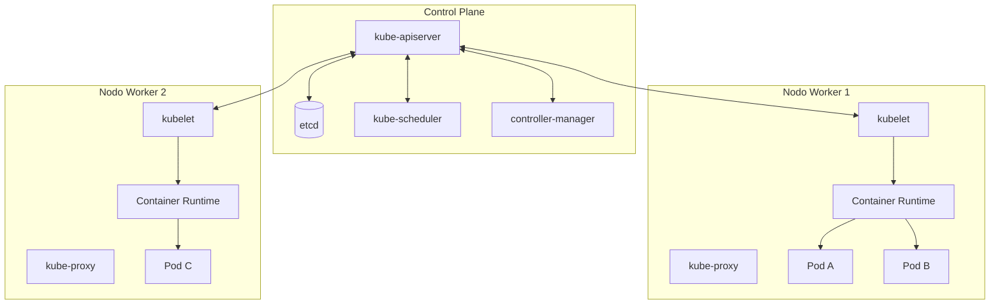
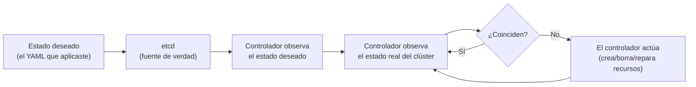

# 01 — Introducción y Arquitectura del Clúster

> Este cheat-sheet profundiza en la sintaxis y arquitectura de Kubernetes. Para el panorama conceptual de dónde encaja en un flujo de MLOps, ver [[09-MLOps-en-Profundidad#Kubernetes|09-MLOps-en-Profundidad]] y [[17-Arquitecturas-de-Despliegue-de-Modelos]] en `Machine Learning/`; para la orquestación más simple que Kubernetes reemplaza a escala, ver `Docker/Orchestration and Scalability.md`.

## ¿Qué problema resuelve Kubernetes?

Cuando una aplicación empaquetada en [[Containers|contenedores]] (ver `Docker/`) pasa de correr en una laptop a correr en producción, aparecen preguntas que un humano no puede responder manualmente a escala: ¿en qué máquina se ejecuta cada contenedor? ¿qué pasa si esa máquina se cae? ¿cómo se reparte el tráfico entre 50 réplicas? ¿cómo se actualiza la aplicación sin downtime?

**Kubernetes (K8s)** es un orquestador de contenedores de código abierto, originado en Google (basado en su sistema interno Borg), que automatiza:

- **Scheduling:** decidir en qué nodo del clúster corre cada contenedor.
- **Self-healing:** reiniciar o reubicar contenedores que fallan o cuyo nodo muere.
- **Escalado:** horizontal (más réplicas) y, con addons, vertical (más recursos por réplica).
- **Service discovery y balanceo de carga:** los contenedores se encuentran entre sí sin IPs hardcodeadas.
- **Despliegues progresivos y rollbacks:** actualizar la aplicación de forma controlada, y revertir si algo falla.
- **Gestión declarativa de configuración y secretos.**

El "8" en K8s es un numerónimo: cuenta las ocho letras entre la "K" y la "s" de "Kubernetes" (palabra griega para "timonel" — quien dirige un barco, de ahí también el logo del timón).

## Docker vs. Kubernetes — no son competidores

Es un malentendido común pensar que Kubernetes reemplaza a Docker. En realidad operan en capas distintas:

| | Docker | Kubernetes |
|---|---|---|
| Responde a | "¿Cómo empaqueto y corro **un** contenedor?" | "¿Cómo gestiono **miles** de contenedores across muchas máquinas?" |
| Unidad de trabajo | Imagen / contenedor individual | Clúster completo de nodos |
| Runtime de contenedores | Es el runtime (o lo era — ver nota abajo) | Usa un runtime de contenedores (containerd, CRI-O) por debajo |

> **Nota histórica:** Kubernetes usaba `dockershim` para hablar con Docker Engine directamente; desde la v1.24 ese shim se eliminó y K8s habla con runtimes que implementan el **Container Runtime Interface (CRI)** — típicamente `containerd` (el motor que el propio Docker usa internamente) o `CRI-O`. En la práctica esto es transparente: las imágenes construidas con `docker build` siguen funcionando igual en Kubernetes, porque el formato de imagen OCI es el mismo.

## Arquitectura de un clúster



Un clúster de Kubernetes tiene dos tipos de máquinas (nodos): las del **control plane** (el "cerebro") y los **nodos worker** (donde realmente corren las aplicaciones).

### El Control Plane

- **`kube-apiserver`:** el único punto de entrada al clúster. Toda interacción — `kubectl`, dashboards, controladores internos — pasa por su API REST. Es stateless, lo que permite tener varias réplicas para alta disponibilidad.
- **`etcd`:** una base de datos clave-valor distribuida que almacena **todo** el estado del clúster (qué recursos existen, su configuración, su estado actual). Es la única fuente de verdad — si `etcd` se pierde sin backup, se pierde el estado del clúster completo.
- **`kube-scheduler`:** decide en qué nodo debe correr cada Pod recién creado, basándose en recursos disponibles, afinidad/anti-afinidad, taints/tolerations, etc.
- **`kube-controller-manager`:** corre los "controladores" — bucles de reconciliación que comparan continuamente el **estado deseado** (lo que está en `etcd`) contra el **estado real** del clúster y actúan para cerrar la brecha (por ejemplo, el controlador de `ReplicaSet` crea un Pod nuevo si detecta que faltan réplicas — ver [[04 - Deployments y ReplicaSets]]).

### Los Nodos Worker

- **`kubelet`:** el agente que corre en cada nodo worker. Habla con el `kube-apiserver`, recibe la orden "este Pod debe correr aquí", y se asegura de que los contenedores de ese Pod estén realmente corriendo y saludables (ejecutando los [[03 - Pods#Probes - Liveness, Readiness y Startup|probes]]).
- **`kube-proxy`:** gestiona las reglas de red en cada nodo para que el tráfico dirigido a un [[05 - Services y Networking|Service]] llegue al Pod correcto, sin importar en qué nodo esté.
- **Container Runtime:** el software que realmente crea y ejecuta los contenedores (containerd, CRI-O). Kubernetes le habla a través del CRI.

## El bucle de reconciliación — la idea central de todo Kubernetes

Este patrón se repite en **todos** los objetos de Kubernetes (Deployments, Services, PVCs, etc.) y es la clave para entender por qué Kubernetes es "declarativo" y no "imperativo":



No le dices a Kubernetes "crea un contenedor" (imperativo); le dices "quiero que exista este estado" (declarativo — un manifiesto YAML), y un controlador se encarga perpetuamente de que ese estado se mantenga, incluso si algo falla a las 3am sin que nadie intervenga. Esto es lo que distingue a Kubernetes de correr `docker run` manualmente y es la base de todo lo que sigue en este cheat-sheet.

## Opciones para tener un clúster

| Opción | Uso típico |
|---|---|
| **Minikube** / **kind** (Kubernetes in Docker) | Clúster local de un solo nodo para desarrollo y aprendizaje |
| **Docker Desktop** (K8s integrado) | Clúster local mínimo, activable con un checkbox |
| **EKS** (AWS) / **GKE** (Google) / **AKS** (Azure) | Clúster gestionado en la nube — el proveedor administra el control plane (ver [[13 - Managed Kubernetes, CI-CD y Buenas Prácticas]]) |
| **kubeadm** | Herramienta para levantar un clúster propio ("on-prem") desde cero |

Para practicar los ejemplos de este cheat-sheet, `kind` o `minikube` son suficientes:

```bash
# kind (requiere Docker corriendo)
kind create cluster --name practica

# minikube
minikube start
```

## Panorama de este cheat-sheet

| Tema | Archivo |
|---|---|
| `kubectl` y el modelo declarativo | [[02 - kubectl y el Modelo Declarativo]] |
| Pods | [[03 - Pods]] |
| Deployments y ReplicaSets | [[04 - Deployments y ReplicaSets]] |
| Services y Networking | [[05 - Services y Networking]] |
| ConfigMaps y Secrets | [[06 - ConfigMaps y Secrets]] |
| Volumes y almacenamiento persistente | [[07 - Volumes y Almacenamiento Persistente]] |
| Escalado automático | [[08 - Escalado - HPA, VPA y Cluster Autoscaler]] |
| Helm | [[09 - Helm - Gestión de Paquetes para Kubernetes]] |
| Seguridad y RBAC | [[10 - Seguridad y RBAC]] |
| Servir modelos de ML en K8s | [[11 - Kubernetes para Servir Modelos de ML]] |
| Observabilidad | [[12 - Observabilidad en Kubernetes]] |
| Managed K8s, CI/CD y buenas prácticas | [[13 - Managed Kubernetes, CI-CD y Buenas Prácticas]] |

## Ver también

- [[09-MLOps-en-Profundidad#Kubernetes]] (en `Machine Learning/`)
- [[17-Arquitecturas-de-Despliegue-de-Modelos]] (en `Machine Learning/`)
- `Docker/Orchestration and Scalability.md`
- `Docker/Introduction to Docker.md`
