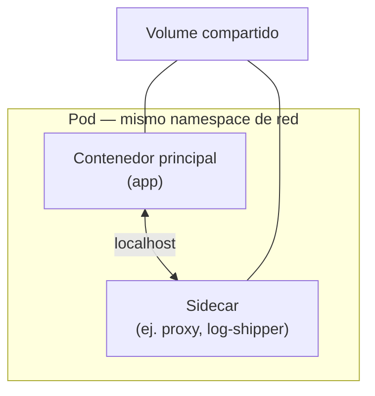
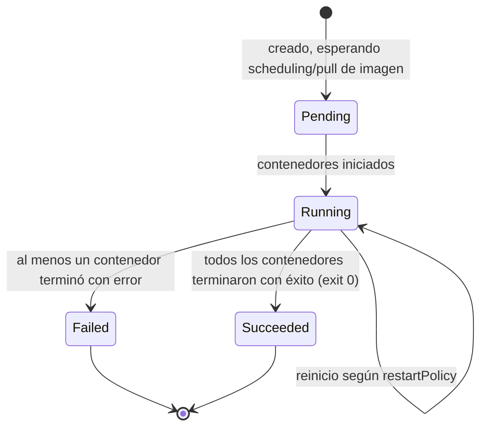

# 03 — Pods

El **Pod** es la unidad más pequeña que Kubernetes programa y gestiona directamente — nunca se despliega un contenedor "suelto"; siempre vive dentro de un Pod, aunque sea un Pod con un solo contenedor.

## ¿Por qué existe el Pod, si ya existe el contenedor?

Un Pod agrupa uno o más contenedores que **deben** compartir el mismo ciclo de vida, red y almacenamiento — cosas que Docker por sí solo no modela bien entre contenedores distintos.



Todos los contenedores de un Pod comparten:
- **La misma IP y espacio de puertos** — se comunican entre sí vía `localhost`, no vía red.
- **Los mismos [[07 - Volumes y Almacenamiento Persistente|Volumes]]** montados, si se declaran compartidos.
- **El mismo ciclo de vida** — se programan, escalan y eliminan juntos como una unidad.

## Patrón multi-contenedor: sidecar

El caso más común de un Pod con más de un contenedor es el **patrón sidecar**: un contenedor "principal" (la aplicación) acompañado de un contenedor auxiliar que le agrega una capacidad sin modificar su código — un proxy de red (Istio/Envoy), un recolector de logs, o un sincronizador de archivos.

```yaml
apiVersion: v1
kind: Pod
metadata:
  name: modelo-con-logging
spec:
  containers:
    - name: api-modelo
      image: mi-registro/api-modelo:1.0
      ports:
        - containerPort: 8000
      volumeMounts:
        - name: logs
          mountPath: /var/log/app
    - name: log-shipper
      image: fluent-bit:latest
      volumeMounts:
        - name: logs
          mountPath: /var/log/app
          readOnly: true
  volumes:
    - name: logs
      emptyDir: {}
```

En la práctica casi nunca se crean Pods "sueltos" a mano en producción — se gestionan a través de un [[04 - Deployments y ReplicaSets|Deployment]], que es quien crea, reemplaza y escala los Pods. Escribir un Pod directo (como en los ejemplos de este archivo) es útil para entender el objeto base y para debugging rápido.

## Ciclo de vida de un Pod



`kubectl get pods` muestra la fase (`Pending`, `Running`, `Succeeded`, `Failed`, `Unknown`) y el conteo de reinicios (`RESTARTS`) — un número alto de reinicios es la primera señal de un contenedor que está fallando (`kubectl describe pod` y `kubectl logs --previous` son el siguiente paso, ver [[02 - kubectl y el Modelo Declarativo]]).

### `restartPolicy`

```yaml
spec:
  restartPolicy: Always   # Always (default, para servicios) | OnFailure | Never (para Jobs de una sola corrida)
```

## Probes — Liveness, Readiness y Startup

Kubernetes no puede saber si una aplicación está realmente sana solo porque el proceso sigue corriendo (un proceso puede estar "colgado" sin haber muerto). Los **probes** son chequeos activos que el `kubelet` ejecuta periódicamente contra cada contenedor.

```yaml
containers:
  - name: api-modelo
    image: mi-registro/api-modelo:1.0
    ports:
      - containerPort: 8000
    livenessProbe:
      httpGet:
        path: /health
        port: 8000
      initialDelaySeconds: 10
      periodSeconds: 15
    readinessProbe:
      httpGet:
        path: /ready
        port: 8000
      initialDelaySeconds: 5
      periodSeconds: 5
    startupProbe:
      httpGet:
        path: /health
        port: 8000
      failureThreshold: 30
      periodSeconds: 10
```

| Probe | Pregunta que responde | Qué pasa si falla |
|---|---|---|
| **Liveness** | ¿Sigue vivo este contenedor, o está en un estado irrecuperable (deadlock)? | El `kubelet` **reinicia** el contenedor |
| **Readiness** | ¿Está listo para recibir tráfico ahora mismo? | El Pod se **saca temporalmente** de los endpoints del [[05 - Services y Networking|Service]] — sin reiniciarlo |
| **Startup** | ¿Ya terminó de arrancar (útil para apps lentas al iniciar)? | Bloquea liveness/readiness hasta que pase, evitando reinicios prematuros durante un arranque largo |

Para una API que sirve un modelo de ML, la distinción **liveness vs. readiness** es especialmente relevante: si el modelo está recargando pesos nuevos (ver [[11 - Kubernetes para Servir Modelos de ML]]), el proceso sigue "vivo" pero no debería recibir tráfico todavía — ahí el readiness probe evita mandarle requests mientras el liveness probe no lo mata innecesariamente.

## Requests y Limits de recursos

```yaml
containers:
  - name: api-modelo
    image: mi-registro/api-modelo:1.0
    resources:
      requests:
        cpu: "250m"      # 0.25 vCPU — lo que el scheduler garantiza reservar
        memory: "512Mi"
      limits:
        cpu: "1"         # 1 vCPU — el techo; excederlo causa throttling de CPU
        memory: "1Gi"    # excederlo causa que el contenedor sea terminado (OOMKilled)
```

El **scheduler** usa `requests` para decidir en qué nodo cabe el Pod (no puede programar un Pod en un nodo sin suficientes recursos *reservados* disponibles); `limits` es el techo duro en tiempo de ejecución. Omitir `limits` en cargas de ML (entrenamiento, inferencia con modelos pesados) es una causa común de que un solo Pod acapare toda la memoria del nodo y afecte a los demás.

## Ver también

- [[01 - Introducción y Arquitectura del Clúster]]
- [[04 - Deployments y ReplicaSets]]
- [[07 - Volumes y Almacenamiento Persistente]]
- [[11 - Kubernetes para Servir Modelos de ML]]
