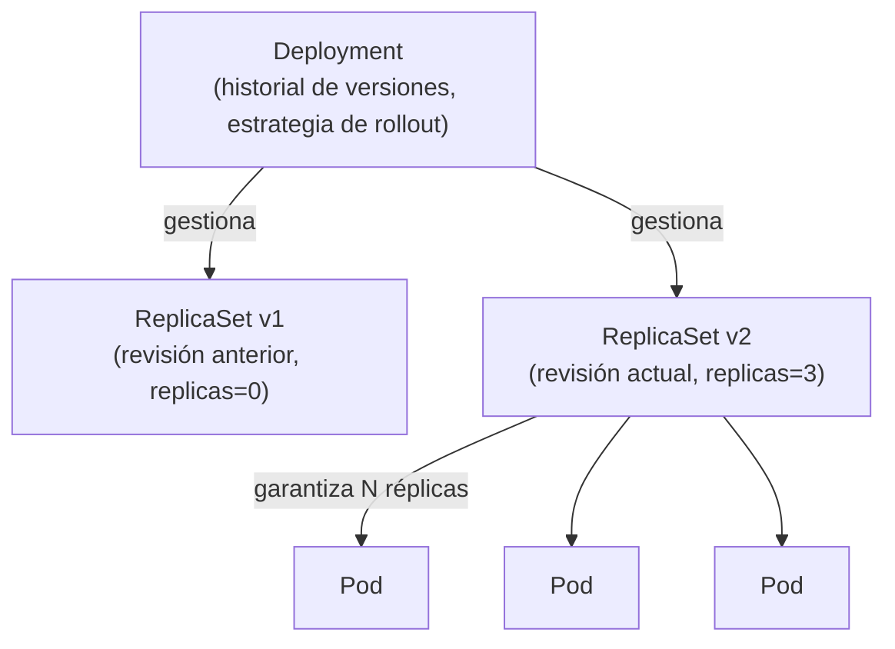

# 04 — Deployments y ReplicaSets

Los [[03 - Pods|Pods]] son efímeros y no se auto-reparan por sí solos: si un Pod creado a mano muere, nadie lo vuelve a crear. El **Deployment** es el objeto que en la práctica gestiona las aplicaciones en Kubernetes: declara "quiero N réplicas de este Pod, siempre", y Kubernetes se encarga del resto.

## La jerarquía Deployment → ReplicaSet → Pod



- Un **ReplicaSet** garantiza que un número fijo de réplicas de un Pod estén corriendo en todo momento — si una muere, crea otra.
- Un **Deployment** gestiona ReplicaSets, no Pods directamente. Cada vez que cambia la plantilla del Pod (nueva imagen, nueva variable de entorno), el Deployment crea un **nuevo** ReplicaSet y hace la transición gradual del viejo al nuevo — esto es lo que habilita rolling updates y rollbacks.

En la práctica **casi nunca se crea un ReplicaSet directamente**; siempre se declara un Deployment y Kubernetes gestiona el ReplicaSet por debajo.

## Manifiesto de un Deployment

```yaml
apiVersion: apps/v1
kind: Deployment
metadata:
  name: api-modelo
  labels:
    app: api-modelo
spec:
  replicas: 3
  selector:
    matchLabels:
      app: api-modelo
  template:
    metadata:
      labels:
        app: api-modelo
    spec:
      containers:
        - name: api-modelo
          image: mi-registro/api-modelo:1.2.0
          ports:
            - containerPort: 8000
          resources:
            requests: { cpu: "250m", memory: "512Mi" }
            limits: { cpu: "1", memory: "1Gi" }
          readinessProbe:
            httpGet: { path: /ready, port: 8000 }
```

`selector.matchLabels` debe coincidir exactamente con `template.metadata.labels` — es cómo el Deployment sabe qué Pods le pertenecen. `template` es, en esencia, la especificación de un Pod embebida dentro del Deployment.

```bash
kubectl apply -f deployment.yaml
kubectl get deployments
kubectl get replicasets
kubectl get pods -l app=api-modelo   # filtrar por label
```

## Escalar manualmente

```bash
kubectl scale deployment api-modelo --replicas=5

# o editando replicas en el YAML y volviendo a aplicar
```

Para escalado automático basado en métricas, ver [[08 - Escalado - HPA, VPA y Cluster Autoscaler]].

## Estrategias de despliegue

```yaml
spec:
  strategy:
    type: RollingUpdate   # default
    rollingUpdate:
      maxUnavailable: 1   # cuántos Pods pueden estar caídos durante el rollout
      maxSurge: 1          # cuántos Pods extra puede crear temporalmente por encima de `replicas`
```

| Estrategia | Cómo funciona | Cuándo usarla |
|---|---|---|
| **Recreate** | Mata todos los Pods viejos antes de crear los nuevos | Cuando la app no soporta correr dos versiones simultáneas (ej. migraciones de esquema incompatibles) — implica downtime |
| **RollingUpdate** (default) | Reemplaza Pods gradualmente, siempre manteniendo un mínimo de réplicas disponibles | El caso general — sin downtime |
| **Blue-Green** | No es nativo de Kubernetes; se implementa con dos Deployments completos (`blue`/`green`) y se cambia el selector del [[05 - Services y Networking|Service]] de uno a otro de golpe | Cuando se necesita una transición instantánea y un rollback trivial (cambiar el selector de vuelta) |
| **Canary** | Se despliega una segunda versión con pocas réplicas junto a la estable, recibiendo solo una fracción del tráfico | Validar una versión nueva con tráfico real limitado antes de un rollout completo — típicamente orquestado con Argo Rollouts o un service mesh, no con Deployments puros |

## Rollouts y Rollbacks

```bash
# ver el estado de un rollout en progreso
kubectl rollout status deployment/api-modelo

# historial de revisiones
kubectl rollout history deployment/api-modelo

# revertir a la revisión anterior
kubectl rollout undo deployment/api-modelo

# revertir a una revisión específica
kubectl rollout undo deployment/api-modelo --to-revision=2

# pausar un rollout a medio camino (útil para canary manual)
kubectl rollout pause deployment/api-modelo
kubectl rollout resume deployment/api-modelo
```

Esto es lo que hace a Kubernetes especialmente valioso para servir modelos de ML en producción (ver [[11 - Kubernetes para Servir Modelos de ML]]): si una nueva versión del modelo empeora las predicciones o tiene un bug, `rollout undo` regresa al estado anterior en segundos, sin reconstruir nada.

## Otros controladores de carga de trabajo (para contraste)

El Deployment no es el único controlador de más alto nivel; existen para patrones distintos:

| Controlador | Para qué |
|---|---|
| **Deployment** | Apps stateless, sin identidad fija entre réplicas (el caso general — APIs, servicios web) |
| **StatefulSet** | Apps con estado que necesitan identidad de red estable y almacenamiento persistente individual por réplica (bases de datos, brokers) |
| **DaemonSet** | Exactamente un Pod por nodo del clúster (agentes de logging/monitoreo — ver [[12 - Observabilidad en Kubernetes]]) |
| **Job** | Corre un Pod hasta que termine con éxito, una sola vez (ej. una tarea batch de entrenamiento) |
| **CronJob** | Igual que Job, pero programado periódicamente (ej. un reentrenamiento nocturno) |

```yaml
# ejemplo mínimo de Job — una corrida de entrenamiento que se ejecuta una vez y termina
apiVersion: batch/v1
kind: Job
metadata:
  name: entrenamiento-modelo
spec:
  template:
    spec:
      containers:
        - name: entrenamiento
          image: mi-registro/entrenamiento:1.0
          command: ["python", "train.py"]
      restartPolicy: OnFailure
  backoffLimit: 3
```

## Ver también

- [[03 - Pods]]
- [[05 - Services y Networking]]
- [[08 - Escalado - HPA, VPA y Cluster Autoscaler]]
- [[11 - Kubernetes para Servir Modelos de ML]]
