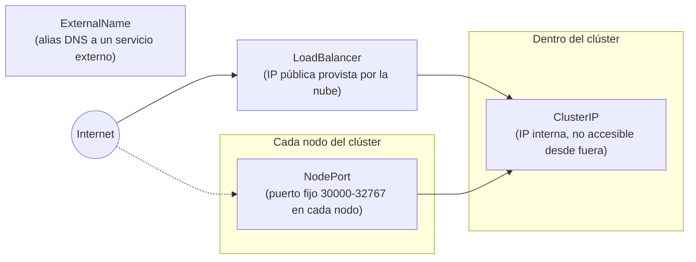

# 05 — Services y Networking

Los Pods son efímeros: cada vez que un [[04 - Deployments y ReplicaSets|Deployment]] reemplaza un Pod, este recibe una **IP nueva**. Ningún cliente debería depender de la IP de un Pod individual. El **Service** resuelve esto: da una identidad de red **estable** a un grupo de Pods, sin importar cuántas veces cambien.

## Cómo un Service encuentra sus Pods — selectors

```yaml
apiVersion: v1
kind: Service
metadata:
  name: api-modelo-svc
spec:
  selector:
    app: api-modelo      # debe coincidir con las labels del Deployment/Pod
  ports:
    - port: 80            # puerto que expone el Service
      targetPort: 8000     # puerto real del contenedor
  type: ClusterIP
```

El Service no apunta a Pods específicos por nombre; selecciona **dinámicamente** cualquier Pod cuyas labels coincidan con `selector`. Kubernetes mantiene actualizada la lista de Pods que hacen match en un objeto `Endpoints` (o `EndpointSlice`), y `kube-proxy` en cada nodo usa esa lista para enrutar el tráfico — así el Service sigue funcionando aunque los Pods detrás cambien constantemente.

```bash
kubectl get services
kubectl get endpoints api-modelo-svc
```

## Los cuatro tipos de Service



| Tipo | Alcance | Cuándo usarlo |
|---|---|---|
| **ClusterIP** (default) | Solo accesible dentro del clúster | Comunicación interna entre microservicios — el caso más común |
| **NodePort** | Expone un puerto fijo (30000-32767) en **cada** nodo del clúster | Pruebas rápidas o clústeres on-prem sin balanceador de nube |
| **LoadBalancer** | Aprovisiona un balanceador de carga externo del proveedor de nube (ELB, GCLB, etc.) | Exponer un servicio a internet en un clúster gestionado (EKS/GKE/AKS) |
| **ExternalName** | Mapea el Service a un nombre DNS externo, sin proxy | Referenciar un servicio fuera del clúster (ej. una base de datos gestionada) con el mismo mecanismo de descubrimiento interno |

```yaml
# NodePort
spec:
  type: NodePort
  ports:
    - port: 80
      targetPort: 8000
      nodePort: 30080   # opcional; si se omite, Kubernetes asigna uno libre

# LoadBalancer (en un clúster gestionado en la nube)
spec:
  type: LoadBalancer
  ports:
    - port: 80
      targetPort: 8000
```

## DNS interno — service discovery automático

Kubernetes corre **CoreDNS** dentro del clúster, que registra automáticamente un nombre DNS por cada Service:

```
<nombre-del-service>.<namespace>.svc.cluster.local
```

```bash
# desde cualquier Pod del mismo namespace, esto ya funciona:
curl http://api-modelo-svc/predict

# desde otro namespace, hay que ser explícito:
curl http://api-modelo-svc.ml-staging.svc.cluster.local/predict
```

Esto es lo que le permite a un frontend, por ejemplo, llamar a `http://api-modelo-svc/predict` sin jamás conocer una IP — ni siquiera necesita saber cuántas réplicas hay detrás; el Service y `kube-proxy` reparten la carga automáticamente entre todos los Pods sanos (los que pasan el `readinessProbe`, ver [[03 - Pods#Probes - Liveness, Readiness y Startup]]).

## Ingress — enrutamiento HTTP(S) a nivel de aplicación

Un `LoadBalancer` por Service se vuelve costoso e impráctico si hay muchos servicios (cada uno pide un balanceador de nube distinto). El **Ingress** resuelve esto: es una capa de enrutamiento HTTP/HTTPS que multiplexa **un solo** punto de entrada externo hacia muchos Services internos, basándose en el host o el path de la petición.

```yaml
apiVersion: networking.k8s.io/v1
kind: Ingress
metadata:
  name: api-ingress
  annotations:
    nginx.ingress.kubernetes.io/rewrite-target: /
spec:
  rules:
    - host: modelos.miempresa.com
      http:
        paths:
          - path: /clasificador
            pathType: Prefix
            backend:
              service:
                name: api-clasificador-svc
                port: { number: 80 }
          - path: /regresor
            pathType: Prefix
            backend:
              service:
                name: api-regresor-svc
                port: { number: 80 }
```

Un objeto `Ingress` por sí solo no hace nada — necesita un **Ingress Controller** corriendo en el clúster (NGINX Ingress Controller, Traefik, o el nativo de la nube como AWS ALB Ingress Controller) que efectivamente lea esas reglas y las aplique. Es habitual que el Ingress Controller también termine TLS/HTTPS (certificados vía cert-manager), centralizando esa configuración en un solo lugar en vez de en cada Service.

## Comunicación Pod-a-Pod — el modelo de red plano

Kubernetes exige (vía su especificación de red, implementada por plugins CNI como Calico, Cilium o Flannel) que **todo Pod pueda comunicarse con todo Pod** del clúster usando su IP directamente, sin NAT — sin importar en qué nodo estén. Esto simplifica enormemente el modelo mental: dentro del clúster, la red se comporta como una sola red plana; el aislamiento entre aplicaciones se logra con [[10 - Seguridad y RBAC#NetworkPolicies|NetworkPolicies]], no con la topología de red en sí.

## Ver también

- [[03 - Pods]]
- [[04 - Deployments y ReplicaSets]]
- [[10 - Seguridad y RBAC]]
- [[11 - Kubernetes para Servir Modelos de ML]]
