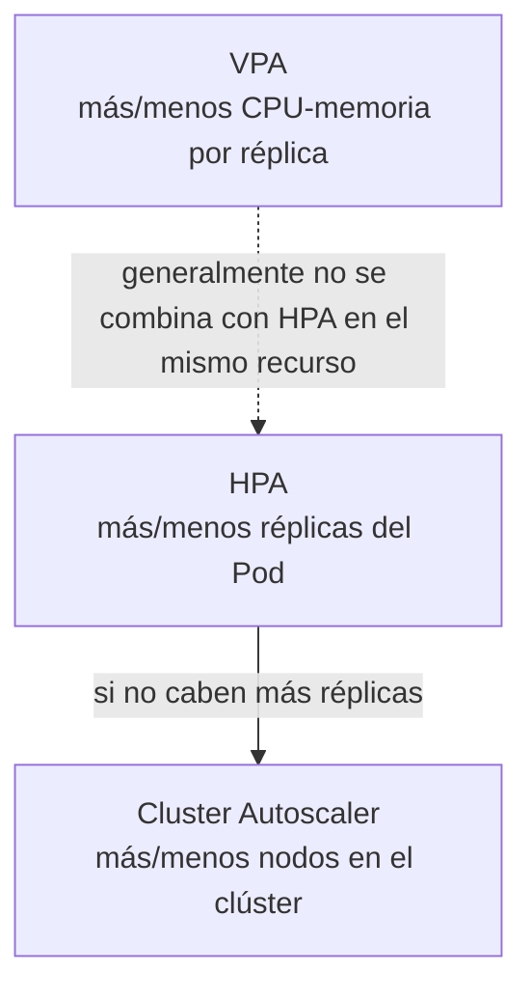

# 08 — Escalado: HPA, VPA y Cluster Autoscaler

Escalar manualmente con `kubectl scale` (ver [[04 - Deployments y ReplicaSets#Escalar manualmente]]) funciona para ajustes puntuales, pero no reacciona a la demanda real en tiempo real. Kubernetes ofrece tres mecanismos de autoescalado, cada uno resolviendo un eje distinto del problema.



## Horizontal Pod Autoscaler (HPA) — más o menos réplicas

El más usado en producción: ajusta el número de réplicas de un [[04 - Deployments y ReplicaSets|Deployment]] según una métrica observada (por defecto, uso de CPU).

```yaml
apiVersion: autoscaling/v2
kind: HorizontalPodAutoscaler
metadata:
  name: api-modelo-hpa
spec:
  scaleTargetRef:
    apiVersion: apps/v1
    kind: Deployment
    name: api-modelo
  minReplicas: 2
  maxReplicas: 10
  metrics:
    - type: Resource
      resource:
        name: cpu
        target:
          type: Utilization
          averageUtilization: 70   # escalar si el uso promedio de CPU supera 70% de los `requests`
```

```bash
kubectl autoscale deployment api-modelo --cpu-percent=70 --min=2 --max=10   # equivalente imperativo
kubectl get hpa
kubectl describe hpa api-modelo-hpa
```

**Requisito importante:** el HPA basado en CPU/memoria necesita que el Deployment tenga `resources.requests` definido (ver [[03 - Pods#Requests y Limits de recursos]]) — el porcentaje de utilización se calcula relativo al request, no a un valor absoluto.

### Escalado por métricas personalizadas — el caso relevante para servir modelos

Para una API de inferencia (ver [[11 - Kubernetes para Servir Modelos de ML]]), CPU rara vez es la señal correcta de carga — es más útil escalar según **requests por segundo** o **longitud de la cola de peticiones**, expuestas como métricas de Prometheus (ver [[12 - Observabilidad en Kubernetes]]):

```yaml
apiVersion: autoscaling/v2
kind: HorizontalPodAutoscaler
metadata:
  name: api-modelo-hpa
spec:
  scaleTargetRef:
    apiVersion: apps/v1
    kind: Deployment
    name: api-modelo
  minReplicas: 2
  maxReplicas: 20
  metrics:
    - type: Pods
      pods:
        metric:
          name: http_requests_per_second   # expuesta vía Prometheus Adapter
        target:
          type: AverageValue
          averageValue: "50"
```

Esto requiere un componente adicional (**Prometheus Adapter** o **KEDA**) que traduzca métricas de Prometheus al formato que el HPA entiende (`custom.metrics.k8s.io`) — el HPA nativo solo sabe leer `metrics.k8s.io` (CPU/memoria) de fábrica.

## Vertical Pod Autoscaler (VPA) — más o menos recursos por réplica

En vez de agregar réplicas, el VPA ajusta los `requests`/`limits` de CPU y memoria de los Pods existentes, basándose en su consumo histórico real.

```yaml
apiVersion: autoscaling.k8s.io/v1
kind: VerticalPodAutoscaler
metadata:
  name: api-modelo-vpa
spec:
  targetRef:
    apiVersion: apps/v1
    kind: Deployment
    name: api-modelo
  updatePolicy:
    updateMode: "Auto"   # Off (solo recomienda) | Initial | Recreate | Auto
```

Es especialmente útil para cargas de trabajo de ML con consumo de memoria difícil de predecir a priori (un modelo grande cargado en memoria) — el VPA "aprende" el uso real y ajusta el request para evitar tanto el desperdicio (request demasiado alto) como los `OOMKilled` (request demasiado bajo).

> **No se recomienda combinar HPA y VPA sobre la misma métrica (CPU) en el mismo recurso** — competirían entre sí (uno cambiando réplicas, el otro cambiando el tamaño de cada réplica, ambos reaccionando al mismo síntoma). Es común usar VPA en modo `Off` (solo recomendaciones) junto con HPA activo, o usar VPA para cargas batch/Jobs que no tienen HPA en absoluto.

## Cluster Autoscaler — más o menos nodos

Si el HPA quiere crear más réplicas pero **no hay espacio** en los nodos existentes, los Pods nuevos quedan en estado `Pending`. El **Cluster Autoscaler** resuelve esto a nivel de infraestructura: añade nodos nuevos al clúster cuando detecta Pods sin poder programarse por falta de recursos, y remueve nodos subutilizados cuando ya no se necesitan.

```bash
# en un clúster gestionado (ej. EKS), el Cluster Autoscaler se configura sobre un Auto Scaling Group / node pool existente
kubectl get pods -o wide   # Pods en estado Pending por falta de recursos son la señal de que el Cluster Autoscaler debería actuar
```

El Cluster Autoscaler es específico del proveedor de infraestructura (AWS, GCP, Azure) porque necesita poder crear/destruir máquinas reales — en clústeres gestionados (ver [[13 - Managed Kubernetes, CI-CD y Buenas Prácticas]]) suele activarse como un addon con unos pocos parámetros, no configurarse desde cero.

## Los tres mecanismos juntos

```
1. Sube el tráfico → el HPA agrega réplicas del Pod (horizontal)
2. Si no caben en los nodos actuales → el Cluster Autoscaler agrega nodos nuevos
3. El VPA (si está activo) ajusta el tamaño de request/limit de cada réplica según su consumo real observado
```

Esta combinación es la razón por la que "escalar automáticamente según demanda real, sin que un humano aprovisione servidores" (la promesa central de Kubernetes para servir modelos en producción — ver [[09-MLOps-en-Profundidad#Kubernetes]]) funciona de punta a punta: desde el Pod individual hasta el clúster físico.

## Ver también

- [[04 - Deployments y ReplicaSets]]
- [[11 - Kubernetes para Servir Modelos de ML]]
- [[12 - Observabilidad en Kubernetes]]
- [[13 - Managed Kubernetes, CI-CD y Buenas Prácticas]]
