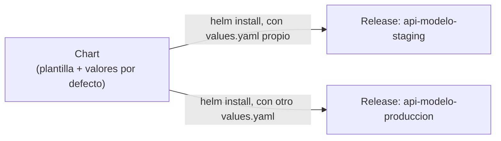

# 09 — Helm: Gestión de Paquetes para Kubernetes

Una aplicación real rara vez es un solo YAML: un Deployment, un Service, un Ingress, un ConfigMap, un Secret, un HPA — todos con valores que cambian entre entornos (`staging` tiene 2 réplicas, `producción` tiene 10; cada uno con su propio dominio, límites de recursos, etc.). Mantener copias manuales de estos YAML por entorno es propenso a errores y difícil de versionar. **Helm** es el gestor de paquetes de facto para Kubernetes — el equivalente de `pip`/`npm` pero para manifiestos de K8s.

## Los tres conceptos centrales



- **Chart:** un paquete de plantillas YAML parametrizadas (usa la sintaxis de templates de Go) más un esquema de valores por defecto. Es la unidad distribuible — como un paquete de `pip`.
- **Values:** el archivo (`values.yaml`) que rellena los parámetros de las plantillas de un Chart para un caso concreto.
- **Release:** una instancia concreta de un Chart, desplegada en un clúster con un conjunto específico de `values` — el mismo Chart puede tener múltiples Releases (`staging`, `producción`) coexistiendo en el mismo clúster o en clústeres distintos.

## Instalación y uso básico

```bash
brew install helm    # o choco install kubernetes-helm en Windows

# agregar un repositorio de charts públicos (ej. Bitnami, prometheus-community)
helm repo add bitnami https://charts.bitnami.com/bitnami
helm repo update

# buscar un chart
helm search repo postgresql

# instalar un chart público (ej. una base de datos PostgreSQL lista para usar)
helm install mi-postgres bitnami/postgresql --set auth.password=secreto123

# listar releases activas
helm list

# ver el estado y los valores de una release
helm status mi-postgres
helm get values mi-postgres

# actualizar una release existente con nuevos valores
helm upgrade mi-postgres bitnami/postgresql --set auth.password=nuevo123

# revertir a una revisión anterior (igual que kubectl rollout undo, pero para toda la release)
helm rollback mi-postgres 1

# desinstalar
helm uninstall mi-postgres
```

## Estructura de un Chart propio

```
api-modelo-chart/
├── Chart.yaml           # metadata: nombre, versión, descripción
├── values.yaml          # valores por defecto
├── templates/
│   ├── deployment.yaml
│   ├── service.yaml
│   ├── ingress.yaml
│   ├── hpa.yaml
│   └── _helpers.tpl     # funciones/plantillas auxiliares reutilizables
└── charts/              # dependencias (sub-charts) empaquetadas
```

```yaml
# Chart.yaml
apiVersion: v2
name: api-modelo
description: Chart para desplegar la API de inferencia del modelo
version: 0.1.0
appVersion: "1.2.0"
```

```yaml
# values.yaml
replicaCount: 2
image:
  repository: mi-registro/api-modelo
  tag: "1.2.0"
resources:
  requests: { cpu: "250m", memory: "512Mi" }
  limits: { cpu: "1", memory: "1Gi" }
ingress:
  enabled: true
  host: modelos.miempresa.com
```

```yaml
# templates/deployment.yaml — usa la sintaxis de templates de Go ({{ }})
apiVersion: apps/v1
kind: Deployment
metadata:
  name: {{ .Release.Name }}-api-modelo
spec:
  replicas: {{ .Values.replicaCount }}
  selector:
    matchLabels:
      app: {{ .Release.Name }}-api-modelo
  template:
    metadata:
      labels:
        app: {{ .Release.Name }}-api-modelo
    spec:
      containers:
        - name: api-modelo
          image: "{{ .Values.image.repository }}:{{ .Values.image.tag }}"
          resources:
            {{- toYaml .Values.resources | nindent 12 }}
```

`{{ .Values.replicaCount }}` toma su valor de `values.yaml` (o de un `--set`/`-f` en la línea de comandos); `{{ .Release.Name }}` es una variable inyectada automáticamente por Helm con el nombre de la release, permitiendo que el mismo Chart genere nombres únicos por instancia sin editar las plantillas.

```bash
# desplegar el chart propio, con un archivo de valores distinto por entorno
helm install api-modelo-staging ./api-modelo-chart -f values-staging.yaml
helm install api-modelo-produccion ./api-modelo-chart -f values-produccion.yaml

# ver el YAML final que Helm generaría, sin aplicarlo (debug)
helm template ./api-modelo-chart -f values-staging.yaml

# validar que el chart es sintácticamente correcto
helm lint ./api-modelo-chart
```

## Por qué Helm importa para reproducibilidad y CI/CD

`helm template` renderiza el Chart a YAML plano sin tocar el clúster — esto permite revisar exactamente qué se va a desplegar antes de aplicarlo (útil en un pipeline de CI, ver [[13 - Managed Kubernetes, CI-CD y Buenas Prácticas]]). Una release de Helm es también más fácil de versionar y auditar que aplicar YAML sueltos con `kubectl apply -f`: cada `helm upgrade` queda registrado como una revisión con su propio `helm rollback`, análogo a cómo [[Machine Learning/46-Reproducibilidad-con-DVC|DVC]] versiona experimentos o cómo `MLflow/07 - Model Registry.md` versiona modelos — la misma idea de "versionar el estado desplegado", aplicada a infraestructura.

## Ver también

- [[02 - kubectl y el Modelo Declarativo]]
- [[04 - Deployments y ReplicaSets]]
- [[13 - Managed Kubernetes, CI-CD y Buenas Prácticas]]
