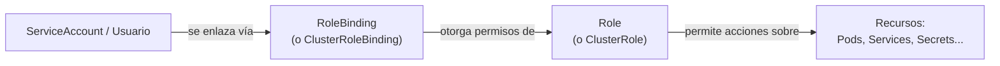

# 10 — Seguridad y RBAC

Un clúster de Kubernetes es, en esencia, una API con permisos de administrador sobre toda la infraestructura que gestiona — quién puede hacer qué contra esa API es una de las superficies de seguridad más críticas del sistema. Kubernetes controla esto con **RBAC (Role-Based Access Control)**.

## RBAC — los cuatro objetos



| Objeto | Alcance | Qué define |
|---|---|---|
| **Role** | Un namespace específico | Un conjunto de permisos (verbos: `get`, `list`, `create`, `delete`...) sobre tipos de recursos dentro de ese namespace |
| **ClusterRole** | Todo el clúster (o recursos sin namespace, como nodos) | Igual que Role, pero sin límite de namespace |
| **RoleBinding** | Un namespace | Asigna un Role (o ClusterRole) a un usuario/grupo/ServiceAccount, limitado a ese namespace |
| **ClusterRoleBinding** | Todo el clúster | Asigna un ClusterRole a nivel global |

```yaml
apiVersion: rbac.authorization.k8s.io/v1
kind: Role
metadata:
  namespace: ml-staging
  name: lector-pods
rules:
  - apiGroups: [""]
    resources: ["pods", "pods/log"]
    verbs: ["get", "list", "watch"]
```

```yaml
apiVersion: rbac.authorization.k8s.io/v1
kind: RoleBinding
metadata:
  name: dar-lectura-a-equipo-ml
  namespace: ml-staging
subjects:
  - kind: User
    name: dereck@miempresa.com
    apiGroup: rbac.authorization.k8s.io
roleRef:
  kind: Role
  name: lector-pods
  apiGroup: rbac.authorization.k8s.io
```

```bash
kubectl get roles -n ml-staging
kubectl get rolebindings -n ml-staging

# verificar si el usuario/ServiceAccount actual puede hacer algo específico (muy útil para debug)
kubectl auth can-i delete pods -n ml-staging
kubectl auth can-i create deployments --as=dereck@miempresa.com -n ml-staging
```

## ServiceAccounts — identidad para las aplicaciones, no para humanos

Los `Role`/`ClusterRole` no solo se asignan a usuarios humanos; las **aplicaciones que corren dentro del clúster** a menudo necesitan hablar con el `kube-apiserver` (por ejemplo, un operador que crea Pods, o un script que lista Secrets). Para eso existe el **ServiceAccount** — una identidad "de máquina" dentro del clúster.

```yaml
apiVersion: v1
kind: ServiceAccount
metadata:
  name: api-modelo-sa
  namespace: ml-staging
```

```yaml
spec:
  serviceAccountName: api-modelo-sa   # el Pod usa esta identidad al hablar con la API
  containers:
    - name: api-modelo
      image: mi-registro/api-modelo:1.0
```

Todo Pod usa **algún** ServiceAccount (si no se especifica, usa el `default` del namespace, que por buenas prácticas debería tener permisos mínimos o nulos). El principio de **menor privilegio** aplica igual que en cualquier sistema: un Pod que solo sirve predicciones de un modelo no necesita permiso para listar Secrets de todo el namespace — se le da exactamente el Role que necesita, nada más.

## NetworkPolicies — aislar tráfico entre Pods

Por defecto, dentro de un clúster **todo Pod puede hablar con todo Pod** (ver [[05 - Services y Networking#Comunicación Pod-a-Pod - el modelo de red plano]]). Una `NetworkPolicy` restringe eso explícitamente — es, en esencia, un firewall a nivel de Pod.

```yaml
apiVersion: networking.k8s.io/v1
kind: NetworkPolicy
metadata:
  name: solo-frontend-a-api-modelo
  namespace: ml-staging
spec:
  podSelector:
    matchLabels:
      app: api-modelo
  policyTypes:
    - Ingress
  ingress:
    - from:
        - podSelector:
            matchLabels:
              app: frontend
      ports:
        - protocol: TCP
          port: 8000
```

Esta política dice: "solo los Pods con label `app: frontend` pueden conectarse al puerto 8000 de los Pods con label `app: api-modelo`; todo el resto del tráfico entrante queda bloqueado". Requiere que el plugin de red (CNI) del clúster soporte `NetworkPolicy` (Calico y Cilium sí; Flannel básico, por defecto, no).

## Security Context — restringir lo que un contenedor puede hacer

```yaml
spec:
  securityContext:
    runAsNonRoot: true
    runAsUser: 1000
  containers:
    - name: api-modelo
      image: mi-registro/api-modelo:1.0
      securityContext:
        allowPrivilegeEscalation: false
        readOnlyRootFilesystem: true
        capabilities:
          drop: ["ALL"]
```

- `runAsNonRoot` / `runAsUser`: evita que el contenedor corra como `root` dentro de su propio namespace de usuario — reduce el impacto de un contenedor comprometido.
- `readOnlyRootFilesystem`: el filesystem del contenedor es de solo lectura salvo los [[07 - Volumes y Almacenamiento Persistente|Volumes]] montados explícitamente — previene que un atacante escriba binarios maliciosos dentro del contenedor en ejecución.
- `capabilities.drop: ["ALL"]`: elimina todas las capacidades de Linux que el contenedor no necesita explícitamente (una imagen web normal no necesita, por ejemplo, `NET_ADMIN`).

## Secrets y el resto del modelo de seguridad

El manejo de credenciales (`Secret`, integración con gestores externos como Vault) ya se cubrió en [[06 - ConfigMaps y Secrets#Secret]] — RBAC es el complemento: aunque un Secret exista, RBAC decide **quién** puede leerlo (`get`/`list` sobre el recurso `secrets`), lo cual es tan importante como cómo se almacena.

## Ver también

- [[05 - Services y Networking]]
- [[06 - ConfigMaps y Secrets]]
- [[13 - Managed Kubernetes, CI-CD y Buenas Prácticas]]
