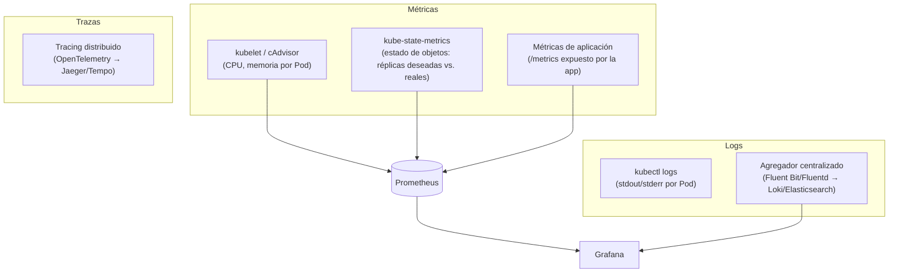

# 12 — Observabilidad en Kubernetes

Con decenas de Pods reprogramándose entre nodos, escalando automáticamente y reiniciándose solos, la observabilidad deja de ser opcional: sin ella es imposible saber si el clúster está sano o diagnosticar por qué un servicio está lento. Este archivo cubre cómo se instrumenta esto en la práctica, complementando el panorama conceptual de `Machine Learning/09-MLOps-en-Profundidad.md` (sección Prometheus/Grafana).

## Las tres capas de observabilidad en Kubernetes



## Métricas — Prometheus

**Prometheus** es el estándar de facto para métricas en Kubernetes: un servidor que hace *pull* periódico (scraping) de endpoints `/metrics` expuestos en formato de texto plano, y los almacena como series de tiempo.

```bash
# instalación típica vía Helm (ver 09 - Helm), usando el chart comunitario que trae Prometheus + Grafana + Alertmanager juntos
helm repo add prometheus-community https://prometheus-community.github.io/helm-charts
helm install monitoring prometheus-community/kube-prometheus-stack
```

### Fuentes de métricas dentro del clúster

- **cAdvisor** (embebido en el `kubelet`): expone uso de CPU/memoria/red **por contenedor**, sin que la aplicación tenga que hacer nada.
- **kube-state-metrics:** expone el **estado declarado** de los objetos de Kubernetes (réplicas deseadas de un Deployment vs. réplicas reales disponibles, Pods en `Pending`, PVCs sin enlazar) — es la fuente para alertar sobre "algo en el clúster no está en el estado que debería" sin mirar métricas de infraestructura.
- **Métricas de aplicación:** la propia app expone un endpoint `/metrics` (típicamente con una librería de cliente de Prometheus) con métricas de negocio — para una API de inferencia, esto es donde vive `http_requests_per_second`, `prediccion_latencia_segundos`, o un contador de predicciones por clase, que luego alimenta al HPA por métricas custom (ver [[08 - Escalado - HPA, VPA y Cluster Autoscaler#Escalado por métricas personalizadas - el caso relevante para servir modelos]]).

```yaml
# ServiceMonitor — le dice a Prometheus (vía el Operator) que scrapee este Service
apiVersion: monitoring.coreos.com/v1
kind: ServiceMonitor
metadata:
  name: api-modelo-monitor
spec:
  selector:
    matchLabels:
      app: api-modelo
  endpoints:
    - port: metrics
      interval: 15s
```

```bash
kubectl top nodes    # requiere metrics-server instalado — uso actual de CPU/memoria por nodo
kubectl top pods     # ídem, por Pod
```

## Logs — de `kubectl logs` a un agregador centralizado

`kubectl logs` (ver [[02 - kubectl y el Modelo Declarativo]]) funciona para debug puntual, pero no escala: los logs de un Pod se **pierden** cuando el Pod se elimina, y no hay forma de buscar "todos los errores 500 de las últimas 24 horas across 30 réplicas" sin agregación.

El patrón estándar es un **DaemonSet** (un Pod por nodo — ver [[04 - Deployments y ReplicaSets#Otros controladores de carga de trabajo (para contraste)]]) corriendo un recolector de logs (Fluent Bit/Fluentd) que lee los logs de **todos** los contenedores del nodo y los envía a un backend centralizado (Loki, Elasticsearch, o el servicio de logs nativo de la nube):

```yaml
apiVersion: apps/v1
kind: DaemonSet
metadata:
  name: fluent-bit
spec:
  selector:
    matchLabels: { app: fluent-bit }
  template:
    metadata:
      labels: { app: fluent-bit }
    spec:
      containers:
        - name: fluent-bit
          image: fluent/fluent-bit:latest
          volumeMounts:
            - name: varlog
              mountPath: /var/log
      volumes:
        - name: varlog
          hostPath:
            path: /var/log
```

Este es el caso de uso canónico de `hostPath` (ver [[07 - Volumes y Almacenamiento Persistente#hostPath - montar un directorio del nodo (usar con cautela)]]): el agente de logging necesita leer archivos del nodo directamente, algo que ningún otro tipo de aplicación debería hacer normalmente.

## Grafana — visualización

**Grafana** se conecta a Prometheus (y opcionalmente a Loki para logs) para construir dashboards. El chart `kube-prometheus-stack` mencionado arriba ya incluye dashboards preconstruidos para la salud del clúster (uso de nodos, estado de Pods, capacidad restante) listos para usar sin configuración adicional.

```bash
# acceder al Grafana instalado por el chart (vía port-forward, sin exponerlo públicamente)
kubectl port-forward svc/monitoring-grafana 3000:80
```

## Trazas distribuidas — cuándo se vuelven necesarias

Cuando una petición de inferencia atraviesa varios servicios (ej. un gateway → un servicio de features → el modelo → un servicio de post-procesamiento), las métricas y logs por separado no bastan para responder "¿en qué paso específico se fue la latencia?". Ahí entra el **tracing distribuido** (OpenTelemetry como estándar de instrumentación, Jaeger o Grafana Tempo como backend) — cada petición lleva un ID de traza que se propaga entre servicios, permitiendo reconstruir el camino completo con la latencia de cada salto.

## Ver también

- [[08 - Escalado - HPA, VPA y Cluster Autoscaler]]
- [[09 - Helm - Gestión de Paquetes para Kubernetes]]
- [[09-MLOps-en-Profundidad]] (en `Machine Learning/`, sección Prometheus/Grafana)
