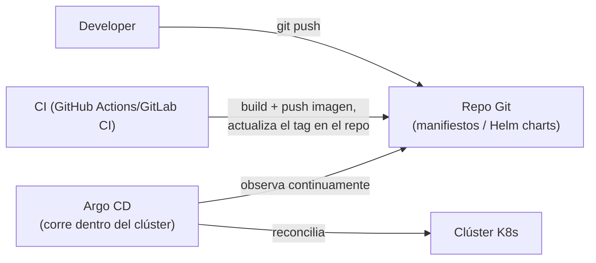

# 13 — Managed Kubernetes, CI/CD y Buenas Prácticas

Cierre del cheat-sheet: cómo se opera Kubernetes en la nube en la práctica, cómo se integra en un pipeline de CI/CD, los errores más comunes al empezar, y una comparativa final con Docker Swarm ahora que se cubrió todo lo que Kubernetes ofrece.

## Managed Kubernetes — EKS, GKE, AKS

Levantar y mantener el **control plane** (ver [[01 - Introducción y Arquitectura del Clúster#El Control Plane]]) por cuenta propia —parchar `etcd`, actualizar versiones de la API, garantizar alta disponibilidad del `kube-apiserver`— es trabajo operativo serio. Los tres proveedores de nube grandes ofrecen Kubernetes como servicio gestionado, donde ellos operan el control plane y el usuario solo gestiona los nodos worker (o ni eso, en modo serverless):

| Servicio | Proveedor | Notas |
|---|---|---|
| **EKS** (Elastic Kubernetes Service) | AWS | Se integra nativamente con IAM (para RBAC — ver [[10 - Seguridad y RBAC]]), ALB Ingress Controller, EBS/EFS para [[07 - Volumes y Almacenamiento Persistente\|Volumes]] |
| **GKE** (Google Kubernetes Engine) | Google Cloud | El más maduro históricamente (Google creó Kubernetes); modo **Autopilot** gestiona también los nodos, no solo el control plane |
| **AKS** (Azure Kubernetes Service) | Azure | Se integra con Azure AD para RBAC y Azure Monitor para observabilidad (ver [[12 - Observabilidad en Kubernetes]]) — complementa a `Machine Learning/51-Azure-ML.md` como alternativa de despliegue a Azure ML gestionado |

En los tres casos, el flujo de trabajo diario con `kubectl`/`helm` es **idéntico** al de un clúster local (`kind`/`minikube`) — la diferencia está en cómo se autentica (`aws eks update-kubeconfig`, `gcloud container clusters get-credentials`, `az aks get-credentials`) y en qué `StorageClass`/`Ingress Controller`/Cluster Autoscaler vienen preconfigurados.

```bash
# ejemplo: conectar kubectl a un clúster EKS existente
aws eks update-kubeconfig --name mi-cluster --region us-east-1
kubectl get nodes   # ya funciona igual que con cualquier otro clúster
```

## CI/CD con Kubernetes — el flujo GitOps

El patrón moderno recomendado no es "el pipeline de CI corre `kubectl apply` directamente contra producción" — es **GitOps**: el estado deseado del clúster vive en un repositorio Git, y un agente **dentro** del clúster (no el pipeline de CI) es quien aplica los cambios, comparando continuamente el repo contra el estado real (el mismo patrón de reconciliación de [[01 - Introducción y Arquitectura del Clúster#El bucle de reconciliación - la idea central de todo Kubernetes]], ahora aplicado a "todo el clúster" en vez de a un solo recurso).



- **CI (GitHub Actions/GitLab CI):** construye la imagen del contenedor, corre tests, la publica en un registro, y actualiza el tag de imagen en el repositorio de manifiestos (o de Helm values) — pero **no** toca el clúster directamente.
- **Argo CD** (la herramienta líder en este espacio): corre como un controlador dentro del clúster, observa el repo Git, y aplica automáticamente cualquier diferencia — brindando una fuente de verdad auditable (todo cambio al clúster pasa por un commit de Git) y facilitando rollbacks (`git revert` en vez de recordar comandos manuales).

```yaml
# ejemplo mínimo de una Application de Argo CD
apiVersion: argoproj.io/v1alpha1
kind: Application
metadata:
  name: api-modelo
spec:
  source:
    repoURL: https://github.com/miempresa/manifiestos-k8s
    path: api-modelo
    targetRevision: main
  destination:
    server: https://kubernetes.default.svc
    namespace: ml-produccion
  syncPolicy:
    automated:
      prune: true
      selfHeal: true   # revierte automáticamente cambios manuales hechos fuera de Git
```

Este flujo cierra exactamente el paso 7-8 del pipeline MLOps descrito en `Machine Learning/09-MLOps-en-Profundidad.md#El flujo de herramientas MLOps de punta a punta` ("Automatización del despliegue → CI/CD + Argo CD" → "Infraestructura de servicio en producción → Kubernetes").

## Troubleshooting común

| Síntoma | Causa probable | Dónde investigar |
|---|---|---|
| `Pod` en `Pending` indefinidamente | Recursos insuficientes en el clúster, o un `PersistentVolumeClaim` que no encuentra un `PersistentVolume` | `kubectl describe pod` → sección `Events`; ver [[07 - Volumes y Almacenamiento Persistente]] |
| `ImagePullBackOff` | Imagen inexistente/mal escrita, o falta `imagePullSecrets` para un registro privado | `kubectl describe pod`; ver [[06 - ConfigMaps y Secrets#imagePullSecrets - un tipo especial de Secret]] |
| `CrashLoopBackOff` | El proceso dentro del contenedor termina con error al arrancar | `kubectl logs --previous`; ver [[02 - kubectl y el Modelo Declarativo]] |
| Pod `Running` pero el Service no le manda tráfico | Las `labels` del Pod no coinciden con el `selector` del Service, o el `readinessProbe` nunca pasa | `kubectl get endpoints`, `kubectl describe pod` (sección probes); ver [[05 - Services y Networking]] |
| `OOMKilled` | El contenedor excedió su `limits.memory` | Revisar consumo real vs. límite declarado; considerar VPA (ver [[08 - Escalado - HPA, VPA y Cluster Autoscaler#Vertical Pod Autoscaler (VPA) - más o menos recursos por réplica]]) |
| `kubectl` no responde / timeouts | Contexto apuntando al clúster equivocado, o problema de red/VPN hacia el `kube-apiserver` | `kubectl config current-context`; ver [[02 - kubectl y el Modelo Declarativo#Instalación y contexto]] |

```bash
# el flujo de diagnóstico estándar, en orden
kubectl get pods                          # ¿qué Pod está mal?
kubectl describe pod <nombre>              # eventos: por qué no arrancó/se programó
kubectl logs <nombre> [--previous]         # qué dijo la app antes de morir
kubectl get events --sort-by='.lastTimestamp' -n <namespace>   # eventos recientes de todo el namespace
```

## Buenas prácticas resumidas

- Definir siempre `requests`/`limits` de recursos (ver [[03 - Pods#Requests y Limits de recursos]]) — sin ellos, el scheduler y el HPA no pueden razonar sobre capacidad.
- Definir `readinessProbe` en todo servicio expuesto por un `Service` — evita mandar tráfico a un Pod que aún no está listo.
- Nunca guardar credenciales en variables de entorno hardcodeadas en el YAML de la aplicación — usar `Secret` (o mejor, un gestor externo, ver [[06 - ConfigMaps y Secrets#Secret]]).
- Aplicar el principio de menor privilegio con RBAC (ver [[10 - Seguridad y RBAC]]) — especialmente para `ServiceAccount`s usados por aplicaciones automatizadas.
- Preferir Helm (ver [[09 - Helm - Gestión de Paquetes para Kubernetes]]) sobre YAML sueltos en cuanto exista más de un entorno (`staging`/`producción`).
- Versionar todos los manifiestos en Git y adoptar GitOps en cuanto el equipo crezca más allá de una sola persona desplegando manualmente.

## Comparativa final: Kubernetes vs. Docker Swarm

Retomando la comparación de `Docker/Orchestration and Scalability.md`, ahora con el detalle completo de lo que Kubernetes ofrece:

| | Docker Swarm | Kubernetes |
|---|---|---|
| Curva de aprendizaje | Baja | Alta — pero la inversión se amortiza en clústeres grandes/complejos |
| Autoescalado nativo | Manual (`docker service scale`) | HPA/VPA/Cluster Autoscaler automáticos (ver [[08 - Escalado - HPA, VPA y Cluster Autoscaler]]) |
| Gestión de configuración/secretos | Básica | ConfigMaps/Secrets + integraciones con gestores externos (ver [[06 - ConfigMaps y Secrets]]) |
| Ecosistema de ML/serving | Prácticamente ninguno | KServe, Seldon Core, Kubeflow (ver [[11 - Kubernetes para Servir Modelos de ML]]) |
| Adopción en la nube | Limitada | Estándar en EKS/GKE/AKS — la opción por defecto en toda nube pública mayor |
| Cuándo elegirlo | Proyectos pequeños/medianos, equipo ya cómodo con Docker, sin necesidad de las capacidades avanzadas | Cualquier despliegue de producción a escala real, especialmente si involucra servir modelos de ML con necesidades de escalado/observabilidad serias |

Para el objetivo de MLOps de este vault, Kubernetes es la pieza de infraestructura que sostiene todo lo demás en producción: Docker empaqueta (ver `Docker/`), MLflow versiona y registra modelos, DVC versiona datos, Airflow/Kubeflow orquesta pipelines, y Kubernetes es donde todo eso finalmente **corre a escala**.

## Ver también

- [[01 - Introducción y Arquitectura del Clúster]]
- [[09 - Helm - Gestión de Paquetes para Kubernetes]]
- [[10 - Seguridad y RBAC]]
- [[11 - Kubernetes para Servir Modelos de ML]]
- [[12 - Observabilidad en Kubernetes]]
- [[09-MLOps-en-Profundidad]] (en `Machine Learning/`)
