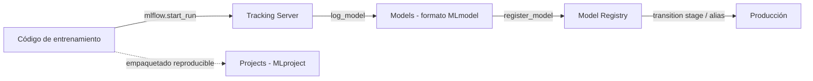

# 01 — Introducción y Arquitectura General

> Este cheat-sheet profundiza en la sintaxis y la lógica interna de MLflow. Para el enfoque operativo aplicado a un proyecto real, ver [[15-MLflow-en-Profundidad]] en `Machine Learning/`.

## ¿Qué es MLflow?

**MLflow** es una plataforma open-source para gestionar el ciclo de vida completo de Machine Learning: experimentación, reproducibilidad, empaquetado y despliegue. Nació en Databricks (2018) y hoy es agnóstica de librería (funciona igual con scikit-learn, PyTorch, XGBoost, Spark ML, LLMs, etc.) y agnóstica de infraestructura (corre local, on-premise o en cualquier nube).

El problema que resuelve: sin una herramienta como MLflow, un equipo de ML termina con:

- Notebooks con celdas re-ejecutadas fuera de orden y resultados que no se pueden reproducir.
- Hojas de Excel o documentos manuales comparando métricas de distintos entrenamientos.
- Modelos guardados como `model_v2_final_FINAL.pkl` sin saber qué hiperparámetros los generaron.
- Ningún registro de qué versión de modelo está en producción ni cómo hacer rollback.

## Los cuatro componentes

MLflow **no es una sola herramienta monolítica** — es una suite de cuatro componentes independientes. Puedes adoptar solo uno (típicamente Tracking) sin usar los demás.

| Componente | Qué resuelve | Analogía |
|---|---|---|
| **Tracking** | Registrar parámetros, métricas, artefactos y código de cada ejecución de entrenamiento | Un "laboratorio notebook" digital y consultable |
| **Projects** | Empaquetar código de ML en un formato reproducible, con su entorno y punto de entrada | Similar en espíritu a `pyproject.toml`, pero enfocado en *cómo ejecutar* no solo en dependencias |
| **Models** | Formato estándar para empaquetar modelos entrenados, servibles desde múltiples plataformas | Un "contenedor universal" para modelos, independiente del framework que los entrenó |
| **Model Registry** | Control de versiones y ciclo de vida de modelos (staging, producción, archivado) | Un "Git para modelos", con historial y capacidad de rollback |



## Instalación

```bash
pip install mlflow

# Con extras según lo que necesites:
pip install mlflow[extras]        # incluye dependencias opcionales (auth, gateway, etc.)
pip install "mlflow[extras]" boto3 psycopg2-binary  # para S3 + Postgres
```

Verificación:

```bash
mlflow --version
```

## Quickstart mínimo

El flujo más básico posible — sin servidor, todo local en la carpeta `./mlruns`:

```python
import mlflow

# Sin configurar nada, MLflow crea ./mlruns/ en el directorio actual
with mlflow.start_run():
    mlflow.log_param("alpha", 0.5)
    mlflow.log_metric("rmse", 0.42)
    mlflow.log_artifact("config.yaml")
```

Para visualizar lo registrado, se levanta la UI localmente:

```bash
mlflow ui
# por defecto en http://127.0.0.1:5000
```

## Los tres modos de despliegue

De menor a mayor madurez de equipo:

1. **Local con `file:./mlruns`**: cada quien tiene sus propios experimentos en disco, no compartidos. Válido para experimentación individual o prototipos.
2. **Servidor de Tracking centralizado**: un proceso `mlflow server` con una base de datos relacional como *backend store* (Postgres/MySQL) y almacenamiento de objetos como *artifact store* (S3, Azure Blob, GCS). Todo el equipo apunta al mismo servidor. Es el estándar para trabajo colaborativo — se profundiza en [[03 - Tracking - Servidor, Backend Store y Artifact Store]].
3. **Managed MLflow (Databricks u otro proveedor)**: el servidor, la base de datos y el almacenamiento los opera el proveedor; tú solo usas la API.

## Conceptos clave que aparecen en todo el resto del cheat-sheet

- **Experiment**: una carpeta lógica que agrupa runs relacionados (ej. `"claro-rd-demand-forecast"`). Tiene un `experiment_id` y un nombre único.
- **Run**: una ejecución individual dentro de un experiment. Cada run tiene un `run_id` único (UUID), un estado (`RUNNING`, `FINISHED`, `FAILED`, `KILLED`) y timestamps de inicio/fin.
- **Tracking URI**: la dirección (local o remota) donde MLflow guarda/lee metadatos de tracking. Puede ser una ruta de archivo (`file:./mlruns`), una URL de servidor (`http://host:5000`) o una base de datos (`postgresql://...`).
- **Registry URI**: la dirección del Model Registry — por defecto es la misma que el Tracking URI, pero se puede separar.
- **Artifact**: cualquier archivo asociado a un run (modelo serializado, gráficas, datasets, configs).

## Dónde encaja MLflow y dónde no

MLflow cubre tracking, empaquetado y registro de modelos. **No** reemplaza:

- Un **orquestador de pipelines** (Airflow, Prefect) — no decide *cuándo* correr un entrenamiento, solo registra *qué pasó* cuando corre.
- Un **feature store** (Feast) — no gestiona features reutilizables entre modelos.
- Un **sistema de monitoreo de producción** (Evidently, Prometheus/Grafana) — Tracking registra métricas de entrenamiento/evaluación offline, no drift ni performance en tiempo real sobre tráfico productivo.
- Un **servidor de inferencia de alto rendimiento** por sí solo — `mlflow models serve` es útil para pruebas; en producción de alto volumen se combina con contenedores propios detrás de un balanceador.

## Ver también

- [[02 - Tracking - Fundamentos y API de Logging]]
- [[06 - Model Format y Flavors]]
- [[07 - Model Registry]]
- [[15-MLflow-en-Profundidad]] (en `Machine Learning/`)
