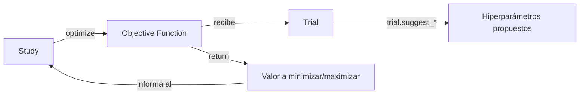

# 01 — Introducción y Conceptos Fundamentales

> Este cheat-sheet profundiza en la sintaxis y la lógica interna de Optuna. Para el enfoque comparativo (Grid Search vs. Random Search vs. Optuna) aplicado a un caso real, ver [[45-Optimizacion-de-Hiperparametros]] en `Machine Learning/`.

## ¿Qué es Optuna?

**Optuna** es un framework open-source de optimización de hiperparámetros basado en **define-by-run**: en vez de declarar el espacio de búsqueda de antemano como una estructura estática (como hace `GridSearchCV`), el espacio se define dinámicamente dentro de la propia función objetivo, a medida que el código se ejecuta. Esto le permite soportar espacios de búsqueda condicionales de forma natural — algo que Grid/Random Search manejan mal.

El problema que resuelve: probar hiperparámetros a mano no escala, y Grid Search escala exponencialmente mal con el número de hiperparámetros. Optuna usa **optimización bayesiana** (por defecto, el algoritmo TPE) para aprender de los trials anteriores y decidir inteligentemente qué combinación probar después, en vez de explorar a ciegas.

## Instalación

```bash
pip install optuna

# Extras opcionales:
pip install optuna[optuna_dashboard]   # UI web para visualizar estudios en tiempo real
pip install optuna-integration          # integraciones con sklearn, LightGBM, MLflow, etc.
```

## La tríada conceptual: Study, Trial, Objective



- **Study**: la sesión de optimización completa. Contiene todos los trials, el sampler usado, la dirección de optimización (`minimize`/`maximize`), y expone `study.best_params`/`study.best_value` al final.
- **Trial**: una única evaluación de la función objetivo, con una combinación específica de hiperparámetros. Cada trial tiene un `trial.number`, un estado (`COMPLETE`, `PRUNED`, `FAIL`) y los valores sugeridos.
- **Objective function**: la función que el usuario define, que recibe un objeto `trial`, entrena/evalúa un modelo usando hiperparámetros sugeridos por ese trial, y retorna el valor numérico a optimizar.

## Quickstart mínimo

```python
import optuna

def objective(trial):
    x = trial.suggest_float("x", -10, 10)
    return (x - 2) ** 2   # función a minimizar (ejemplo trivial, sin ML de por medio)

study = optuna.create_study(direction="minimize")
study.optimize(objective, n_trials=100)

print(study.best_params)   # {'x': 2.00013...}
print(study.best_value)    # ~0.0
print(study.best_trial)    # objeto FrozenTrial completo
```

## Quickstart realista — con un modelo de ML

```python
import optuna
from sklearn.ensemble import RandomForestRegressor
from sklearn.metrics import mean_absolute_error

def objective(trial):
    params = {
        "n_estimators": trial.suggest_int("n_estimators", 100, 500),
        "max_depth": trial.suggest_int("max_depth", 3, 15),
        "learning_rate": trial.suggest_float("learning_rate", 0.01, 0.3, log=True),
    }
    model = XGBRegressor(**params)
    model.fit(X_train, y_train)
    preds = model.predict(X_val)
    return mean_absolute_error(y_val, preds)

study = optuna.create_study(direction="minimize", study_name="claro-rd-demand-tuning")
study.optimize(objective, n_trials=100, timeout=3600)   # timeout en segundos, lo que ocurra primero

print(f"Mejor MAE: {study.best_value:.4f}")
print(f"Mejores hiperparámetros: {study.best_params}")
```

## `direction` — minimizar vs. maximizar

```python
study = optuna.create_study(direction="minimize")   # ej. para MAE, RMSE, log loss
study = optuna.create_study(direction="maximize")   # ej. para accuracy, R², AUC
```

## `n_trials` vs. `timeout` — dos formas de detener la búsqueda

```python
study.optimize(objective, n_trials=100)              # detiene tras 100 trials completados
study.optimize(objective, timeout=1800)               # detiene tras 30 minutos, sin importar cuántos trials
study.optimize(objective, n_trials=100, timeout=1800) # lo que ocurra primero
```

## El algoritmo por defecto: TPE (Tree-structured Parzen Estimator)

Cuando no se especifica un `sampler`, Optuna usa `TPESampler`. La idea central: modela dos distribuciones de probabilidad a partir de los trials ya evaluados — una para las combinaciones que dieron **buenos** resultados y otra para las que dieron **malos** resultados — y usa esa comparación para proponer la siguiente combinación con mayor probabilidad de ser buena, en vez de muestrear a ciegas como Random Search. Se profundiza en [[03 - Samplers en Profundidad]].

## Panorama de todo lo que cubre este cheat-sheet

| Tema | Archivo |
|---|---|
| Definir qué hiperparámetros probar y en qué rango | [[02 - Definición del Espacio de Búsqueda]] |
| Elegir el algoritmo de búsqueda | [[03 - Samplers en Profundidad]] |
| Abandonar trials poco prometedores temprano | [[04 - Pruners en Profundidad]] |
| Persistir y paralelizar la búsqueda | [[05 - Persistencia y Ejecución Distribuida]] |
| Optimizar más de una métrica a la vez | [[06 - Optimización Multi-Objetivo]] |
| Entender visualmente los resultados | [[07 - Visualización y Análisis de Resultados]] |
| Usar Optuna con sklearn, LightGBM, MLflow | [[08 - Integraciones con Frameworks de ML]] |
| Control fino del proceso de búsqueda | [[09 - Callbacks, Constraints y Configuración Avanzada]] |
| Uso desde línea de comandos | [[10 - CLI Reference]] |
| Errores comunes y comparativa con otras librerías | [[11 - Buenas Prácticas, Errores Comunes y Comparativa]] |

## Ver también

- [[45-Optimizacion-de-Hiperparametros]] (en `Machine Learning/`)
- [[15-MLflow-en-Profundidad]] (en `Machine Learning/`)
- `MLflow/10 - Hyperparameter Tuning con MLflow.md`
