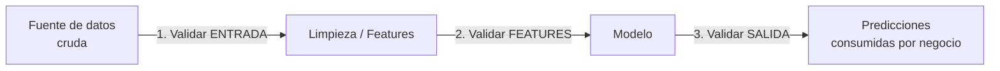

# 10 — Buenas Prácticas y Pandera en Producción

> Cierre del cheat-sheet. Se apoya en todos los archivos anteriores.

## Dónde ubicar validaciones en un pipeline de ML — los tres puntos críticos



1. **Entrada (frontera del sistema)**: validar inmediatamente al recibir datos de una fuente externa (SQL, API, CSV subido por un usuario) — es el punto donde datos corruptos entran al sistema, y el más barato para detenerlos antes de que se propaguen.
2. **Post-feature-engineering**: validar después de generar features derivadas — una transformación con un bug (una división por cero silenciosa, un join que duplica filas) puede introducir corrupción que no estaba en los datos crudos originales.
3. **Salida (antes de servir predicciones)**: validar que las predicciones mismas están en un rango razonable — un modelo que de pronto predice valores absurdos (por un bug de preprocesamiento en producción distinto al de entrenamiento) debería bloquearse antes de llegar al negocio, no descubrirse días después.

## No validar solo una vez — cada frontera es una oportunidad de corrupción distinta

Un error común es validar solo la entrada cruda y asumir que "si entró bien, todo lo que sigue está bien" — pero un bug en la lógica de transformación puede corromper datos que entraron perfectamente válidos. Cada una de las tres fronteras del diagrama anterior necesita su propio esquema, aunque compartan columnas en común (ver herencia de esquemas en [[03 - DataFrameModel - API Basada en Clases]]).

## Versionar esquemas junto al código, no como configuración separada

```python
# schemas.py — esquemas versionados en el MISMO repositorio y proceso de review que el código que los usa
import pandera as pa
from pandera.typing import Series

class DatosCrudosV2(pa.DataFrameModel):
    office_id: Series[int] = pa.Field(gt=0)
    total_demand: Series[float] = pa.Field(ge=0)

    class Config:
        strict = True
```

Los esquemas de Pandera son código Python — se benefician de estar bajo el mismo control de versiones, revisión de Pull Requests y tests que el resto del pipeline (a diferencia de reglas de calidad de datos guardadas en una herramienta externa desconectada del ciclo de desarrollo normal). Un cambio en el esquema (ej. agregar una columna requerida) pasa por el mismo proceso de revisión que cualquier otro cambio de lógica.

## Rendimiento — cuándo la validación exhaustiva se vuelve costosa

```python
# Validación completa en cada request de un endpoint de alta frecuencia puede ser costosa
@app.post("/predecir")
def predecir(datos: list[dict]):
    df = pd.DataFrame(datos)
    df_validado = schema_completo.validate(df, lazy=True)   # overhead en CADA request
    ...
```

Para pipelines batch (entrenamiento, procesamiento nocturno), el overhead de validación es prácticamente irrelevante frente al tiempo total del proceso. Para APIs de inferencia de **muy** alta frecuencia (miles de requests por segundo), vale medir el overhead real de la validación y considerar:

- Validar un esquema **reducido** en el camino caliente (solo los checks más críticos: tipos y rangos básicos), y reservar la validación exhaustiva para procesos batch/monitoreo periódico.
- Usar checks vectorizados en vez de `element_wise=True` (ver [[04 - Checks en Profundidad]]) — la diferencia de rendimiento puede ser significativa en DataFrames grandes.
- Perfilar antes de optimizar — en la mayoría de los casos reales, el overhead de Pandera es pequeño comparado con el tiempo de inferencia del modelo mismo; no asumir que es un cuello de botella sin medir.

## No usar Pandera como sustituto de tests de modelo

```python
# Pandera valida ESTRUCTURA y RANGOS de datos — NO valida que el MODELO se comporte correctamente
schema_salida = pa.DataFrameSchema({
    "prediccion": pa.Column(float, pa.Check.in_range(0, 100_000)),   # esto NO verifica que la predicción sea BUENA
})
```

Un esquema de salida bien diseñado detecta que una predicción esté en un rango físicamente razonable (no un valor negativo de demanda, no un número absurdamente grande) — pero no reemplaza los tests de modelo cubiertos en `Machine Learning/13-Testing-en-Machine-Learning.md` (invarianza, comportamiento esperado, umbral mínimo de desempeño). Son capas complementarias: Pandera protege contra datos/salidas estructuralmente inválidas; los tests de modelo protegen contra un modelo que produce salidas válidas en forma pero incorrectas en sustancia.

## Alertas, no solo excepciones — integrar con el sistema de logging/monitoreo existente

```python
def validar_con_alerta(df, schema, canal_alertas):
    try:
        return schema.validate(df, lazy=True)
    except pa.errors.SchemaErrors as e:
        mensaje = f"Validación de datos falló: {len(e.failure_cases)} problemas — {e.failure_cases['check'].value_counts().to_dict()}"
        canal_alertas.enviar(mensaje)   # Slack, email, PagerDuty, según la criticidad
        raise
```

En un pipeline productivo, un fallo de validación de datos suele ser tan importante como un fallo de código — debería generar la misma visibilidad operativa (logs estructurados, alertas) que cualquier otro incidente, no solo una excepción silenciosa que detiene un job programado sin que nadie se entere hasta revisar manualmente.

## Checklist antes de considerar la validación de datos "lista"

1. ¿Hay un esquema explícito en cada una de las tres fronteras (entrada, post-features, salida)?
2. ¿Los esquemas usan `lazy=True` durante desarrollo/debugging, para ver todos los problemas de una vez?
3. ¿`coerce` se usa deliberadamente, no como reflejo automático para "hacer pasar" la validación?
4. ¿Los fallos de validación generan logging estructurado y, donde corresponda, alertas activas?
5. ¿Los esquemas están versionados en el mismo repo/PR que el código que los usa?
6. ¿Se distingue explícitamente entre "descartar filas inválidas silenciosamente" (`drop_invalid_rows`) y "fallar el pipeline completo" — y esa decisión es intencional, no accidental?
7. ¿La validación de datos se complementa con tests de modelo, no la reemplaza?

## Ver también

- [[06 - Manejo de Errores y Validación Perezosa (Lazy)]]
- [[07 - Coerción, Tipos de Datos y Filtrado de Filas Inválidas]]
- `Machine Learning/13-Testing-en-Machine-Learning.md`
- `Machine Learning/11-Logging-en-Python-para-ML.md`
