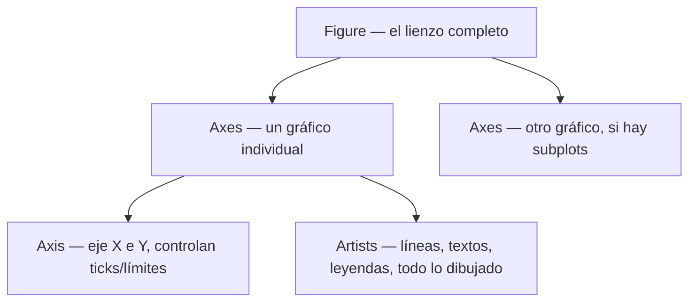

# 01 — Introducción y Arquitectura

> Complementa la mención de Matplotlib en [[Machine Learning/07-Librerias-de-Data-Science-y-ML|Machine Learning/07 - Librerías]] con la profundidad práctica de sintaxis y arquitectura interna.

**Matplotlib** es la librería de visualización base del ecosistema Python — de bajo nivel y muy flexible, es el motor sobre el que corren [[15 - Integración con NumPy, Pandas y Seaborn|Pandas `.plot()` y Seaborn]] internamente. Casi cualquier otra librería de gráficos en Python (Seaborn, Pandas, incluso partes de scikit-learn) delega el renderizado final a Matplotlib.

```python
import matplotlib.pyplot as plt
import numpy as np
```

## Dos formas de usar Matplotlib

Matplotlib expone **dos estilos de API** que conviven, y confundirlos es la fuente número uno de código inconsistente:

```python
# Estilo pyplot (procedural, "estado implícito") — cómodo para exploración rápida
plt.plot([1, 2, 3], [4, 5, 6])
plt.title("Ejemplo")
plt.xlabel("x")
plt.show()

# Estilo orientado a objetos (OO) — explícito, recomendado para código reutilizable/producción
fig, ax = plt.subplots()
ax.plot([1, 2, 3], [4, 5, 6])
ax.set_title("Ejemplo")
ax.set_xlabel("x")
plt.show()
```

| | Estilo `pyplot` | Estilo Orientado a Objetos (OO) |
|---|---|---|
| Cómo funciona | Funciones globales (`plt.plot`, `plt.title`) que operan sobre una figura/eje "actual" implícito | Se obtienen objetos `Figure`/`Axes` explícitos y se llama a sus métodos |
| Cuándo usarlo | Exploración rápida en notebook, un solo gráfico | Múltiples subplots, funciones reutilizables, scripts/producción |
| Riesgo | Con más de un gráfico activo, es fácil perder de vista "cuál" está siendo modificado | Ninguno — siempre explícito sobre qué `Axes` se opera |

**Regla práctica:** para cualquier código que se vaya a reutilizar, meter en una función, o que tenga más de un subplot, usar siempre el estilo orientado a objetos (`fig, ax = plt.subplots()`) — es la convención que sigue el resto de este cheat-sheet.

## La jerarquía de objetos



- **`Figure`**: el lienzo/ventana completo — puede contener uno o varios `Axes`.
- **`Axes`**: un gráfico individual dentro de la figura (a pesar del nombre parecido, **no** es lo mismo que `Axis`) — tiene su propio título, ejes X/Y, y contenido dibujado.
- **`Axis`**: cada uno de los ejes (X, Y) de un `Axes` — controla ticks, límites, escala.
- **Artists**: todo elemento dibujable — líneas, textos, parches, leyendas.

Ver el detalle visual completo de cada componente en [[02 - Anatomía de una Figura]].

## Backends: cómo se renderiza realmente

```python
import matplotlib
matplotlib.get_backend()          # backend activo actual
matplotlib.use("Agg")               # backend sin interfaz gráfica — para generar imágenes en servidores/scripts sin pantalla
```

Un **backend** determina cómo y dónde se renderiza la figura: interactivo (`Qt5Agg`, `TkAgg`, muestra una ventana) vs no interactivo (`Agg`, solo genera archivos de imagen — el que se usa por default en la mayoría de entornos de servidor/CI). En Jupyter, `%matplotlib inline` fija un backend que renderiza directamente como imagen estática dentro de la celda.

## Ver también

- [[02 - Anatomía de una Figura]]
- [[03 - Creación de Figuras y Subplots]]
- [[15 - Integración con NumPy, Pandas y Seaborn]]
- [[Machine Learning/07-Librerias-de-Data-Science-y-ML|Machine Learning/07 - Librerías]]
