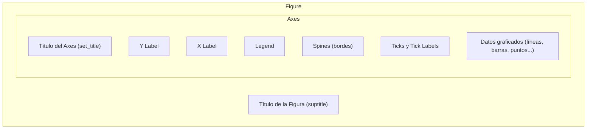

# 02 — Anatomía de una Figura

> Continúa de [[Python/Matplotlib/01 - Introducción y Arquitectura]].

## Componentes de una figura



| Componente | Qué es | Método principal |
|---|---|---|
| `Figure` | El lienzo completo, puede tener varios `Axes` | `fig.suptitle()` |
| `Axes` | Un gráfico individual dentro de la figura | `ax.set_title()` |
| `Axis` (X, Y) | Cada eje individual — controla escala, ticks, límites | `ax.set_xlabel()`, `ax.set_ylabel()` |
| `Spine` | Los 4 bordes del área de gráfico (top, bottom, left, right) | `ax.spines[...]` |
| `Tick` | Las marcas y etiquetas numéricas sobre cada eje | `ax.set_xticks()`, `ax.tick_params()` |
| `Legend` | Cuadro que identifica cada serie graficada | `ax.legend()` |
| `Artist` | Término genérico para CUALQUIER cosa dibujada (líneas, texto, parches) | — |

## Explorando cada componente en código

```python
fig, ax = plt.subplots(figsize=(8, 5))

ax.plot([1, 2, 3], [4, 5, 6], label="serie A")

fig.suptitle("Título general de la Figura")     # título de TODA la figura (útil con varios subplots)
ax.set_title("Título de este Axes")               # título de ESTE gráfico específico
ax.set_xlabel("Eje X")
ax.set_ylabel("Eje Y")
ax.legend()                                          # dibuja la leyenda usando los 'label=' de cada serie
```

## Manipular los `spines` (bordes)

```python
ax.spines["top"].set_visible(False)         # oculta el borde superior — común para un look más limpio
ax.spines["right"].set_visible(False)
ax.spines["left"].set_position(("outward", 10))   # desplaza el borde izquierdo 10 puntos hacia afuera
ax.spines["bottom"].set_color("gray")
```

## Controlar `ticks` explícitamente

```python
ax.set_xticks([0, 1, 2, 3])                          # posiciones exactas donde aparecen marcas
ax.set_xticklabels(["Ene", "Feb", "Mar", "Abr"])        # etiquetas custom para esas posiciones
ax.tick_params(axis="x", rotation=45, labelsize=9)        # rotación y tamaño de las etiquetas
ax.tick_params(axis="both", which="both", direction="in")   # ticks apuntando hacia adentro del gráfico
```

Ver el control fino de escalas, límites, y formatters/locators automáticos en [[08 - Ejes, Escalas y Ticks]].

## Acceder a los `Axes` de una figura ya creada

```python
fig = plt.gcf()          # "get current figure"
ax = plt.gca()             # "get current axes"
fig.axes                    # lista de TODOS los Axes que contiene la figura
```

Útil quan se recibe una `Figure` ya construida (por ejemplo, devuelta por una función de otra librería) y se necesita seguir personalizándola con el estilo orientado a objetos.

## Ver también

- [[Python/Matplotlib/01 - Introducción y Arquitectura]]
- [[08 - Ejes, Escalas y Ticks]]
- [[09 - Texto, Anotaciones y Leyendas]]
