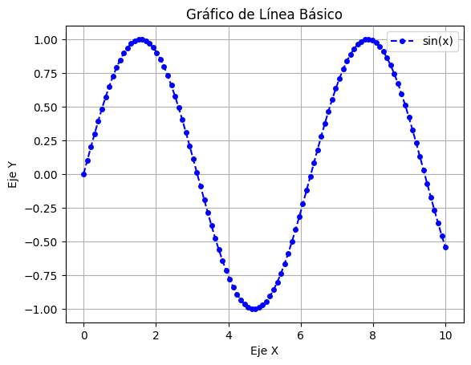
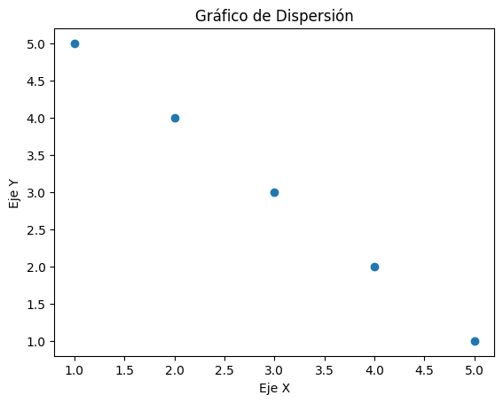
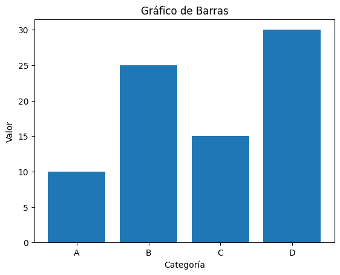
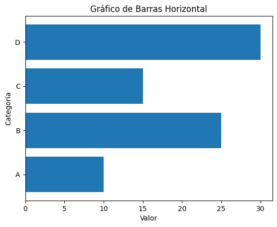
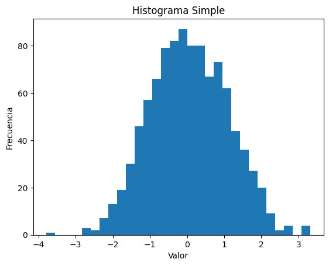
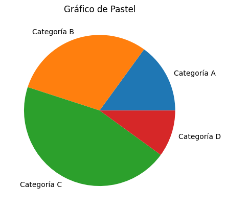
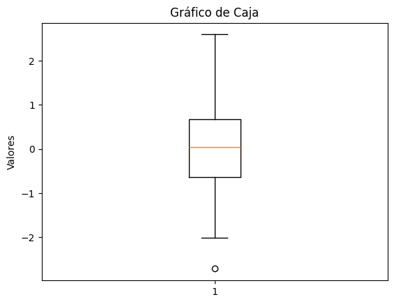
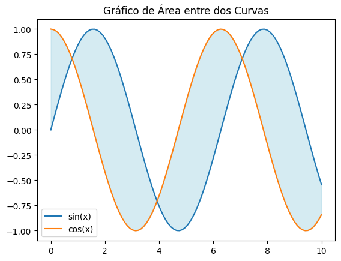

# Basic Plots

## Gráficos Básicos

En **Matplotlib**, existen varios tipos de gráficos básicos que puedes crear. Los más comunes son: gráficos de líneas, gráficos de dispersión, gráficos de barras e histogramas. También puedes generar gráficos circulares, gráficos de contorno, y gráficos 3D, entre otros.


```python
import numpy as np
import matplotlib.pyplot as plt
```

## Line Graphs

La función ``plot()`` es una herramienta fundamental para crear gráficos 2D. Se utiliza principalmente para dibujar puntos, líneas y marcadores a partir de los datos proporcionados.

- **¿Cuándo usar un gráfico de líneas?** Un gráfico de líneas se utiliza principalmente para visualizar tendencias y cambios a lo largo del tiempo, o para comparar cómo diferentes conjuntos de datos varían en relación con una variable continua. Son ideales para mostrar datos continuos y permiten identificar patrones, tendencias y relaciones en los datos. 


```python
#Datos de ejemplo
x = np.linspace(0, 10, 100)
y = np.sin(x)

#Crear un gráfico de línea básico
plt.plot(x, y, label='sin(x)', color='blue', linestyle='--', marker='o', markersize=4)

#Agregar etiquetas y título
plt.xlabel('Eje X')
plt.ylabel('Eje Y')
plt.title('Gráfico de Línea Básico')

#Agregar una leyenda
plt.legend()

#Agregar una cuadrícula
plt.grid(True)

#Mostrar el gráfico
plt.show()
```


    

    


## Scatter Plots

La función ``scatter()`` permite crear gráficos de dispersión. Estos gráficos son una herramienta de visualización fundamental para mostrar la relación entre dos variables numéricas.

- **¿Cuándo usar un gráfico de dispersión?** Un diagrama de dispersión se utiliza para analizar la relación entre dos variables numéricas. Es ideal para identificar patrones, tendencias y correlaciones entre estas variables, así como para detectar valores atípicos (*outliers*).


```python
#Datos de ejemplo
x = [1, 2, 3, 4, 5]
y = [5, 4, 3, 2, 1]

#Crear un gráfico de dispersión
plt.scatter(x, y)

plt.xlabel('Eje X')
plt.ylabel('Eje Y')
plt.title('Gráfico de Dispersión')

plt.show()
```


    

    


## Bar Plots

### Vertical Bar Chart

La función ``bar()`` se utiliza para crear gráficos de barras verticales. Estos gráficos se utilizan comúnmente para representar datos categóricos, donde la altura de cada barra es proporcional al valor que representa.

- **¿Cuándo utilizar un gráfico de barras vertical?** Se utiliza un gráfico de barras vertical para comparar valores entre diferentes categorías, especialmente cuando hay muchas categorías y las etiquetas son cortas.


```python
#Datos de ejemplo
categorias = ['A', 'B', 'C', 'D']
valores = [10, 25, 15, 30]

#Crear un gráfico de barras
plt.bar(categorias, valores)

plt.xlabel('Categoría')
plt.ylabel('Valor')
plt.title('Gráfico de Barras')

plt.show()
```


    

    


### Horizontal Bar Chart

`barh()` es una función que se utiliza para crear gráficos de barras **horizontales**. Es la contraparte horizontal de `bar()`, que crea gráficos de barras verticales.

- **¿Cuándo utilizar un gráfico de barras horizontal?** Un gráfico de barras horizontal es más adecuado cuando se tienen etiquetas largas para las categorías, o cuando se necesita comparar pocas categorías con un enfoque en la clasificación.


```python
#Crear un gráfico de barras horizontal
plt.barh(categorias, valores)

plt.xlabel('Valor')
plt.ylabel('Categoría')
plt.title('Gráfico de Barras Horizontal')

plt.show()
```


    

    


## Histograms

La función `hist()` se utiliza para crear histogramas, que son representaciones gráficas de la distribución de datos numéricos.

- **¿Cuándo utilizar un histograma?** Un histograma se utiliza para visualizar la distribución de datos numéricos continuos, mostrando la frecuencia con la que ocurren ciertos valores dentro de un rango específico. Es útil para identificar patrones, tendencias, valores atípicos y la forma de la distribución de los datos.


```python
#Datos de ejemplo
data = np.random.normal(loc=0, scale=1, size=1000)

#Crear un histograma
plt.hist(data, bins=30) #

plt.xlabel("Valor")
plt.ylabel("Frecuencia")
plt.title("Histograma Simple")

plt.show()
```


    

    


## Pie Charts

La función `pie()` se utiliza para crear gráficos circulares. Los gráficos circulares son gráficos estadísticos circulares divididos en sectores, donde cada sector representa una proporción del total.

- **¿Cuándo utilizar un gráfico de pastel?** Un gráfico de pastel se utiliza para mostrar la relación de las partes con respecto a un todo, idealmente cuando se representan porcentajes o proporciones de un conjunto de datos. Es efectivo para visualizar la distribución de datos en categorías y entender la contribución de cada parte al total, especialmente si hay un número limitado de categorías.


```python
#Datos de ejemplo
sizes = [15, 30, 45, 10]
labels = ['Categoría A', 'Categoría B', 'Categoría C', 'Categoría D']

#Crear un gráfico de pastel
plt.pie(sizes, labels=labels)

plt.title('Gráfico de Pastel')

plt.show()
```


    

    


## Box Plots

La función `boxplot()` se utiliza para generar diagramas de caja y bigotes, que son una representación visual de la distribución de datos numéricos. Estos diagramas ofrecen un resumen de un conjunto de datos basado en un resumen de cinco números: Mínimo, Primer cuartil (*Q1*), Mediana, Tercer cuartil (*Q3*) y Máximo.

- **¿Cuándo utilizar un gráfico de caja?** Un diagrama de caja se utiliza para visualizar la distribución de datos numéricos, especialmente cuando se desea comparar diferentes grupos o identificar valores atípicos. Es útil para mostrar la dispersión, la simetría y los valores centrales de un conjunto de datos.


```python
#Datos de ejemplo
data = np.random.normal(0, 1, 100) # Example: 100 data points from a normal distribution

#Crear un gráfico de caja
plt.boxplot(data)

plt.title("Gráfico de Caja")
plt.ylabel("Valores")

plt.show()
```


    

    


## Area Plots

La función `fill_between()` se utiliza para rellenar el área entre dos curvas horizontales. Es una herramienta eficaz para visualizar rangos, resaltar diferencias o destacar tendencias en los datos.

- **¿Cuándo utilizar un gráfico de área?** Un gráfico de áreas se utiliza para visualizar tendencias y magnitudes de datos a lo largo del tiempo, especialmente cuando se quiere comparar la relación entre diferentes series de datos o cómo contribuyen a un total. Es útil para mostrar la evolución de varias categorías a la vez, resaltando áreas bajo las líneas para enfatizar la magnitud de los cambios.


```python
#Datos de ejemplo
x = np.linspace(0, 10, 100)
y1 = np.sin(x)
y2 = np.cos(x)

#Crear un gráfico de área entre dos curvas
plt.fill_between(x, y1, y2, color='lightblue', alpha=0.5)
plt.plot(x, y1, label='sin(x)')
plt.plot(x, y2, label='cos(x)')

plt.title('Gráfico de Área entre dos Curvas')

plt.legend()
plt.show()
```


    

    

