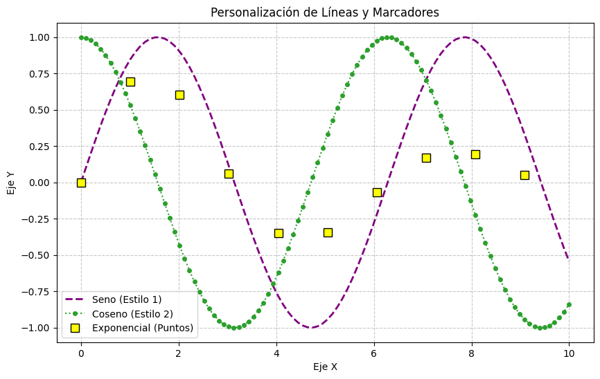
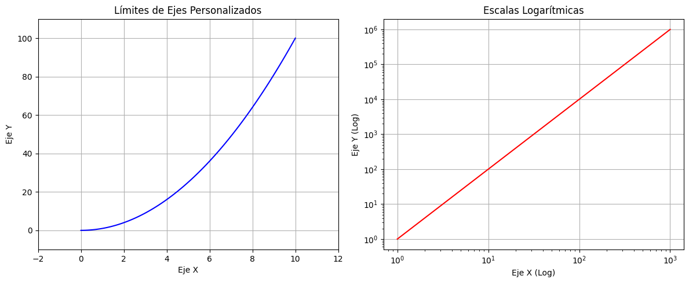
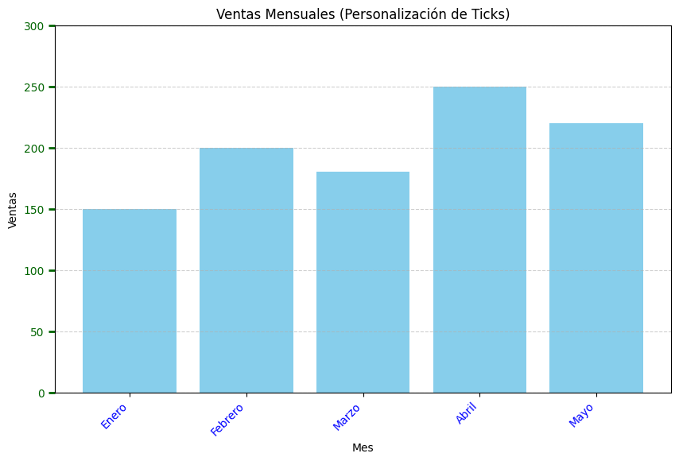
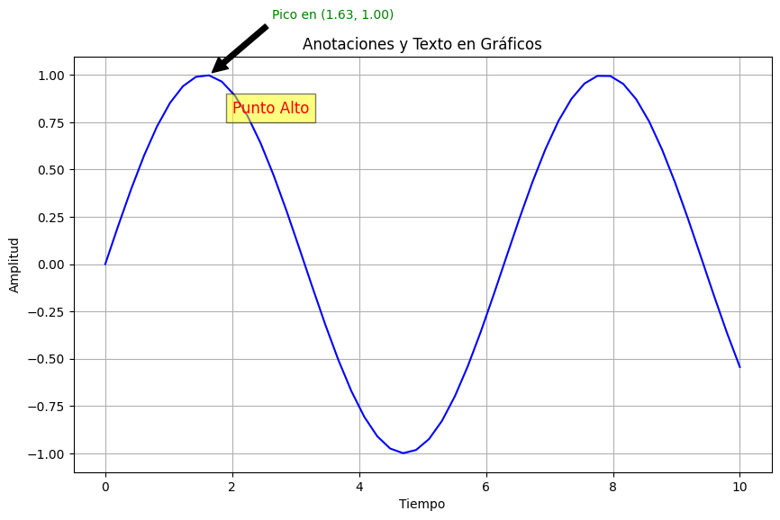
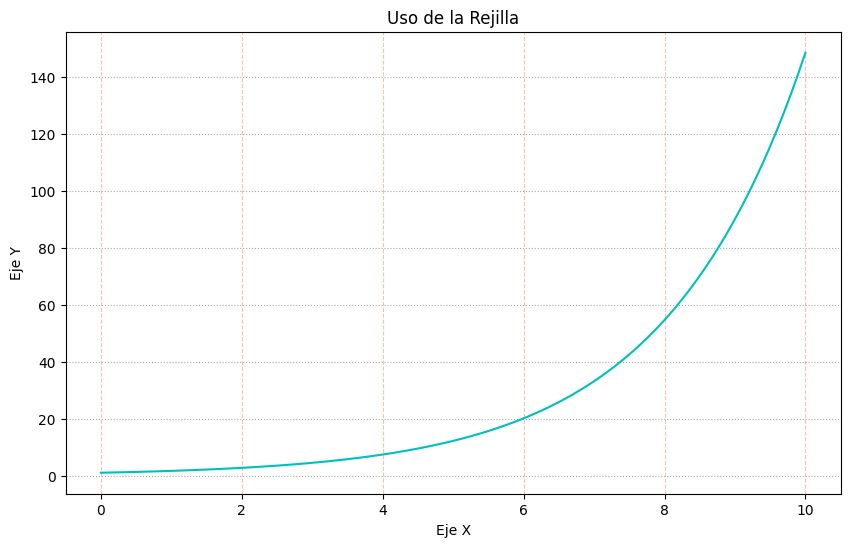
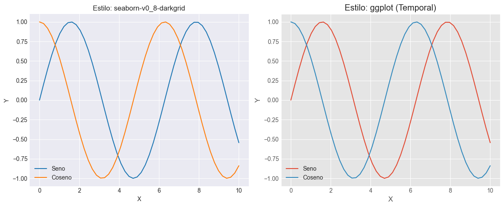
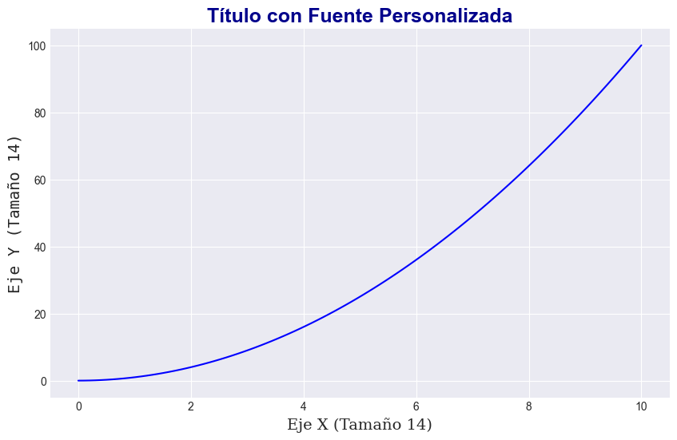

# Customization and Styles

##  Personalización y Estilos

En **Matplotlib**, la personalización se puede lograr mediante el uso de estilos predefinidos o creando estilos propios, así como modificando directamente parámetros de configuración. Esto permite ajustar elementos como colores, fuentes, ejes, títulos y leyendas, entre otros, para adaptar los gráficos al estilo deseado.


```python
import matplotlib.pyplot as plt
import numpy as np
```

## Colors, Markers and Line Styles

La elección adecuada de colores y estilos puede mejorar significativamente la claridad de un gráfico. Podemos especificar estos atributos directamente en las funciones de trazado.

**Parámetros útiles:**

- `color`: Define el color de la línea o los puntos. Puede ser un nombre (ej. `'red'`, `'blue'`), un código hexadecimal (ej. `'#FF5733'`), o una tupla RGB.
- `linestyle` (o `ls`): Define el estilo de la línea (ej. `'-'`, `'--'`, `'-.'`, `':'`).
- `linewidth` (o `lw`): Define el grosor de la línea.
- `marker`: Define el tipo de marcador para los puntos (ej. `'o'`, `'s'`, `'^'`, `'+'`).
- `markersize` (o `ms`): Define el tamaño del marcador.
- `markeredgecolor` (o `mec`): Color del borde del marcador.
- `markerfacecolor` (o `mfc`): Color de la cara del marcador.


```python
#Datos de ejemplo
x = np.linspace(0, 10, 100)
y1 = np.sin(x)
y2 = np.cos(x)
y3 = np.sin(x) * np.exp(-x/5)

plt.figure(figsize=(10, 6))

#Ejemplo 1: Línea con color específico, grosor y estilo
plt.plot(x, y1, color='purple', linestyle='--', linewidth=2, label='Seno (Estilo 1)')

#Ejemplo 2: Línea con marcadores, color hexadecimal y tamaño
plt.plot(x, y2, color='#2CA02C', marker='o', markersize=4, linestyle=':', label='Coseno (Estilo 2)')

#Ejemplo 3: Marcadores personalizados (borde y cara)
plt.plot(x[::10], y3[::10], color='orange', marker='s', markersize=8,
         markeredgecolor='black', markerfacecolor='yellow', linestyle='None',
         label='Exponencial (Puntos)')

plt.title('Personalización de Líneas y Marcadores')
plt.xlabel('Eje X')
plt.ylabel('Eje Y')
plt.legend()
plt.grid(True, linestyle='--', alpha=0.7)
plt.show()
```


    

    


## Axis Limits and Scales

Controlar los límites de los ejes y el tipo de escala es crucial para visualizar correctamente nuestros datos y evitar recortes o espacios en blanco innecesarios.

- `plt.xlim(xmin, xmax)`: Establece los límites del eje X.
- `plt.ylim(ymin, ymax)`: Establece los límites del eje Y.
- `ax.set_xlim(xmin, xmax)` / `ax.set_ylim(ymin, ymax)`: Métodos para objetos `Axes`.
- `plt.xscale(scale)`: Establece la escala del eje X.
- `plt.yscale(scale)`: Establece la escala del eje Y.
- `ax.set_xscale(scale)` / `ax.set_yscale('log')`: Métodos para objetos `Axes`.
  
  
  **Parámetros útiles:**

  - `'linear'`: La escala lineal es la escala predeterminada en Matplotlib. Los datos se distribuyen uniformemente a lo largo del eje.
  - `'log`: La escala logarítmica se utiliza cuando los datos tienen un rango muy amplio, desde valores muy pequeños hasta muy grandes.
  - `'symlog'`: La escala simétrica logarítmica es una combinación de escala lineal y logarítmica. Permite representar datos que incluyen tanto valores positivos como negativos.
  - `'logit'`: La escala Logit es adecuada para datos confinados entre 0 y 1.


```python
#Datos de ejemplo
x_linear = np.linspace(0, 10, 100)
y_linear = x_linear**2

x_log = np.logspace(0, 3, 100) #Datos que se benefician de escala logarítmica
y_log = x_log**2

plt.figure(figsize=(12, 5))

#Subplot 1: Límites personalizados
plt.subplot(1, 2, 1)
plt.plot(x_linear, y_linear, 'b-')
plt.xlim(-2, 12)   #Extender un poco los límites
plt.ylim(-10, 110) #Extender un poco los límites
plt.title('Límites de Ejes Personalizados')
plt.xlabel('Eje X')
plt.ylabel('Eje Y')
plt.grid(True)

#Subplot 2: Escala logarítmica
plt.subplot(1, 2, 2)
plt.plot(x_log, y_log, 'r-')
plt.xscale('log') #Escala logarítmica para el eje X
plt.yscale('log') #Escala logarítmica para el eje Y
plt.title('Escalas Logarítmicas')
plt.xlabel('Eje X (Log)')
plt.ylabel('Eje Y (Log)')
plt.grid(True)

plt.tight_layout() #Ajusta automáticamente los parámetros de la subtrama para un diseño ajustado
plt.show()
```


    

    


## Ticks and Labels

Los "*ticks*" son las marcas en los ejes, y sus etiquetas nos informan sobre los valores representados. Personalizarlos es fundamental para la legibilidad, especialmente con datos no triviales o para formatos específicos.

- `plt.xticks(ticks, labels, **kwargs)`: Establece las ubicaciones y etiquetas de los ticks del eje X.
- `plt.yticks(ticks, labels, **kwargs)`: Establece las ubicaciones y etiquetas de los ticks del eje Y.
- `ax.set_xticks(ticks)` / `ax.set_xticklabels(labels, **kwargs)`: Métodos para objetos `Axes` para un control más separado.
- `ax.tick_params()`: Para personalizar aspectos como el color, tamaño y dirección de los ticks para objetos `Axes`.
- `plt.tick_params()`: Versión para `plt`.


```python
#Datos de ejemplo
meses = ['Enero', 'Febrero', 'Marzo', 'Abril', 'Mayo']
ventas = [150, 200, 180, 250, 220]
x_pos = np.arange(len(meses))

plt.figure(figsize=(10, 6))

plt.bar(x_pos, ventas, color='skyblue')

#Establecer la ubicación de los ticks X
plt.xticks(x_pos)

#Establecer las etiquetas personalizadas para los ticks X y rotarlas
plt.gca().set_xticklabels(meses, rotation=45, ha='right') #'ha' es horizontal alignment

#Personalizar los ticks del eje Y
plt.yticks(np.arange(0, 301, 50)) # Ticks cada 50 unidades

#Personalizar el color y tamaño de los ticks y etiquetas
plt.tick_params(axis='y', colors='darkgreen', length=6, width=2)
plt.tick_params(axis='x', labelcolor='blue', labelsize=10)

plt.title('Ventas Mensuales (Personalización de Ticks)')
plt.xlabel('Mes')
plt.ylabel('Ventas')
plt.grid(axis='y', linestyle='--', alpha=0.6)
plt.show()
```


    

    


## Annotations and Text on the Chart

Añadir texto y anotaciones a un gráfico es esencial para resaltar puntos importantes, explicar tendencias o simplemente añadir información contextual.

- `plt.text(x, y, s, **kwargs)`: Añade texto en las coordenadas (*x, y*). `s` es el string del texto.
- `plt.annotate(s, xy, xytext, arrowprops, **kwargs)`: Añade una anotación con una flecha.
 
  **Parámetros útiles:**
    - `s`: El texto de la anotación.
    - `xy`: La coordenada (*x, y*) que se quiere anotar.
    - `xytext`: La coordenada (*x, y*) donde se ubicará el texto.
    - `arrowprops`: Un diccionario para personalizar la flecha (ej. `dict(facecolor='black', shrink=0.05)`).


```python
#Datos de ejemplo
x = np.linspace(0, 10, 50)
y = np.sin(x)

plt.figure(figsize=(10, 6))
plt.plot(x, y, 'b-')

#Añadir un texto simple en el gráfico
plt.text(2, 0.8, 'Punto Alto', fontsize=12, color='red',
         bbox=dict(facecolor='yellow', alpha=0.5, pad=5))

#Encontrar el punto máximo para la anotación
max_y = np.max(y)
max_x = x[np.argmax(y)]

#Añadir una anotación con flecha
plt.annotate(f'Pico en ({max_x:.2f}, {max_y:.2f})',
             xy=(max_x, max_y), xytext=(max_x + 1, max_y + 0.3),
             arrowprops=dict(facecolor='black', shrink=0.05),
             fontsize=10, color='green')

plt.title('Anotaciones y Texto en Gráficos')
plt.xlabel('Tiempo')
plt.ylabel('Amplitud')
plt.grid(True)
plt.show()
```


    

    


## Grid

La rejilla o cuadrícula (*grid*) es una herramienta útil para facilitar la lectura de los valores en los ejes, especialmente en gráficos de línea o dispersión.

- `plt.grid(True|False, **kwargs)`: Activa o desactiva la rejilla (por defecto en `False`).

   **Parámetros útiles:**
   - `axis`: Especifica qué eje (`'x'`, `'y'`, `'both'`) mostrar la rejilla.
   - `linestyle` (o `ls`): Estilo de línea de la rejilla.
   - `linewidth` (o `lw`): Grosor de la línea.
   - `color`: Color de la rejilla.
   - `alpha`: Transparencia de la rejilla.


```python
#Datos de ejemplo
x = np.linspace(0, 10, 100)
y = np.exp(x/2)

plt.figure(figsize=(10, 6))
plt.plot(x, y, 'c-')

#Rejilla solo en el eje Y, con estilo personalizado
plt.grid(axis='y', linestyle=':', color='gray', alpha=0.7, linewidth=0.8)

#Rejilla en el eje X, con otro estilo
plt.grid(axis='x', linestyle='--', color='lightcoral', alpha=0.5)

plt.title('Uso de la Rejilla')
plt.xlabel('Eje X')
plt.ylabel('Eje Y')
plt.show()
```


    

    


## Predefined Styles

Matplotlib incluye una serie de estilos predefinidos que cambian globalmente el aspecto de los gráficos, desde los colores hasta los tipos de letra y el fondo. Son una excelente manera de dar un toque profesional rápidamente.

- `plt.style.available`: Muestra una lista de todos los estilos disponibles.
- `plt.style.use('nombre_del_estilo')`: Aplica un estilo específico.
- `plt.style.context('nombre_del_estilo')`: Aplica un estilo temporalmente dentro de un bloque `with`.


```python
#Datos de ejemplo
x = np.linspace(0, 10, 50)
y1 = np.sin(x)
y2 = np.cos(x)

#Mostrar estilos disponibles
print(plt.style.available)

#Estilo global para el primer gráfico
plt.style.use('seaborn-v0_8-darkgrid')

plt.figure(figsize=(12, 5))

plt.subplot(1, 2, 1)
plt.plot(x, y1, label='Seno')
plt.plot(x, y2, label='Coseno')
plt.title('Estilo: seaborn-v0_8-darkgrid')
plt.xlabel('X')
plt.ylabel('Y')
plt.legend()
plt.grid(True)


#Aplicar un estilo diferente temporalmente para el segundo gráfico
with plt.style.context('ggplot'): #Otro estilo popular
    plt.subplot(1, 2, 2)
    plt.plot(x, y1, label='Seno')
    plt.plot(x, y2, label='Coseno')
    plt.title('Estilo: ggplot (Temporal)')
    plt.xlabel('X')
    plt.ylabel('Y')
    plt.legend()
    plt.grid(True)

plt.tight_layout()
plt.show()

#Después del bloque 'with', el estilo global vuelve a ser 'seaborn-v0_8-darkgrid'
#Si no se usa 'with', el estilo se mantiene hasta que se cambie de nuevo.
```

    ['Solarize_Light2', '_classic_test_patch', '_mpl-gallery', '_mpl-gallery-nogrid', 'bmh', 'classic', 'dark_background', 'fast', 'fivethirtyeight', 'ggplot', 'grayscale', 'petroff10', 'seaborn-v0_8', 'seaborn-v0_8-bright', 'seaborn-v0_8-colorblind', 'seaborn-v0_8-dark', 'seaborn-v0_8-dark-palette', 'seaborn-v0_8-darkgrid', 'seaborn-v0_8-deep', 'seaborn-v0_8-muted', 'seaborn-v0_8-notebook', 'seaborn-v0_8-paper', 'seaborn-v0_8-pastel', 'seaborn-v0_8-poster', 'seaborn-v0_8-talk', 'seaborn-v0_8-ticks', 'seaborn-v0_8-white', 'seaborn-v0_8-whitegrid', 'tableau-colorblind10']
    


    

    


## Font Handling

La tipografía en un gráfico es tan importante como los datos mismos. Un tamaño de fuente adecuado y un tipo de letra consistente mejoran la legibilidad.

- Parámetros de fuente en funciones de texto: `fontsize`, `fontweight`, `fontstyle`, `fontfamily`.
- `plt.rc()`: Para establecer parámetros de configuración globalmente para los elementos de Matplotlib.
- `matplotlib.rcParams`: Diccionario que contiene todos los parámetros de configuración.


```python
#Datos de ejemplo
x = np.linspace(0, 10, 100)
y = x**2

plt.figure(figsize=(10, 6))
plt.plot(x, y, 'b-')

#Personalizar el título
plt.title('Título con Fuente Personalizada', fontsize=18, fontweight='bold', color='darkblue')

#Personalizar las etiquetas de los ejes
plt.xlabel('Eje X (Tamaño 14)', fontsize=14, fontfamily='serif')
plt.ylabel('Eje Y (Tamaño 14)', fontsize=14, fontfamily='monospace')

#Personalizar las etiquetas de los ticks (usando rcParams para un cambio global para ticks)
#NOTA: Esto afectaría a todos los gráficos posteriores si no se restablece o se usa en un 'with'
plt.rcParams['xtick.labelsize'] = 12
plt.rcParams['ytick.labelsize'] = 12

plt.grid(True)
plt.show()

#Restablecer los parámetros de rcParams si es necesario para gráficos futuros
plt.rcParams.update(plt.rcParamsDefault)
```


    

    

