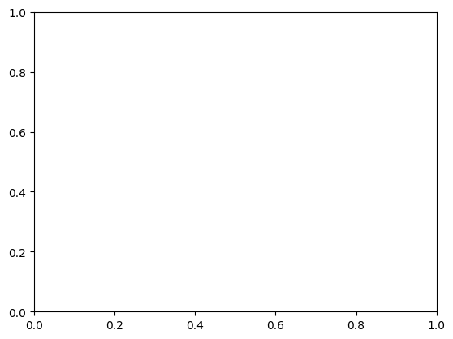
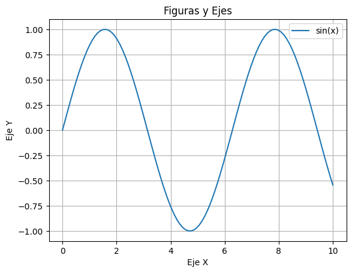

#  Introduction to Matplotlib

## Introducción a Matplotlib

**Matplotlib** es una biblioteca de gráficos para Python que se utiliza para crear visualizaciones de datos estáticas, animadas e interactivas. Permite generar diversos tipos de gráficos, como diagramas de barras, gráficos de líneas, diagramas de dispersión y mucho más, y personalizar su apariencia con facilidad. Es una herramienta fundamental para la ciencia de datos y el aprendizaje automático, ya que facilita la exploración, análisis y comunicación de datos.

## Import Matplotlib


```python
import numpy as np
import matplotlib.pyplot as plt
```

## Example data


```python
#Datos de ejemplo
x = np.linspace(0, 10, 100)
y = np.sin(x)
```

## Figures and Axes

En **Matplotlib**, las figuras y los ejes son objetos fundamentales para la creación de gráficos. La **figura** es el contenedor general, como un lienzo, donde se ubican todos los elementos del gráfico, incluyendo los ejes, títulos, leyendas, etc. Los **ejes** (*o subgráficos*) son las regiones dentro de la figura donde se dibujan los datos, con sus propios ejes x e y, marcas, etiquetas, etc.

### Figure

Una figura es el objeto de más alto nivel en Matplotlib y actúa como contenedor para todos los elementos de un gráfico. Se puede crear una figura explícitamente usando `plt.figure()` o implícitamente al usar funciones como `plt.subplots()`. Una figura puede contener múltiples ejes (*subgráficos*).

### Axes

Los ejes definen la región donde se dibujan los datos, con sus propios ejes ***x*** e ***y***. Se puede acceder a los métodos de los ejes para personalizar la apariencia del gráfico, como agregar etiquetas, títulos, leyendas, etc y se crean típicamente dentro de una figura, ya sea explícitamente con `plt.subplots()` o `plt.subplot()`. 


```python
#Crear una figura y un conjunto de ejes
fig, ax = plt.subplots()  # Equivalente a fig = plt.figure() y ax = fig.add_subplot()
```


    

    


## `plot()`

Para crear un gráfico en Matplotlib, la función principal es `plt.plot()`. Esta función permite dibujar líneas o marcadores en un objeto Axes. Toma los datos ***x*** e ***y*** y dibuja una línea que conecta los puntos.


```python
#Dibujar datos en el eje
ax.plot(x, y)
```


    [<matplotlib.lines.Line2D at 0x1b9697347d0>]


## Basic customization

La personalización básica incluye cambiar colores, estilos de línea, marcadores y etiquetas, así como agregar títulos y leyendas. Se puede lograr a través de argumentos en las funciones de trazado o modificando los parámetros de las funciones.


```python
#Personalizar el gráfico
ax.set_xlabel("Eje X")
ax.set_ylabel("Eje Y")
ax.set_title("Figuras y Ejes")

ax.legend(["sin(x)"])
ax.grid(True)
```

## Save Figures

Para guardar un gráfico en Matplotlib, se utiliza la función `plt.savefig()`. Esta función se aplica a la figura actual y permite especificar el nombre del archivo y el formato de salida. Debe ser llamada antes de `plt.show()` para que funcione correctamente.


```python
#Guardar en png
plt.savefig('grafico.png', dpi=300) #Resolución de 300 dpi

#Guardar en pdf
plt.savefig('grafico.pdf')

#Guardar en svg
plt.savefig('grafico.svg')

#Guardar en jpg
plt.savefig('grafico.jpg')
```


    <Figure size 640x480 with 0 Axes>


## `show()`

La función `plt.show()` se utiliza para mostrar todas las figuras activas. Al crear un gráfico con Matplotlib, la figura se genera en memoria, pero no se muestra automáticamente en pantalla, especialmente al ejecutar un script fuera de un entorno interactivo como un Jupyter Notebook.

**NOTA:** Si lo ejecutas en una celda diferente a la que define la figura, es posible que no veas la figura porque el comando `plt.show()` no "recordará" la figura creada en otra celda.


```python
#Mostrar el gráfico
plt.show()
```

## Complete Example


```python
#Crear una figura y un conjunto de ejes
fig, ax = plt.subplots()  # Equivalente a fig = plt.figure() y ax = fig.add_subplot()

#Dibujar datos en el eje
ax.plot(x, y)

#Personalizar el gráfico
ax.set_xlabel("Eje X")
ax.set_ylabel("Eje Y")
ax.set_title("Figuras y Ejes")

ax.legend(["sin(x)"])
ax.grid(True)

#Guardar en png
plt.savefig('grafico.png', dpi=300) #Resolución de 300 dpi

#Guardar en pdf
plt.savefig('grafico.pdf')

#Guardar en svg
plt.savefig('grafico.svg')

#Guardar en jpg
plt.savefig('grafico.jpg')

#Mostrar el gráfico
plt.show()
```


    

    

