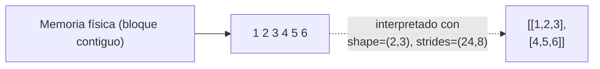

# 01 — Introducción y Arquitectura Interna

> Complementa la sección `### NumPy` de [[Machine Learning/07-Librerias-de-Data-Science-y-ML#NumPy|Machine Learning/07 - Librerías]] con la profundidad práctica de sintaxis y arquitectura interna.

**NumPy** (*Numerical Python*) es la librería base de cómputo numérico en Python: provee el objeto **`ndarray`**, un arreglo multidimensional homogéneo, y un motor de operaciones vectorizadas escrito en C que corre muchísimo más rápido que loops nativos de Python. Es, literalmente, el cimiento sobre el que están construidos [[Python/Pandas/01 - Introducción y Arquitectura Interna|Pandas]], scikit-learn, y en buena medida PyTorch/TensorFlow.

```python
import numpy as np
```

## `ndarray` — la estructura central

```python
arr = np.array([1, 2, 3, 4, 5])
matriz = np.array([[1, 2, 3], [4, 5, 6]])
```

A diferencia de una lista de Python, un `ndarray` es **homogéneo** (todos sus elementos comparten el mismo `dtype`) y de **tamaño fijo** al crearse — estas dos restricciones son precisamente lo que le permite a NumPy almacenar los datos en un bloque contiguo de memoria y operar sobre ellos a velocidad de C.

## Atributos fundamentales

```python
arr.ndim        # número de dimensiones (ejes)
arr.shape       # tupla con el tamaño de cada dimensión
arr.size        # número total de elementos
arr.dtype       # tipo de dato de los elementos
arr.itemsize    # bytes que ocupa CADA elemento
arr.nbytes      # bytes totales ocupados por el array (== size * itemsize)
```

Ver el catálogo completo de inspección en [[04 - Inspección y Atributos de Arrays]].

## Memoria contigua: `strides` y el orden C vs Fortran

Internamente, un `ndarray` no es una lista de listas anidadas — es un único bloque de memoria contigua más una tupla de **strides** (cuántos bytes hay que saltar en memoria para avanzar una posición en cada eje) que le dice a NumPy cómo interpretar ese bloque plano como una matriz multidimensional.

```python
matriz = np.array([[1, 2, 3], [4, 5, 6]])
matriz.strides   # (24, 8) en una matriz de int64 -> saltar 24 bytes para la siguiente fila, 8 para la siguiente columna
matriz.flags     # incluye C_CONTIGUOUS / F_CONTIGUOUS
```



| Orden | Cómo recorre la memoria | Quién lo usa por default |
|---|---|---|
| **C-order** (row-major) | Fila por fila | NumPy (default), C, Python |
| **Fortran-order** (column-major) | Columna por columna | `order="F"` explícito, MATLAB, Fortran, álgebra lineal (LAPACK) |

```python
arr_fortran = np.array([[1, 2], [3, 4]], order="F")
```

Esta arquitectura es la razón de fondo detrás de operaciones "gratis" como `.T` (transponer): en vez de mover datos en memoria, NumPy simplemente **recalcula los strides** y devuelve una vista con los ejes reinterpretados — ver el detalle de vistas vs copias en [[09 - Copias vs Vistas]].

## El sistema de `dtype`

```python
arr.dtype               # ej. dtype('int64')
np.array([1, 2, 3], dtype=np.float32)
np.array([1, 2, 3]).astype(np.float64)
```

Cada elemento de un `ndarray` ocupa exactamente `itemsize` bytes según su `dtype` (`int64` → 8 bytes, `float32` → 4 bytes...) — el catálogo completo de tipos, casting y sus riesgos está en [[03 - Tipos de Datos (dtype)]].

## Vectorización: por qué NumPy es rápido

```python
# Loop nativo de Python — lento, cada suma pasa por el intérprete
resultado = [x + 1 for x in lista_python]

# Vectorizado — la suma corre en un loop compilado de C, sin overhead del intérprete
resultado = arr + 1
```

Esta diferencia de rendimiento (típicamente 10x-100x) es el motivo por el que **toda** la API de NumPy — y por extensión Pandas, scikit-learn — está diseñada alrededor de operaciones vectorizadas en vez de loops explícitos. Ver el detalle de cuándo y por qué en [[15 - Rendimiento y Vectorización Avanzada]].

## Ver también

- [[02 - Creación de Arrays]]
- [[03 - Tipos de Datos (dtype)]]
- [[04 - Inspección y Atributos de Arrays]]
- [[09 - Copias vs Vistas]]
- [[15 - Rendimiento y Vectorización Avanzada]]
- [[Python/Pandas/01 - Introducción y Arquitectura Interna|Python/Pandas]] — construido directamente sobre NumPy
- [[Machine Learning/07-Librerias-de-Data-Science-y-ML#NumPy|Machine Learning/07 - Librerías]]
