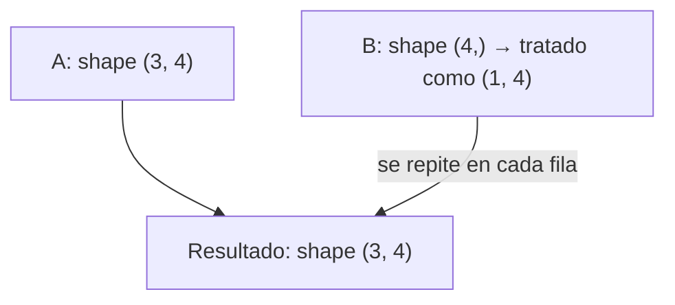

# 08 — Broadcasting

> Continúa de [[07 - Manipulación de Forma (Reshaping)]]. El mecanismo que permite operar entre arrays de formas distintas sin escribir loops explícitos.

## Qué es broadcasting

**Broadcasting** es el conjunto de reglas que NumPy usa para permitir operaciones aritméticas entre arrays de **formas distintas**, "estirando" conceptualmente el más pequeño para que encaje con el más grande — sin llegar a copiar datos realmente en memoria.

```python
arr = np.array([1, 2, 3])
arr + 5                    # array([6, 7, 8]) — el escalar 5 se "difunde" a los 3 elementos
```

## Las reglas de broadcasting

Para operar dos arrays, NumPy compara sus formas **de derecha a izquierda**, dimensión por dimensión. Dos dimensiones son compatibles si:
1. Son **iguales**, o
2. Una de ellas es **1** (esa dimensión se "estira" para igualar a la otra)

Si ninguna condición se cumple para algún eje, NumPy lanza `ValueError: operands could not be broadcast together`.

```python
# Ejemplo compatible:
# A.shape = (3, 4)
# B.shape =    (4,)   <- se alinea a la derecha: (4,) actúa como (1, 4), compatible con (3, 4)
A = np.ones((3, 4))
B = np.array([1, 2, 3, 4])
A + B     # B se "difunde" a cada una de las 3 filas -> shape resultado (3, 4)
```



## Ejemplo clásico: normalizar columnas de una matriz

```python
matriz = np.array([[1, 2, 3], [4, 5, 6], [7, 8, 9]])
promedio_por_columna = matriz.mean(axis=0)     # shape (3,)
matriz_centrada = matriz - promedio_por_columna  # (3,3) - (3,) -> broadcasting válido, resta columna a columna
```

## Cuando las formas NO son compatibles

```python
A = np.ones((3, 4))
B = np.ones((3,))          # shape (3,) NO es compatible con (3, 4) al alinear por la derecha: 4 != 3, ninguno es 1
A + B                         # ValueError: operands could not be broadcast together with shapes (3,4) (3,)

# Solución: hacer explícito el eje con reshape o np.newaxis
A + B[:, np.newaxis]           # B pasa a shape (3, 1), ahora SÍ compatible con (3, 4) -> se difunde por columnas
```

El error de broadcasting más común en la práctica es querer operar por **filas** cuando el vector tiene forma `(n,)` en vez de `(n, 1)` — la solución casi siempre es `vector[:, np.newaxis]` (ver [[07 - Manipulación de Forma (Reshaping)#expand_dims() y squeeze() — agregarquitar dimensiones de tamaño 1|expand_dims/newaxis]]).

## Tabla de compatibilidad rápida

| Shape A | Shape B | ¿Compatible? | Resultado |
|---|---|---|---|
| `(3, 4)` | `(4,)` | Sí | `(3, 4)` |
| `(3, 4)` | `(3, 1)` | Sí | `(3, 4)` |
| `(3, 4)` | `(1, 4)` | Sí | `(3, 4)` |
| `(3, 4)` | `(3,)` | **No** | `ValueError` |
| `(8, 1, 6, 1)` | `(7, 1, 5)` | Sí | `(8, 7, 6, 5)` |

## Por qué importa: rendimiento y memoria

Broadcasting evita crear copias intermedias infladas — `A + B` con `B` de shape `(4,)` **no** materializa una matriz `(3, 4)` completa de `B` repetido en memoria antes de sumar; NumPy itera con los strides ajustados para reutilizar los mismos datos de `B` en cada fila. Es, junto a la vectorización general, una de las razones centrales del rendimiento de NumPy frente a loops explícitos (ver [[15 - Rendimiento y Vectorización Avanzada]]).

## Ver también

- [[07 - Manipulación de Forma (Reshaping)]]
- [[10 - Operaciones Matemáticas y Vectorización]]
- [[15 - Rendimiento y Vectorización Avanzada]]
