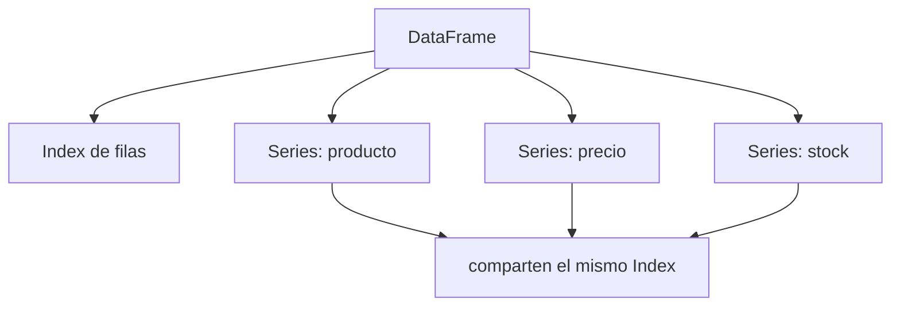

# 01 — Introducción y Arquitectura Interna

> Complementa la sección `### Pandas` de [[Machine Learning/07-Librerias-de-Data-Science-y-ML#Pandas|Machine Learning/07 - Librerías]] con la profundidad práctica de sintaxis y arquitectura interna.

**Pandas** es la librería de manipulación y análisis de datos tabulares en memoria más usada del ecosistema Python. Construida directamente sobre [[Python/NumPy/01 - Introducción y Arquitectura Interna|NumPy]], añade dos estructuras con **índice etiquetado** (`Index`) que NumPy no tiene: `Series` (1D) y `DataFrame` (2D).

```python
import pandas as pd
import numpy as np
```

## `Series` — un arreglo 1D con índice

```python
s = pd.Series([10, 20, 30, 40], index=["a", "b", "c", "d"], name="ventas")
```

Internamente una `Series` es dos arreglos alineados: los **valores** (un `ndarray` de NumPy, o un `ExtensionArray` — ver más abajo) y el **índice** (`Index`), que asigna una etiqueta a cada posición. Esa etiqueta es lo que permite alinear datos automáticamente en operaciones aritméticas entre dos `Series`, aunque tengan distinto orden:

```python
a = pd.Series([1, 2, 3], index=["x", "y", "z"])
b = pd.Series([10, 20, 30], index=["z", "y", "x"])
a + b
# x    31
# y    22
# z    13
# dtype: int64   <- se alinea por ETIQUETA, no por posición
```

## `DataFrame` — una colección de `Series` que comparten índice

```python
df = pd.DataFrame({
    "producto": ["A", "B", "C"],
    "precio": [10.5, 22.0, 7.25],
    "stock": [100, 50, 200],
})
```

Cada columna de un `DataFrame` es, conceptualmente, una `Series` independiente que comparte el mismo `Index` de filas. `df["precio"]` devuelve exactamente eso: un objeto `Series` con el mismo índice que `df`.



## El `Index` no es solo una lista de etiquetas

El `Index` es un objeto de primera clase con su propio tipo y comportamiento:

```python
df.index          # RangeIndex, Int64Index, DatetimeIndex, MultiIndex...
df.columns         # también es un Index (de nombres de columna)
df.index.dtype
df.index.is_unique      # False permite índices duplicados (¡riesgo de bugs!)
df.index.is_monotonic_increasing
```

Un `RangeIndex` (el default al crear un DataFrame sin especificar índice) es una secuencia perezosa tipo `range()` — no materializa enteros en memoria hasta que se necesita, más eficiente que un `Int64Index` explícito. Ver [[13 - MultiIndex y Datos Jerárquicos]] para índices con múltiples niveles.

## El sistema de `dtype`: NumPy vs Extension Arrays

Pandas soporta dos familias de tipos de dato por columna:

| Familia | Ejemplos | Notas |
|---|---|---|
| **NumPy-backed** | `int64`, `float64`, `bool`, `object` | El default histórico. `object` es una caja genérica para strings/mixtos — lenta y pesada en memoria. |
| **Extension Arrays** | `category`, `Int64` (nullable), `boolean`, `string`, `datetime64[ns, tz]`, `ArrowDtype` | Resuelven limitaciones de NumPy: nulos nativos en enteros, timezone-aware, backend Arrow. |

```python
df.dtypes
df["stock"] = df["stock"].astype("Int64")   # entero NULLABLE (con mayúscula) — admite pd.NA
df["stock"].isna()
```

`int64` de NumPy **no puede representar `NaN`** (NaN es un `float`), por eso una columna entera con nulos se "degrada" silenciosamente a `float64` a menos que se use el tipo extendido `Int64`. Ver el backend Arrow completo en [[15 - Rendimiento y Optimización]].

## `BlockManager`: cómo se almacenan las columnas internamente

Un `DataFrame` no guarda cada columna como un array totalmente independiente y disperso en memoria: internamente agrupa columnas del **mismo dtype** en bloques contiguos (`Block`) administrados por un `BlockManager` (o `ArrayManager` como alternativa desde pandas 2.x). Esto tiene una consecuencia práctica directa: **mezclar muchos dtypes distintos en un DataFrame fragmenta la memoria** y hace más lentas operaciones fila-por-fila.

```python
df._mgr   # inspección interna (uso educativo, no para código de producción)
```

## Mutabilidad y Copy-on-Write

Desde pandas 2.x, el modo **Copy-on-Write (CoW)** (default desde pandas 3.0) cambia la semántica de cuándo una operación devuelve una vista vs una copia — reduce drásticamente los falsos positivos de `SettingWithCopyWarning`. El detalle completo, con ejemplos de qué código rompe y cómo migrarlo, está en [[17 - Buenas Prácticas, Errores Comunes y Comparativa]].

```python
pd.set_option("mode.copy_on_write", True)   # explícito en pandas 2.x; default en 3.0
```

## Ver también

- [[02 - Creación y Carga de Datos]]
- [[03 - Exploración e Inspección de Datos]]
- [[13 - MultiIndex y Datos Jerárquicos]]
- [[15 - Rendimiento y Optimización]]
- [[17 - Buenas Prácticas, Errores Comunes y Comparativa]]
- [[Python/NumPy/01 - Introducción y Arquitectura Interna|Python/NumPy]] — la base sobre la que corre Pandas
- [[Machine Learning/07-Librerias-de-Data-Science-y-ML#Pandas|Machine Learning/07 - Librerías]]
