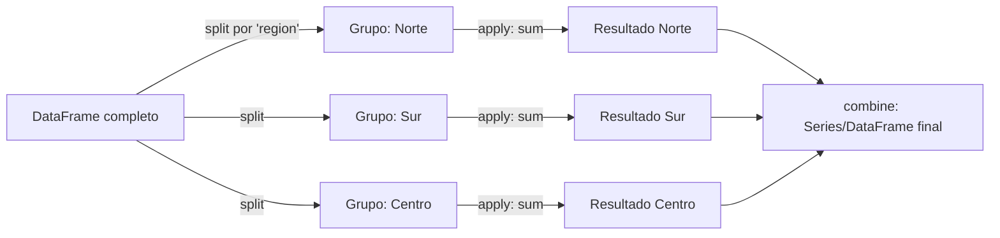

# 08 — Agrupación y Agregación (GroupBy)

> Continúa de [[07 - Datos Nulos y Duplicados]].

## El patrón split-apply-combine

`groupby()` implementa el patrón **split → apply → combine**: divide el DataFrame en grupos según una o más claves, aplica una función a cada grupo de forma independiente, y combina los resultados en una sola estructura de salida.



## Agregación básica

```python
df.groupby("region")["monto"].sum()
df.groupby("region")["monto"].mean()
df.groupby(["region", "producto"])["monto"].sum()   # agrupar por múltiples claves -> resultado con MultiIndex

df.groupby("region").size()          # número de filas por grupo (cuenta también nulos)
df.groupby("region")["monto"].count()  # número de valores NO nulos por grupo
```

## `agg()` — múltiples agregaciones a la vez

```python
df.groupby("region")["monto"].agg(["sum", "mean", "count", "std"])

df.groupby("region").agg({
    "monto": ["sum", "mean"],
    "stock": "max",
})   # distinta agregación por columna, en una sola llamada
```

### Named aggregation — salida con nombres de columna limpios

```python
df.groupby("region").agg(
    monto_total=("monto", "sum"),
    monto_promedio=("monto", "mean"),
    num_transacciones=("monto", "count"),
)
```

`agg()` con tuplas nombradas (`nombre_salida=("columna", "función")`) evita el `MultiIndex` de columnas feo que resulta de `.agg({"monto": ["sum", "mean"]})` — es la forma preferida en código de producción.

## `transform()` vs `apply()` vs `agg()` — la diferencia que confunde a todos

| Método | Forma de salida | Uso típico |
|---|---|---|
| `agg()` | Una fila por grupo (reduce) | Totales, promedios por grupo |
| `transform()` | Mismo tamaño que el DataFrame original (broadcast) | Agregar una columna "promedio del grupo" a cada fila original |
| `apply()` | Depende de lo que devuelva la función (flexible pero más lento) | Lógica de grupo que no encaja en `agg`/`transform` |

```python
# agg: una fila por grupo
df.groupby("region")["monto"].agg("mean")

# transform: MISMO número de filas que df — útil para comparar cada fila contra el promedio de su grupo
df["monto_promedio_region"] = df.groupby("region")["monto"].transform("mean")
df["desviacion_vs_region"] = df["monto"] - df["monto_promedio_region"]

# apply: función arbitraria sobre cada grupo (DataFrame completo del grupo como argumento)
df.groupby("region").apply(lambda g: g.nlargest(3, "monto"))   # top-3 por region
```

## `filter()` — quedarse con grupos completos que cumplen una condición

```python
df.groupby("producto").filter(lambda g: g["monto"].sum() > 10_000)   # solo productos con ventas totales > 10k
```

A diferencia de `agg`, `filter()` devuelve las **filas originales completas** de los grupos que pasan la condición, no un resumen.

## `pivot_table()` — agregación con salida en formato tabla cruzada

```python
pd.pivot_table(
    df,
    values="monto",
    index="region",
    columns="producto",
    aggfunc="sum",
    fill_value=0,
    margins=True,        # agrega fila/columna de totales generales
)
```

`pivot_table` es esencialmente `groupby` + `unstack` combinados en una sola llamada, pensado para el caso de uso "tabla dinámica" al estilo Excel. Ver la familia completa de reshaping en [[10 - Reshaping y Pivoting]].

## `crosstab()` — tabla de frecuencias cruzadas

```python
pd.crosstab(df["region"], df["producto"])                       # conteo de ocurrencias cruzadas
pd.crosstab(df["region"], df["producto"], normalize="index")    # como proporción por fila
pd.crosstab(df["region"], df["producto"], values=df["monto"], aggfunc="sum")
```

## Opciones útiles de `groupby`

```python
df.groupby("region", as_index=False)["monto"].sum()   # devuelve 'region' como columna normal, no como índice
df.groupby("categoria", observed=True)["monto"].sum()  # con dtype category: no genera filas para categorías sin datos
df.groupby("region", sort=False)["monto"].sum()         # conserva orden de aparición en vez de ordenar alfabéticamente
```

## Ver también

- [[07 - Datos Nulos y Duplicados]]
- [[09 - Combinación de DataFrames]]
- [[10 - Reshaping y Pivoting]]
- [[12 - Texto y Datos Categóricos]] — `observed=True` y el dtype `category`
- [[15 - Rendimiento y Optimización]]
