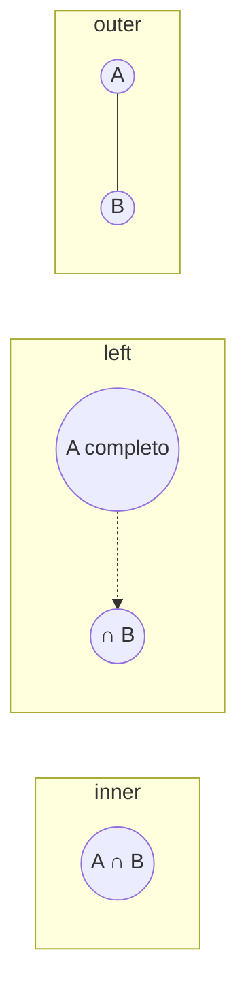

# 09 — Combinación de DataFrames

> Continúa de [[08 - Agrupación y Agregación (GroupBy)]].

## `merge()` — combinar por columnas clave (equivalente a un JOIN de SQL)

```python
pd.merge(clientes, pedidos, on="cliente_id", how="inner")
```

### Tipos de join

```python
pd.merge(clientes, pedidos, on="cliente_id", how="inner")   # solo claves presentes en AMBOS
pd.merge(clientes, pedidos, on="cliente_id", how="left")    # todas las filas de clientes, con NaN si no hay match
pd.merge(clientes, pedidos, on="cliente_id", how="right")   # todas las filas de pedidos
pd.merge(clientes, pedidos, on="cliente_id", how="outer")   # unión completa, NaN donde no hay match en ninguno
pd.merge(clientes, pedidos, how="cross")                     # producto cartesiano — sin columna 'on'
```



| how | Filas resultantes |
|---|---|
| `inner` | Intersección de claves |
| `left` | Todas las de la tabla izquierda |
| `right` | Todas las de la tabla derecha |
| `outer` | Unión de ambas, con NaN donde falte |
| `cross` | Producto cartesiano (todas las combinaciones) |

### Claves con nombres distintos, o por índice

```python
pd.merge(clientes, pedidos, left_on="id", right_on="cliente_id")
pd.merge(clientes, pedidos, left_index=True, right_index=True)   # combinar por índice en vez de columna
pd.merge(clientes, pedidos, on=["cliente_id", "region"])          # múltiples columnas clave
```

### `validate` e `indicator` — detectar problemas de cardinalidad

```python
pd.merge(clientes, pedidos, on="cliente_id", validate="one_to_many")
# lanza MergeError si la relación real no es 1:N como se esperaba — atrapa bugs de duplicación silenciosa

pd.merge(clientes, pedidos, on="cliente_id", how="outer", indicator=True)
# agrega columna '_merge' con valores 'left_only' / 'right_only' / 'both' — diagnóstico rápido de qué no matcheó
```

`validate` es la protección más subestimada de `merge()`: un join con cardinalidad inesperada (ej. claves duplicadas en la tabla que se creía única) **infla filas silenciosamente** sin ningún error — `validate="one_to_one"` (o `"1:1"`, `"1:m"`, `"m:1"`, `"m:m"`) convierte ese bug silencioso en una excepción explícita.

## `join()` — combinar por índice, sintaxis abreviada

```python
clientes.join(pedidos, how="left", lsuffix="_cli", rsuffix="_ped")
```

`join()` es azúcar sintáctico sobre `merge()` para el caso específico de combinar por índice — internamente delega en `merge(left_index=True, right_index=True)`.

## `concat()` — apilar DataFrames (no combinar por clave)

```python
pd.concat([df_enero, df_febrero, df_marzo])                    # apilar verticalmente (axis=0, default)
pd.concat([df_enero, df_febrero], ignore_index=True)             # reindexar 0..n en vez de conservar índices originales
pd.concat([df_a, df_b], axis=1)                                   # pegar horizontalmente (columna a columna, por índice)
pd.concat([df_enero, df_febrero], keys=["enero", "febrero"])     # agrega nivel extra de MultiIndex identificando el origen
```

`concat` sirve para **apilar** datos con la misma estructura (ej. un CSV por mes), mientras que `merge`/`join` sirven para **combinar** datos relacionados por una clave — son operaciones conceptualmente distintas aunque ambas "junten" DataFrames.

## Tabla de decisión rápida

| Necesito... | Uso |
|---|---|
| Unir filas de la misma estructura (ej. varios meses) | `pd.concat()`, `axis=0` |
| Pegar columnas nuevas alineadas por índice | `pd.concat()`, `axis=1`, o `.join()` |
| Combinar dos tablas relacionadas por una clave (ej. clientes + pedidos) | `pd.merge()` |
| Verificar que un merge no duplique filas inesperadamente | `pd.merge(..., validate=...)` |

## Ver también

- [[08 - Agrupación y Agregación (GroupBy)]]
- [[10 - Reshaping y Pivoting]]
- [[13 - MultiIndex y Datos Jerárquicos]]
- [[SQL/Joins|SQL — Joins]] — el equivalente conceptual en SQL
