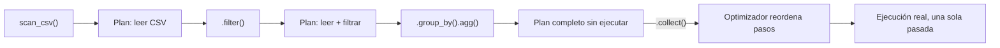

# 02 — Eager vs Lazy API

> Continúa de [[01 - Introducción y Arquitectura]]. El concepto más importante de todo el cheat-sheet — casi todo el rendimiento de Polars depende de usar bien la API lazy.

## API Eager — ejecución inmediata

```python
df = pl.read_csv("ventas.csv")
resultado = df.filter(pl.col("precio") > 100).group_by("region").agg(pl.col("monto").sum())
```

Cada línea se ejecuta **al momento** — igual que Pandas. Simple de razonar, pero Polars no tiene oportunidad de optimizar la secuencia completa de operaciones porque no la conoce de antemano.

## API Lazy — construir un plan, optimizar, ejecutar al final

```python
resultado = (
    pl.scan_csv("ventas.csv")                              # 'scan_' en vez de 'read_' — no carga nada todavía
    .filter(pl.col("precio") > 100)
    .group_by("region")
    .agg(pl.col("monto").sum())
    .collect()                                                # AQUÍ se ejecuta todo, ya optimizado
)
```

Con `scan_csv()` (en vez de `read_csv()`), cada método (`.filter()`, `.group_by()`, `.agg()`) no ejecuta nada — solo va construyendo un **plan de consulta** (query plan). Solo al llamar `.collect()` Polars analiza el plan completo, lo **optimiza** (ver [[13 - Optimización de Queries Lazy]]), y ejecuta la versión más eficiente posible.



## Por qué esto importa: predicate pushdown como ejemplo concreto

```python
# Con LAZY, Polars puede "empujar" el filtro hacia ABAJO, antes de leer todo el CSV
resultado = (
    pl.scan_csv("ventas_enorme.csv")
    .filter(pl.col("region") == "Norte")      # el optimizador puede aplicar esto DURANTE la lectura del archivo
    .select(["fecha", "monto"])                  # y leer SOLO estas 2 columnas, ni siquiera el resto
    .collect()
)
```

El motor lazy puede reordenar el plan para filtrar filas y seleccionar columnas **antes** de materializar el resto de los datos en memoria — con la API eager, `read_csv()` ya cargó el archivo completo antes de que el `.filter()` tuviera oportunidad de actuar. Esta es la razón estructural detrás de gran parte de la ventaja de rendimiento de Polars frente a Pandas en archivos grandes.

## Convertir entre eager y lazy

```python
df = pl.DataFrame({"a": [1, 2, 3]})
lf = df.lazy()              # eager -> lazy
df_de_vuelta = lf.collect()   # lazy -> eager (ejecuta el plan)

df.lazy().filter(pl.col("a") > 1).collect()   # patrón común: pasar a lazy solo para una cadena de operaciones, luego volver
```

## Inspeccionar el plan sin ejecutarlo

```python
lf = pl.scan_csv("ventas.csv").filter(pl.col("precio") > 100)

print(lf.explain())              # plan de ejecución OPTIMIZADO, en texto legible
print(lf.explain(optimized=False))   # plan SIN optimizar, para comparar qué cambió el optimizador
```

Ver el catálogo completo de optimizaciones (predicate pushdown, projection pushdown, elminación de operaciones redundantes) en [[13 - Optimización de Queries Lazy]].

## `collect(streaming=True)` — para datasets más grandes que la RAM

```python
resultado = (
    pl.scan_csv("archivo_enorme.csv")
    .group_by("region")
    .agg(pl.col("monto").sum())
    .collect(streaming=True)     # procesa en lotes (batches), sin cargar el archivo completo en memoria
)
```

Ver el detalle completo del motor de streaming en [[14 - Streaming y Datasets Grandes]].

## Regla práctica: ¿cuándo usar cada una?

| Situación | API recomendada |
|---|---|
| Exploración interactiva rápida en un notebook, dataset pequeño | Eager (`pl.read_csv`, `pl.DataFrame`) |
| Cualquier pipeline de producción, o archivo mediano/grande | Lazy (`pl.scan_csv`, encadenar, `.collect()` al final) |
| Dataset más grande que la RAM disponible | Lazy + `.collect(streaming=True)` |

## Ver también

- [[01 - Introducción y Arquitectura]]
- [[13 - Optimización de Queries Lazy]]
- [[14 - Streaming y Datasets Grandes]]
