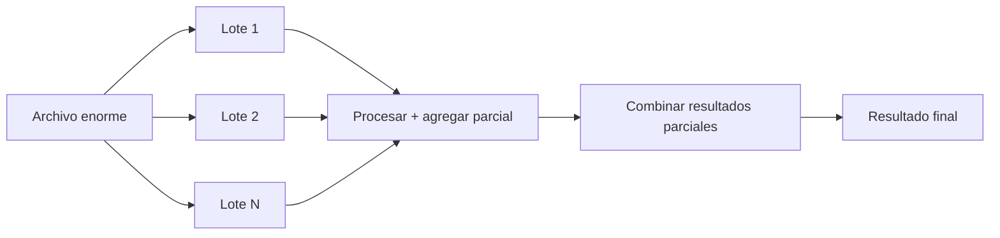

# 14 — Streaming y Datasets Grandes

> Continúa de [[13 - Optimización de Queries Lazy]].

## El problema: datasets más grandes que la RAM disponible

Incluso con el optimizador de consultas ([[13 - Optimización de Queries Lazy]]), un `.collect()` normal intenta materializar el **resultado completo** en memoria de una sola vez — si el resultado (no necesariamente el archivo de entrada) es más grande que la RAM disponible, esto falla igual que le pasaría a Pandas.

## `collect(streaming=True)` — ejecución por lotes (batches)

```python
resultado = (
    pl.scan_csv("archivo_enorme.csv")
    .filter(pl.col("region") == "Norte")
    .group_by("producto")
    .agg(pl.col("monto").sum())
    .collect(streaming=True)
)
```

Con `streaming=True`, Polars procesa los datos en **lotes** (chunks) en vez de cargar todo de una vez: lee un lote, aplica las operaciones compatibles con streaming, libera memoria, y continúa con el siguiente lote — permitiendo procesar archivos de entrada mucho más grandes que la RAM disponible, siempre que la operación en sí (como una agregación) no requiera ver todos los datos a la vez para producir el resultado final.



## Qué operaciones soportan streaming (y cuáles no completamente)

| Operación | Soporte streaming |
|---|---|
| `filter()`, `select()`, `with_columns()` | Completo |
| `group_by().agg()` con agregaciones simples (sum, mean, count) | Completo |
| `join()` | Parcial, mejora continuamente entre versiones |
| `sort()` global, `pivot()` | Limitado — a menudo requieren ver todos los datos a la vez |

El soporte de streaming de Polars ha ido creciendo con cada versión — verificar la documentación oficial para el estado exacto de una operación específica es recomendable antes de depender de streaming en un pipeline de producción con datos genuinamente masivos.

## Verificar si un plan se puede ejecutar en modo streaming

```python
lf.explain(streaming=True)     # muestra qué partes del plan corren en modo streaming y cuáles no
```

## Comparación con el patrón `chunksize` de Pandas

```python
# Pandas: el usuario administra manualmente el loop de lotes
for chunk in pd.read_csv("archivo_enorme.csv", chunksize=100_000):
    resultado_parcial = chunk.groupby("region")["monto"].sum()
    ...  # combinar manualmente

# Polars: streaming es automático dentro del motor, sin loop manual
resultado = pl.scan_csv("archivo_enorme.csv").group_by("region").agg(pl.col("monto").sum()).collect(streaming=True)
```

La diferencia central: en Pandas, procesar por lotes es responsabilidad **manual** del código del usuario (ver [[Python/Pandas/02 - Creación y Carga de Datos#Lectura en trozos (chunksize) para archivos que no caben en memoria|Python/Pandas]]); en Polars, el motor de streaming administra los lotes internamente — el código se ve idéntico a una consulta normal, solo cambia el argumento `streaming=True` en `.collect()`.

## Cuándo streaming no es suficiente

Cuando incluso el streaming de Polars no basta (datos verdaderamente masivos, o se necesita distribuir el cómputo entre múltiples máquinas), el siguiente escalón es PySpark — ver la comparación completa de cuándo dar ese salto en [[17 - Buenas Prácticas, Errores Comunes y Comparativa]].

## Ver también

- [[13 - Optimización de Queries Lazy]]
- [[02 - Eager vs Lazy API]]
- [[17 - Buenas Prácticas, Errores Comunes y Comparativa]]
