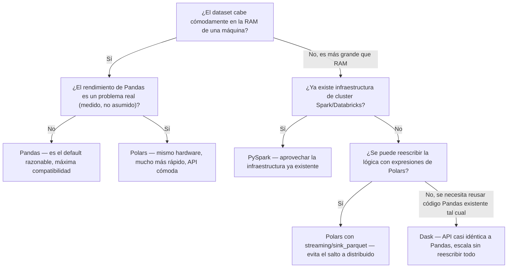

# 17 — Buenas Prácticas, Errores Comunes y Comparativa

> Cierra la serie iniciada en [[01 - Introducción y Arquitectura]].

## Errores comunes específicos de Polars

### Quedarse en modo eager cuando el pipeline ya justifica lazy

```python
# Funciona, pero desperdicia la ventaja estructural de Polars
df = pl.read_csv("ventas.csv")
resultado = df.filter(pl.col("monto") > 100).group_by("region").agg(pl.col("monto").sum())

# CORRECTO en cualquier pipeline no trivial — usar scan_ + collect()
resultado = (
    pl.scan_csv("ventas.csv")
    .filter(pl.col("monto") > 100)
    .group_by("region")
    .agg(pl.col("monto").sum())
    .collect()
)
```

Ver el detalle completo de por qué esto importa en [[02 - Eager vs Lazy API]] y [[13 - Optimización de Queries Lazy]].

### Abusar de `map_elements()`

```python
# LENTO — ejecuta Python puro fila por fila, sin paralelismo ni optimización
df.with_columns(pl.col("precio").map_elements(lambda x: x * 1.16, return_dtype=pl.Float64))

# RÁPIDO — expresión nativa
df.with_columns((pl.col("precio") * 1.16).alias("precio"))
```

Casi cualquier transformación numérica, de texto o condicional tiene una expresión nativa equivalente (ver [[04 - Expresiones (pl.col)]], [[05 - Selección y Filtrado#pl.when().then().otherwise() — condicional vectorizado|pl.when]]) — `map_elements()` debe ser la última opción, no la primera que se prueba.

### Olvidar que no hay `Index` y buscar `.loc`/`.iloc`

```python
df.loc[...]      # AttributeError — Polars no tiene .loc
```

Quien viene de Pandas busca instintivamente `.loc`/`.iloc` — en Polars el equivalente es `filter()` + `select()` (ver [[05 - Selección y Filtrado]]), no un método de indexado por etiqueta/posición combinado.

### Múltiples `.filter()`/`.with_columns()` separados en vez de uno combinado

```python
# Funciona, pero cada llamada es un paso separado en el plan
df.filter(pl.col("a") > 0).filter(pl.col("b") > 0)

# Más idiomático: combinar en una sola expresión booleana
df.filter((pl.col("a") > 0) & (pl.col("b") > 0))
```

El optimizador lazy generalmente fusiona filtros consecutivos de todas formas, pero combinar condiciones explícitamente es más legible y dejar menos trabajo al optimizador nunca perjudica.

## Checklist antes de dar por "listo" un pipeline de Polars

- [ ] ¿Se usó `scan_*` + lazy + `.collect()` en vez de `read_*` eager para cualquier pipeline no trivial?
- [ ] ¿Las transformaciones usan expresiones nativas (`pl.col`, `pl.when`) en vez de `map_elements()`?
- [ ] ¿Se combinaron condiciones de filtro en una sola expresión booleana cuando es natural hacerlo?
- [ ] Con datasets grandes, ¿se consideró `.collect(streaming=True)` o `sink_parquet()`?

---

## Comparativa exhaustiva: Polars vs Pandas vs Dask vs PySpark

### Arquitectura y motor de ejecución

| | Pandas | Polars | Dask | PySpark |
|---|---|---|---|---|
| Lenguaje del motor | Python + C (NumPy) | **Rust** | Python (orquesta Pandas fragmentado) | JVM (Scala/Java), con API Python |
| Formato de memoria interno | NumPy arrays (+ opcional Arrow desde 2.0) | **Apache Arrow nativo** | NumPy/Pandas por partición | Su propio formato columnar (Tungsten) |
| Modelo de ejecución | Eager (inmediato) siempre | **Eager y Lazy**, ambos de primera clase | Lazy (grafo de tareas) | Lazy (plan de ejecución Catalyst) |
| Optimizador de consultas | No tiene | **Sí** (predicate/projection pushdown, ver [[13 - Optimización de Queries Lazy]]) | Limitado (optimiza el grafo de tareas, no la lógica de negocio) | **Sí, muy sofisticado** (Catalyst Optimizer + Tungsten) |
| Índice (`Index`) | Sí, concepto central | **No existe** | Hereda el de Pandas por partición | No (más parecido a SQL) |

### Paralelismo y escala

| | Pandas | Polars | Dask | PySpark |
|---|---|---|---|---|
| Paralelismo multi-núcleo | No (single-thread por default) | **Sí, automático** en la mayoría de operaciones | Sí, multi-proceso | Sí, multi-proceso/cluster |
| Distribución multi-máquina (cluster) | No | No (single-machine, pero usa TODOS los núcleos de esa máquina) | **Sí** | **Sí**, es su razón de ser |
| Procesamiento out-of-core (más grande que RAM) | No nativamente (requiere `chunksize` manual) | **Sí**, vía streaming (ver [[14 - Streaming y Datasets Grandes]]) | Sí, es su propósito central | Sí, diseñado para esto desde el inicio |
| Tamaño de dato "cómodo" | Cabe en RAM de una máquina | Cabe en RAM (o algo más, con streaming) — mucho más que Pandas en la misma máquina gracias a Arrow + paralelismo | Más grande que RAM, una máquina potente o cluster pequeño-mediano | Terabytes+, cluster grande |

### Rendimiento típico (benchmarks generales, no absolutos)

En benchmarks públicos comparativos (como el H2O.ai db-benchmark, ampliamente citado en la comunidad), el orden típico de velocidad en operaciones de agregación/join sobre datasets que caben en RAM de una sola máquina es, de más rápido a más lento: **Polars > Pandas (con backend Arrow) > Pandas clásico**, con Polars frecuentemente 5-10x más rápido que Pandas clásico en agregaciones sobre datasets de varios GB. Estos números varían mucho según la operación específica, el hardware y la versión de cada librería — la comparación cualitativa (arquitectura, capacidades) es más estable en el tiempo que cualquier número concreto de benchmark.

### API y filosofía de sintaxis

| | Pandas | Polars | Dask DataFrame | PySpark |
|---|---|---|---|---|
| Filosofía | Múltiples formas de hacer lo mismo (`[]`, `.loc`, `.apply`...) | Un mecanismo unificado: **expresiones** dentro de contextos (ver [[04 - Expresiones (pl.col)]]) | Calca la API de Pandas casi 1:1 | API propia, inspirada en SQL/Spark, distinta a Pandas |
| Curva de aprendizaje si ya se sabe Pandas | — | Media — la lógica es similar, la sintaxis de expresiones requiere reaprender | **Mínima** — el objetivo explícito es reusar código Pandas | Alta — sintaxis y conceptos (RDD, particiones, `Row`) distintos |
| Nulos | `NaN` (float) + `None` + `NaT` + `pd.NA` según contexto, inconsistente históricamente | **Un solo `null`**, consistente en cualquier dtype (ver [[07 - Valores Nulos]]) | Hereda el comportamiento de Pandas | `null` de SQL, consistente |
| Window functions / `over()` | `.transform()`, con limitaciones | `.over()`, expresivo y directo (ver [[08 - Agrupación y Agregación#over() — funciones de ventana (window functions), el equivalente a transform()|Agrupación]]) | Hereda de Pandas | `Window` de Spark SQL, muy potente pero verboso |

### Madurez del ecosistema e interoperabilidad

| | Pandas | Polars | Dask | PySpark |
|---|---|---|---|---|
| Años en el mercado | 15+ (desde 2008) | Nuevo relativamente (proyecto público desde 2020) | ~10 años | 10+ años (Spark en general desde 2014) |
| Integración con el resto del ecosistema Python (Matplotlib, Scikit-learn, Seaborn) | **Máxima** — es el estándar de facto que todos soportan directamente | Creciente, pero a menudo requiere `.to_pandas()`/`.to_numpy()` como puente | Buena (opera fragmentos que son Pandas por debajo) | Limitada — vive más en su propio ecosistema (MLlib en vez de scikit-learn) |
| Disponibilidad de recursos de aprendizaje/Stack Overflow | Enorme | Creciente rápido, pero mucho menor que Pandas | Media | Grande, pero especializada en Big Data/Spark |
| Instalación y despliegue | Trivial (`pip install pandas`) | Trivial (`pip install polars`), sin dependencias externas pesadas | Trivial para uso local; requiere configuración para cluster | Requiere JVM, y configuración real de infraestructura para uso en cluster |

### Cuándo elegir cada una — árbol de decisión



### Resumen en una tabla de decisión rápida

| Situación | Elección recomendada |
|---|---|
| Proyecto nuevo, dataset cabe en RAM, quiero la opción más rápida y moderna | **Polars** |
| Proyecto existente en Pandas, funciona bien, sin problemas de rendimiento | **Pandas** — no migrar sin una razón concreta |
| Pandas se volvió lento/con problemas de memoria, pero no se justifica un cluster | **Polars** (el "punto intermedio" mencionado en [[Machine Learning/04-Ingenieria-de-Datos#Polars|Machine Learning/04]]) |
| Necesito reusar mucho código Pandas ya escrito, escalando a más de una máquina | **Dask** |
| Ya existe un cluster Spark/Databricks en la organización | **PySpark** |
| Terabytes de datos, equipo de datos ya está en el ecosistema Big Data empresarial | **PySpark** |
| Solo necesito consultas SQL rápidas ad-hoc sobre archivos Parquet/CSV, sin pipeline complejo | DuckDB (mencionado como alternativa en [[16 - Integración con el Ecosistema#DuckDB — consultas SQL directamente sobre DataFrames de Polars|Integración]]) |

### La conclusión práctica

Ninguna de las cuatro reemplaza completamente a las demás — son puntos distintos en el mismo espectro de "tamaño de dato x necesidad de distribución": Pandas y Polars compiten en el mismo espacio (una sola máquina), con Polars como la opción más moderna y rápida a igual de hardware; Dask es el puente para escalar código Pandas existente sin reescribirlo; PySpark es la herramienta cuando el volumen o la infraestructura ya exige un cluster distribuido real. La pregunta correcta no es "¿cuál es la mejor?" sino "¿cuál corresponde al tamaño de dato y la infraestructura que realmente tengo?" — ver la misma idea aplicada específicamente a Pandas vs sus alternativas en [[Python/Pandas/17 - Buenas Prácticas, Errores Comunes y Comparativa#Comparativa Pandas vs Polars vs Dask vs PySpark|Python/Pandas]].

## Ver también

- [[01 - Introducción y Arquitectura]]
- [[02 - Eager vs Lazy API]]
- [[14 - Streaming y Datasets Grandes]]
- [[Python/Pandas/17 - Buenas Prácticas, Errores Comunes y Comparativa|Python/Pandas]]
- [[Machine Learning/04-Ingenieria-de-Datos#Polars|Machine Learning/04 - Ingeniería de Datos]]
