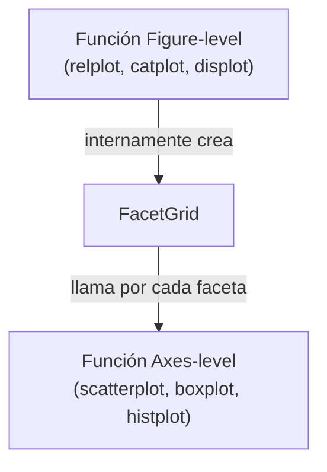

# 01 — Introducción y Arquitectura

> Complementa la sección `### Seaborn` de [[Machine Learning/07-Librerias-de-Data-Science-y-ML#Seaborn|Machine Learning/07 - Librerías]] con la profundidad práctica de sintaxis.

**Seaborn** es una librería de visualización estadística construida **directamente sobre** [[Python/Matplotlib/01 - Introducción y Arquitectura|Matplotlib]] — no lo reemplaza, sino que añade una capa de alto nivel con defaults estéticos cuidados y funciones diseñadas específicamente para explorar relaciones estadísticas entre variables de un [[Python/Pandas/01 - Introducción y Arquitectura Interna|DataFrame de Pandas]].

```python
import seaborn as sns
import matplotlib.pyplot as plt
import pandas as pd
```

## Por qué Seaborn existe sobre Matplotlib

```python
# Con Matplotlib puro: agrupar y graficar una barra por categoría requiere varios pasos manuales
promedios = df.groupby("region")["monto"].mean()
fig, ax = plt.subplots()
ax.bar(promedios.index, promedios.values)

# Con Seaborn: la agregación, el intervalo de confianza y el estilo vienen incluidos en una sola llamada
sns.barplot(data=df, x="region", y="monto")
```

Seaborn conoce la **semántica estadística** de lo que se le pide: `barplot` no solo dibuja barras, también calcula el estimador (media por default) y su intervalo de confianza automáticamente (ver [[13 - Estadística Integrada]]) — Matplotlib no tiene ningún concepto de "estimador" o "intervalo de confianza", solo dibuja lo que se le da explícitamente.

## Dos niveles de funciones: Figure-level vs Axes-level

Esta es la distinción arquitectónica más importante de Seaborn, y la fuente más común de confusión para quien empieza:

```python
# Axes-level: dibuja sobre un Axes de Matplotlib específico, se puede combinar con subplots propios
fig, ax = plt.subplots()
sns.scatterplot(data=df, x="precio", y="demanda", ax=ax)

# Figure-level: crea y administra SU PROPIA Figure completa, con soporte nativo de facetado (ver 09)
sns.relplot(data=df, x="precio", y="demanda", kind="scatter", col="region")
```

| | Axes-level | Figure-level |
|---|---|---|
| Ejemplos | `scatterplot`, `lineplot`, `boxplot`, `histplot`, `heatmap` | `relplot`, `displot`, `catplot`, `lmplot`, `pairplot`, `jointplot` |
| Acepta `ax=` | Sí | **No** — administra su propia Figure |
| Se puede meter en un `plt.subplots()` propio | Sí | No directamente |
| Facetado automático (`col=`, `row=`) | No | Sí, nativo |
| Devuelve | Un objeto `Axes` de Matplotlib | Un objeto `FacetGrid`/`PairGrid`/`JointGrid` propio de Seaborn |

**Regla práctica:** si se necesita combinar el gráfico con otros subplots de Matplotlib ya existentes, usar la versión **axes-level** (`ax=`). Si se necesita facetar por una categoría (un panel por región, por ejemplo) sin escribir el loop manualmente, usar la versión **figure-level** correspondiente (`relplot` en vez de `scatterplot`/`lineplot`, `catplot` en vez de `boxplot`/`violinplot`, `displot` en vez de `histplot`/`kdeplot`).



Cada función figure-level es, internamente, un `FacetGrid` (ver [[09 - FacetGrid - Small Multiples]]) que llama repetidamente a su función axes-level equivalente — por eso ambas familias comparten los mismos argumentos estadísticos (`hue`, `size`, `style`), solo difieren en cómo administran la `Figure`.

## Ver también

- [[02 - Formato de Datos - Long vs Wide]]
- [[09 - FacetGrid - Small Multiples]]
- [[15 - Integración con Matplotlib y Pandas]]
- [[Python/Matplotlib/01 - Introducción y Arquitectura|Python/Matplotlib]]
- [[Machine Learning/07-Librerias-de-Data-Science-y-ML#Seaborn|Machine Learning/07 - Librerías]]
