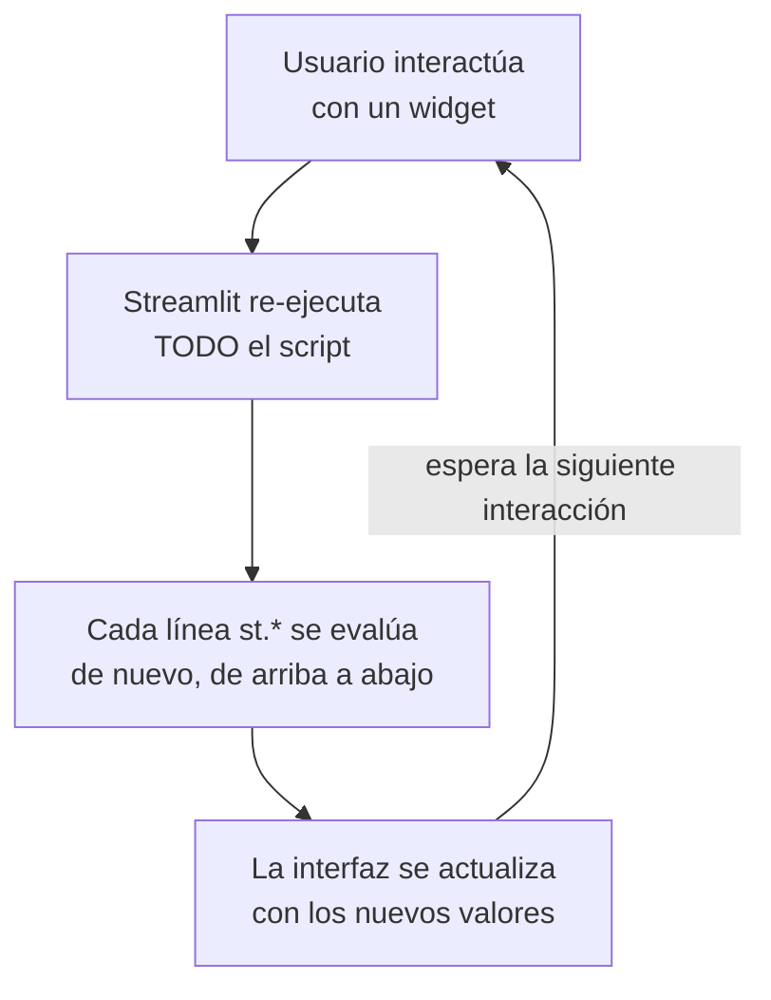

# 01 — Introducción y Modelo de Ejecución

> Este cheat-sheet profundiza en la sintaxis y arquitectura de Streamlit. Ver `Machine Learning/07-Librerias-de-Data-Science-y-ML.md` para dónde encaja frente a Dash/Plotly/Bokeh en el panorama general de visualización.

## ¿Qué es Streamlit?

**Streamlit** es un framework open-source de Python para construir aplicaciones web interactivas de datos (dashboards, demos de modelos, herramientas internas) sin escribir HTML, CSS ni JavaScript — un script de Python normal, ejecutado con `streamlit run`, se convierte directamente en una app web.

El problema que resuelve: para un data scientist, construir una interfaz web tradicional (Flask/Django + frontend) para exponer un modelo o un análisis a usuarios no técnicos implica aprender un stack completamente distinto al de análisis de datos. Streamlit reduce esa barrera a "escribir Python normal, con algunas funciones especiales para mostrar cosas en pantalla".

## Instalación

```bash
pip install streamlit

streamlit hello   # levanta una app de demostración, para confirmar que la instalación funciona
```

## El modelo de ejecución — la idea más importante de todo Streamlit

**Cada vez que el usuario interactúa con la app (mueve un slider, pulsa un botón, escribe texto), Streamlit re-ejecuta el script COMPLETO de arriba a abajo.** No hay un modelo de eventos tradicional (callbacks que modifican partes específicas del DOM) — en su lugar, todo el script vuelve a correr, y Streamlit se encarga de actualizar eficientemente solo lo que cambió en la interfaz.

```python
import streamlit as st

st.title("Mi primera app")   # esto se ejecuta CADA VEZ que hay una interacción, no solo al inicio

nombre = st.text_input("¿Cómo te llamas?")   # cada tecla escrita dispara un rerun completo del script
if nombre:
    st.write(f"Hola, {nombre}!")
```



Este modelo explica por qué:
- Variables locales normales **se pierden** entre interacciones (por eso existe `st.session_state`, ver [[07 - Session State - Estado entre Reruns]]).
- Operaciones costosas (cargar un dataset, entrenar un modelo) necesitan **cache** explícito para no repetirse en cada rerun (ver [[08 - Caching - cache_data y cache_resource]]).
- El orden del código en el script **es** el orden en que los elementos aparecen en la página — no hay una separación entre "lógica" y "layout" como en frameworks tradicionales.

## Ejecutar una app

```bash
streamlit run app.py

streamlit run app.py --server.port 8502   # puerto específico
streamlit run app.py --server.headless true   # sin abrir el navegador automáticamente (útil en servidores)
```

Por defecto, Streamlit levanta un servidor local en `http://localhost:8501` con **hot-reload**: al guardar cambios en el archivo, la app pregunta si se debe re-ejecutar automáticamente.

## Quickstart — una app mínima completa

```python
import streamlit as st
import pandas as pd

st.title("Panel de Demanda — Claro RD")

archivo = st.file_uploader("Sube el CSV de demanda histórica", type="csv")

if archivo is not None:
    df = pd.read_csv(archivo)
    st.write("Vista previa de los datos:")
    st.dataframe(df.head())

    region_seleccionada = st.selectbox("Selecciona una región", df["region"].unique())
    df_filtrado = df[df["region"] == region_seleccionada]

    st.line_chart(df_filtrado.set_index("fecha")["demanda"])
```

En menos de 15 líneas: una app con carga de archivos, una tabla, un selector interactivo y una gráfica que reacciona a la selección — sin ninguna línea de HTML/JS.

## `st.write` — la función "hazlo todo"

```python
st.write("texto simple")
st.write(df)                    # detecta que es un DataFrame, lo muestra como tabla interactiva
st.write({"clave": "valor"})     # detecta que es un dict, lo muestra como JSON
st.write(fig)                     # detecta una figura de Matplotlib/Plotly, la renderiza
st.write(modelo)                   # incluso objetos de Python arbitrarios, con repr() legible
```

`st.write` inspecciona el tipo del argumento y elige automáticamente la mejor forma de mostrarlo — útil para prototipado rápido, aunque en código de producción suele preferirse la función específica (`st.dataframe`, `st.json`, `st.pyplot`) por claridad explícita sobre qué se está renderizando.

## La estructura mínima recomendada de un proyecto

```
mi_app/
├── app.py                  # punto de entrada principal
├── requirements.txt
├── .streamlit/
│   ├── config.toml          # configuración de tema, servidor
│   └── secrets.toml          # credenciales (NUNCA versionado en Git)
└── pages/                    # para apps multipágina, ver 10
    ├── 1_Analisis.py
    └── 2_Prediccion.py
```

## Panorama de este cheat-sheet

| Tema | Archivo |
|---|---|
| Texto, Markdown, código | [[02 - Elementos de Texto y Markdown]] |
| Botones, sliders, inputs | [[03 - Widgets de Entrada]] |
| Columnas, tabs, sidebar | [[04 - Layout y Contenedores]] |
| Tablas, métricas, JSON | [[05 - Mostrar Datos - DataFrames, Tablas y Métricas]] |
| Gráficas nativas y con Matplotlib/Plotly | [[06 - Gráficos y Visualización]] |
| Estado que persiste entre reruns | [[07 - Session State - Estado entre Reruns]] |
| Evitar recalcular en cada rerun | [[08 - Caching - cache_data y cache_resource]] |
| Formularios y control de reruns | [[09 - Forms, Callbacks y Control de Reruns]] |
| Apps con múltiples páginas | [[10 - Multipage Apps y Navegación]] |
| Servir un modelo de ML interactivamente | [[11 - Integración con Modelos de ML]] |
| Llevar la app a producción | [[12 - Despliegue - Community Cloud, Docker y Secrets]] |
| Bases de datos, MLflow, APIs | [[13 - Integración con el Ecosistema]] |
| Rendimiento, testing, seguridad | [[14 - Buenas Prácticas, Rendimiento y Testing]] |

## Ver también

- `Machine Learning/07-Librerias-de-Data-Science-y-ML.md`
- `MLflow/09 - Model Serving y Despliegue.md`
- `Machine Learning/49-APIs-con-FastAPI-para-Servir-Modelos.md`
